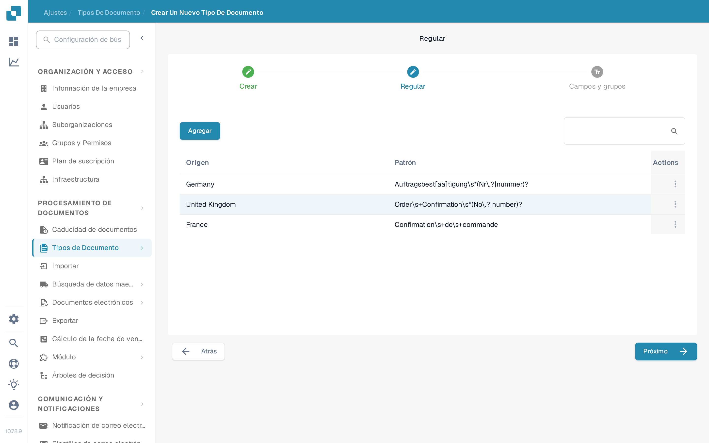

# Regex Manager

Esta función de DocBits le ofrece una alternativa a la clasificación por modelo: le permite escribir expresiones regulares buscables para un tipo de documento, para la clasificación y otros fines.

**Tipo de documento:** El Regex Manager le permite escribir expresiones regulares, y DocBits busca esas expresiones en el documento. Si el documento coincide con la expresión regular de un documento definido, se clasifica en el tipo de documento correspondiente. Por ejemplo, si escribe una expresión regular que encuentra «Gutschrift», DocBits clasifica como nota de crédito todo documento que contenga ese término.

**Origen del documento:** Esto le indica a DocBits, mediante expresiones regulares, el país de origen de un documento. Por ejemplo, si la expresión regular de un documento en español contiene el término «Factura» y DocBits encuentra ese término en un documento, sabe que el documento es de origen español y lo clasifica como tal.

## Acceso al Regex Manager

Para usar esta función, vaya a Ajustes → Tipos de Documento y haga clic en «Nuevo». En el asistente «Crear un nuevo tipo de documento», escriba un nombre para el tipo de documento y seleccione «Regular» en lugar de «Auto» como método de extracción; después continúe con «Próximo».

<figure><figcaption>
El asistente «Crear un nuevo tipo de documento» con el nombre del tipo de documento y la elección entre «Auto» y «Regular».
</figcaption></figure>

## Agregar y quitar Regex

El paso de Regex muestra una tabla con las expresiones regulares existentes, con su Origen y su Patrón, junto con el botón «Agregar» para crear nuevas entradas de regex.

<figure><figcaption>
El paso de Regex con la tabla de las expresiones regulares existentes y el botón «Agregar».
</figcaption></figure>
