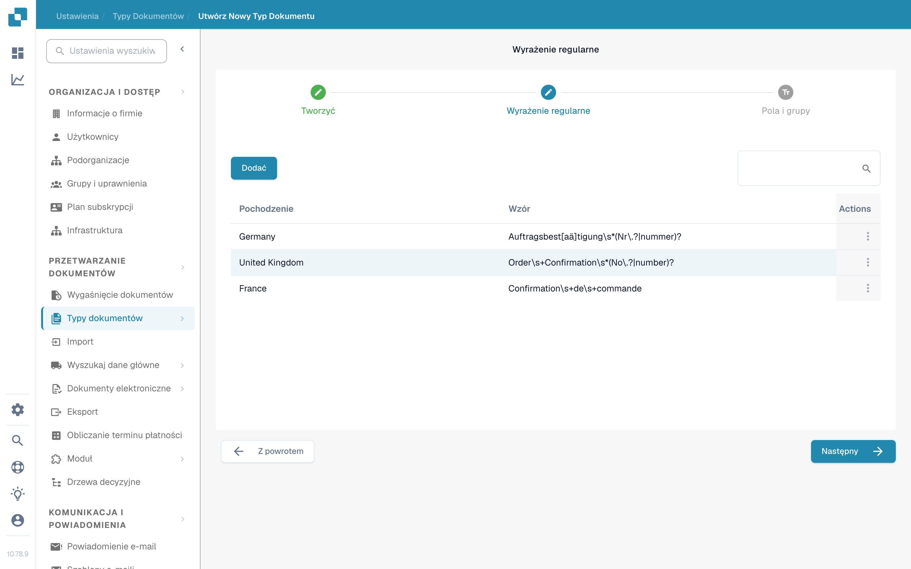

# Menedżer Wyrażeń Regularnych

Ta funkcja DocBits jest alternatywą dla klasyfikacji opartej na modelach: pozwala pisać przeszukiwalne wyrażenia regularne dla typu dokumentu, do klasyfikacji i innych celów.

Typ dokumentu: Menedżer Wyrażeń Regularnych umożliwia pisanie wyrażeń regularnych, które są następnie wyszukiwane w dokumencie. Jeśli DocBits znajdzie dopasowanie do wyrażenia regularnego zdefiniowanego dokumentu, przypisze dokument do odpowiedniego typu dokumentu. Na przykład jeśli napiszesz wyrażenie regularne wyszukujące „Gutschrift”, a DocBits znajdzie ten termin w dokumencie, sklasyfikuje go jako notę kredytową.

Pochodzenie dokumentu: dzięki wyrażeniom regularnym DocBits rozpoznaje także kraj pochodzenia dokumentu. Na przykład jeśli wyrażenie regularne dla dokumentu hiszpańskiego zawiera termin „Factura”, a DocBits znajdzie go w dokumencie, uzna, że dokument pochodzi z Hiszpanii, i odpowiednio go sklasyfikuje.

## **Otwieranie Menedżera Wyrażeń Regularnych**

W DocBits przejdź do Ustawienia → Typy dokumentów. W sekcji „Niestandardowe typy dokumentów” kliknij „Nowy”. Wpisz nazwę typu dokumentu, opcjonalnie dodaj opis i zaznacz „Dostępny stół”, jeśli dokument zawiera tabelę. Następnie wybierz „Wyrażenie regularne” zamiast „Automatyczny” i kliknij „Następny”.

<figure><figcaption>
Wybierz „Wyrażenie regularne”, aby klasyfikować nowy typ dokumentu za pomocą wyrażeń regularnych.
</figcaption></figure>

## **Dodawanie i usuwanie wyrażeń regularnych**

Krok „Wyrażenie regularne” pokazuje istniejące modele, każdy z pochodzeniem i wzorem, oraz przycisk „Dodać” do tworzenia nowego modelu. Menu akcji na końcu wiersza służy do zarządzania danym wpisem. Kliknij „Następny”, aby przejść do kroku „Pola i grupy”.

<figure><figcaption>
Istniejące modele wyrażeń regularnych z pochodzeniem i wzorem. „Dodać” tworzy nowy model.
</figcaption></figure>
