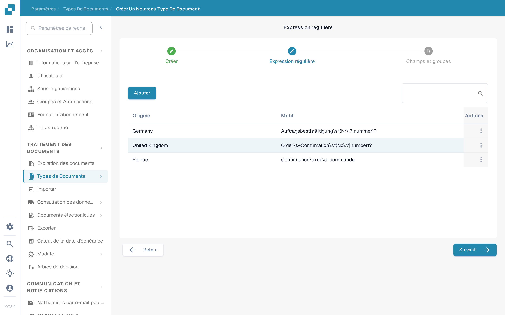

# Regex Manager

Cette fonctionnalité de DocBits est une alternative à la classification par modèle : elle vous permet d'écrire des expressions régulières consultables pour un type de document, pour la classification et d'autres usages.

**Type de document:** Le Regex Manager vous permet d'écrire des expressions régulières, et DocBits recherche ces expressions dans le document. Si un document correspond à l'expression régulière d'un document défini, il est classé dans le type de document correspondant. Par exemple, si vous écrivez une expression régulière qui trouve « Gutschrift », DocBits classe comme avoir tout document contenant ce terme.

**Origine du document:** Cela indique à DocBits, grâce aux expressions régulières, le pays d'origine d'un document. Par exemple, si l'expression régulière d'un document espagnol contient le terme « Factura » et que DocBits trouve ce terme dans un document, il sait que le document est d'origine espagnole et le classe comme tel.

## Accès au Regex Manager

Pour utiliser cette fonctionnalité, allez dans Paramètres → Types de Documents et cliquez sur « Nouveau ». Dans l'assistant « Créer un nouveau type de document », saisissez un nom pour le type de document et sélectionnez « Expression régulière » au lieu de « Auto » comme méthode d'extraction, puis poursuivez avec « Suivant ».

<figure><figcaption>
L'assistant « Créer un nouveau type de document » avec le nom du type de document et le choix entre « Auto » et « Expression régulière ».
</figcaption></figure>

## Ajouter et supprimer des Regex

L'étape Regex affiche un tableau des expressions régulières existantes, avec leur Origine et leur Motif, ainsi qu'un bouton « Ajouter » pour créer de nouvelles entrées regex.

<figure><figcaption>
L'étape Regex avec le tableau des expressions régulières existantes et le bouton « Ajouter ».
</figcaption></figure>
