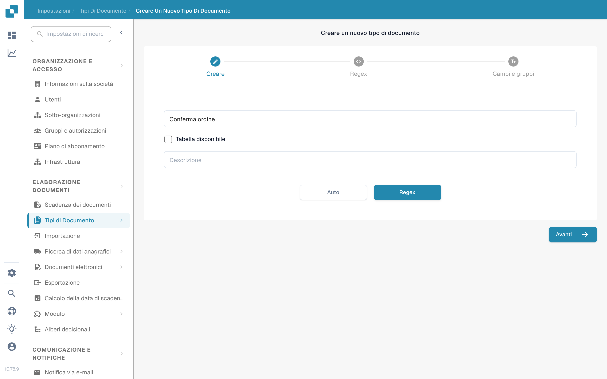
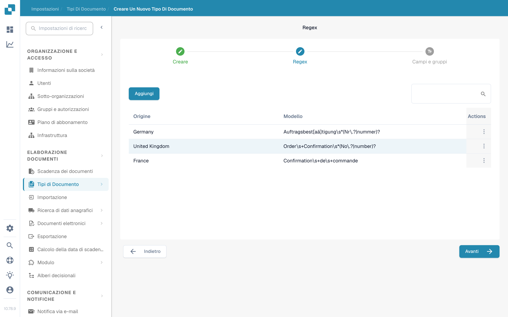

# Gestore Regex

Questa funzione di DocBits offre un’alternativa alla classificazione basata su modelli, perché permette di scrivere espressioni regolari di ricerca per un tipo di documento, per la classificazione e per altri scopi.

Tipo di documento: il Gestore Regex consente di scrivere espressioni regolari che vengono poi cercate nel documento. Se DocBits trova una corrispondenza con l’espressione regolare di un documento definito, classifica il documento nel tipo di documento corrispondente. Ad esempio, se scrivi un’espressione regolare per trovare “Gutschrift” e DocBits trova questo termine in un documento, lo classificherà come nota di credito.

Origine del documento: tramite le espressioni regolari DocBits riconosce anche il paese di origine di un documento. Ad esempio, se un’espressione regolare per un documento spagnolo contiene il termine “Factura” e DocBits lo trova nel documento, saprà che il documento è di origine spagnola e lo classificherà di conseguenza.

## **Accedere al Gestore Regex**

In DocBits vai a Impostazioni → Tipi di documento. In “Tipi di documento personalizzati” fai clic su “Nuovo”. Inserisci un nome per il tipo di documento, aggiungi una descrizione facoltativa e seleziona “Tabella disponibile” se il documento contiene una tabella. Poi scegli “Regex” invece di “Auto” e fai clic su “Avanti”.

<figure><figcaption>
Scegli “Regex” per classificare il nuovo tipo di documento con espressioni regolari.
</figcaption></figure>

## **Aggiungere e rimuovere regex**

Il passaggio “Regex” mostra i modelli regex esistenti, ciascuno con origine e modello, e un pulsante “Aggiungi” per creare un nuovo modello. Usa il menu delle azioni a fine riga per gestire la voce. Fai clic su “Avanti” per proseguire con “Campi e gruppi”.

<figure><figcaption>
Modelli regex esistenti con origine e modello. “Aggiungi” ne crea uno nuovo.
</figcaption></figure>
