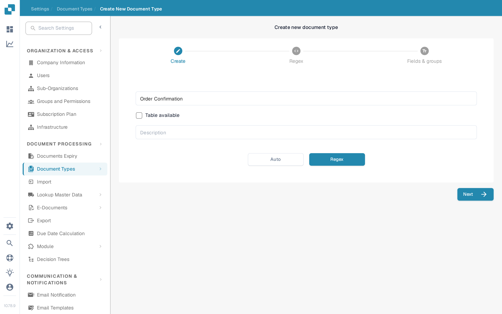
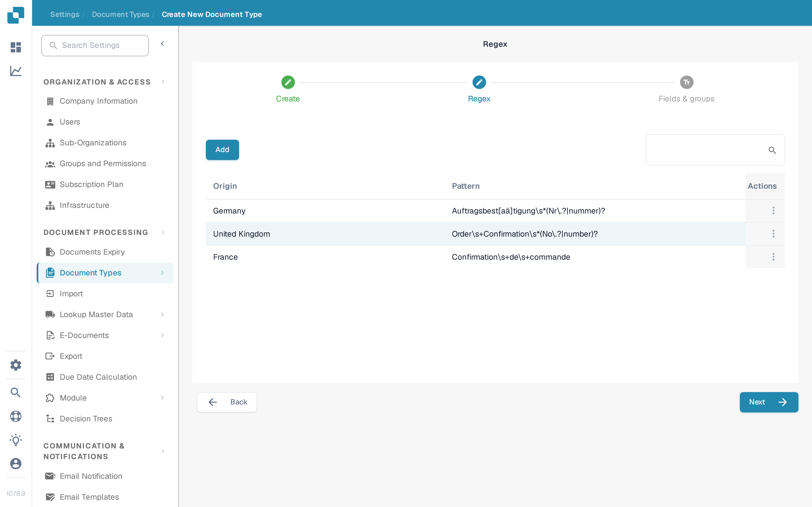

# Regex Manager

This DocBits feature gives you an alternative to model classification: it lets you write searchable regular expressions for a document type, for classification and other purposes.

**Document Type:** The Regex Manager lets you write regular expressions, and DocBits searches the document for these expressions. If a document matches the regex of a defined document, it is classified into the corresponding document type. For example, if you write a regular expression that finds “Gutschrift”, DocBits classifies any document containing this term as a credit note.

**Document Origin:** This tells DocBits the country of origin of a document through regular expressions. For example, if the regular expression for a Spanish document contains the term “Factura” and DocBits finds this term in a document, it knows the document is of Spanish origin and classifies it as such.

## Accessing the Regex Manager

To use this feature, go to Settings → Document Types and click “New”. In the “Create new document type” wizard, enter a name for the document type and select “Regex” instead of “Auto” as the extraction method, then continue with “Next”.

<figure><figcaption>
The “Create new document type” wizard with the document type name and the choice between “Auto” and “Regex”.
</figcaption></figure>

## Adding and Removing Regex

The Regex step shows a table of the existing regular expressions with their Origin and Pattern, along with an “Add” button to create new regex entries.

<figure><figcaption>
The Regex step with the table of existing regular expressions and the “Add” button.
</figcaption></figure>
