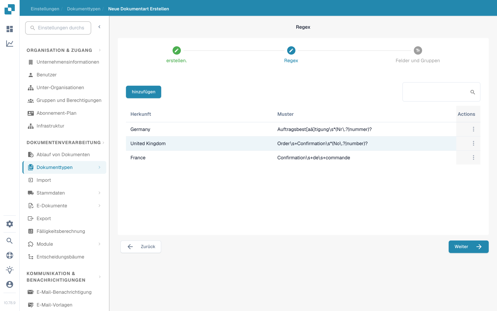

# Regex Manager

Diese Funktion von DocBits bietet Ihnen eine Alternative zur modellbasierten Klassifizierung, da Sie damit durchsuchbare reguläre Ausdrücke für einen Dokumenttyp schreiben können, zur Klassifizierung und für andere Zwecke.

Dokumenttyp: Mit dem Regex Manager schreiben Sie reguläre Ausdrücke, nach denen anschließend im Dokument gesucht wird. Findet DocBits eine Übereinstimmung mit dem regulären Ausdruck eines definierten Dokumenttyps, ordnet es das Dokument diesem Dokumenttyp zu. Wenn Sie zum Beispiel einen regulären Ausdruck für „Gutschrift“ schreiben und DocBits diesen Begriff in einem Dokument findet, wird das Dokument als Gutschrift klassifiziert.

Dokumentherkunft: Über reguläre Ausdrücke erkennt DocBits auch das Herkunftsland eines Dokuments. Enthält ein regulärer Ausdruck für ein spanisches Dokument zum Beispiel den Begriff „Factura“ und DocBits findet diesen Begriff im Dokument, weiß es, dass das Dokument spanischer Herkunft ist, und ordnet es entsprechend zu.

## **Den Regex Manager öffnen**

Gehen Sie in DocBits zu Einstellungen → Dokumenttypen. Klicken Sie unter „Benutzerdefinierte Dokumenttypen“ auf „Neu“. Geben Sie einen Namen für den Dokumenttyp ein, ergänzen Sie optional eine Beschreibung und aktivieren Sie „Tabelle verfügbar“, wenn das Dokument eine Tabelle enthält. Wählen Sie dann „Regex“ statt „Automatisch“ und klicken Sie auf „Weiter“.

<figure><figcaption>
Wählen Sie „Regex“, um den neuen Dokumenttyp mit regulären Ausdrücken zu klassifizieren.
</figcaption></figure>

## **Regex hinzufügen und entfernen**

Der Schritt „Regex“ zeigt die bereits vorhandenen Regex-Modelle mit Herkunft und Muster sowie die Schaltfläche „hinzufügen“, mit der Sie ein neues Regex-Modell anlegen. Über das Aktionsmenü am Zeilenende verwalten Sie den jeweiligen Eintrag. Mit „Weiter“ gelangen Sie zu „Felder und Gruppen“.

<figure><figcaption>
Vorhandene Regex-Modelle mit Herkunft und Muster. Mit „hinzufügen“ legen Sie ein neues an.
</figcaption></figure>
