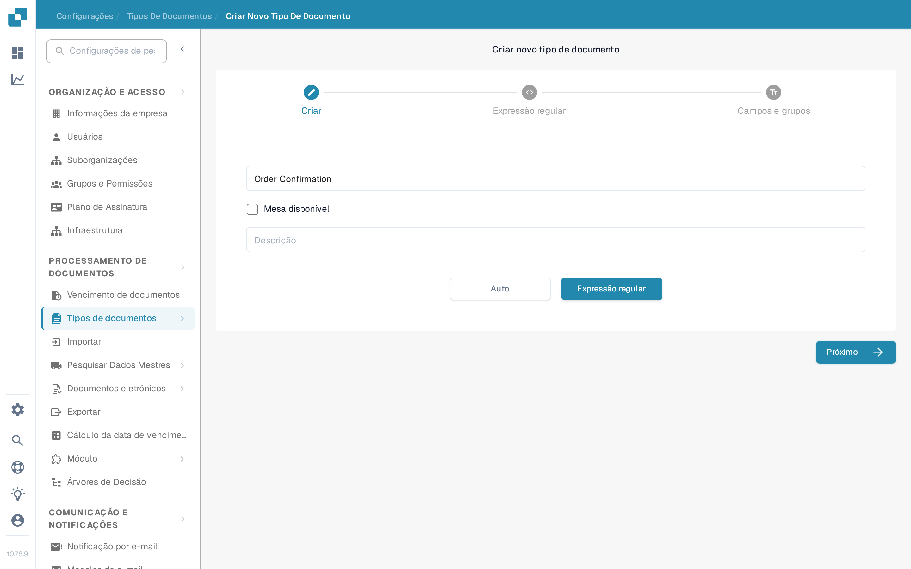

# Regex Manager

Esta funcionalidade do DocBits é uma alternativa à classificação por modelo: permite escrever expressões regulares pesquisáveis para um tipo de documento, para classificação e outros fins.

**Tipo de documento:** O Regex Manager permite escrever expressões regulares, e o DocBits procura essas expressões no documento. Se um documento corresponder à regex de um documento definido, ele é classificado no tipo de documento correspondente. Por exemplo, se escrever uma expressão regular que encontra “Gutschrift”, o DocBits classifica como nota de crédito qualquer documento que contenha esse termo.

**Origem do documento:** Isso indica ao DocBits, por meio de expressões regulares, o país de origem de um documento. Por exemplo, se a expressão regular de um documento espanhol contiver o termo “Factura” e o DocBits encontrar esse termo num documento, ele reconhece que o documento é de origem espanhola e o classifica como tal.

## Acessando o Regex Manager

Para usar esta funcionalidade, vá a Configurações → Tipos de documentos e clique em “Novo”. No assistente “Criar novo tipo de documento”, digite um nome para o tipo de documento e selecione “Expressão regular” em vez de “Auto” como método de extração; em seguida, continue com “Próximo”.

<figure><figcaption>
O assistente “Criar novo tipo de documento” com o nome do tipo de documento e a escolha entre “Auto” e “Expressão regular”.
</figcaption></figure>

## Adicionar e remover Regex

A etapa Regex mostra uma tabela com as expressões regulares existentes, com Origem e Padrão, além do botão “Adicionar” para criar novas entradas de regex.

<figure><figcaption>
A etapa Regex com a tabela das expressões regulares existentes e o botão “Adicionar”.
</figcaption></figure>
