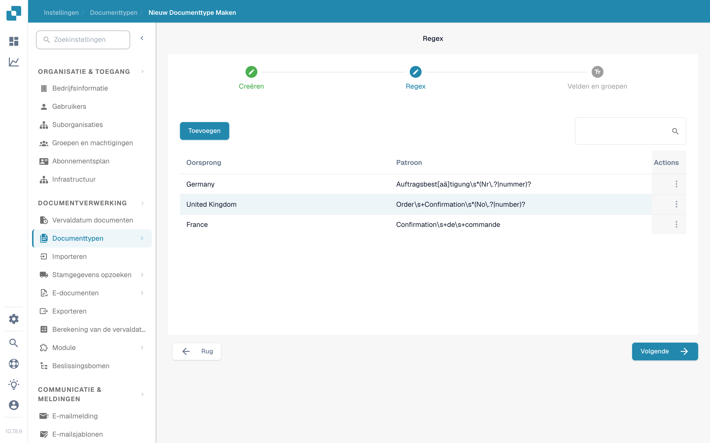

# Regex Manager

Deze functie van DocBits biedt u een alternatief voor modelclassificatie: u kunt er doorzoekbare reguliere expressies voor een documenttype mee schrijven, voor classificatie en andere doeleinden.

Documenttype: met de Regex Manager schrijft u reguliere expressies die vervolgens in het document worden gezocht. Vindt DocBits een overeenkomst met de reguliere expressie van een gedefinieerd document, dan wijst het het document toe aan het bijbehorende documenttype. Als u bijvoorbeeld een reguliere expressie schrijft om “Gutschrift” te vinden en DocBits dit woord in een document vindt, wordt het document als creditnota geclassificeerd.

Documentoorsprong: met reguliere expressies herkent DocBits ook het land van herkomst van een document. Bevat een reguliere expressie voor een Spaans document bijvoorbeeld het woord “Factura” en vindt DocBits dit woord in het document, dan weet het dat het document van Spaanse oorsprong is en classificeert het dit dienovereenkomstig.

## **De Regex Manager openen**

Ga in DocBits naar Instellingen → Documenttypen. Klik onder “Aangepaste documenttypen” op “Nieuw”. Voer een naam voor het documenttype in, voeg eventueel een beschrijving toe en vink “Tafel beschikbaar” aan als het document een tabel bevat. Kies daarna “Regex” in plaats van “Auto” en klik op “Volgende”.

<figure><figcaption>
Kies “Regex” om het nieuwe documenttype met reguliere expressies te classificeren.
</figcaption></figure>

## **Regex toevoegen en verwijderen**

De stap “Regex” toont de bestaande regexmodellen, elk met oorsprong en patroon, en een knop “Toevoegen” om een nieuw regexmodel te maken. Gebruik het actiemenu aan het einde van de rij om dat item te beheren. Klik op “Volgende” om verder te gaan met “Velden en groepen”.

<figure><figcaption>
Bestaande regexmodellen met oorsprong en patroon. “Toevoegen” maakt een nieuw model.
</figcaption></figure>
