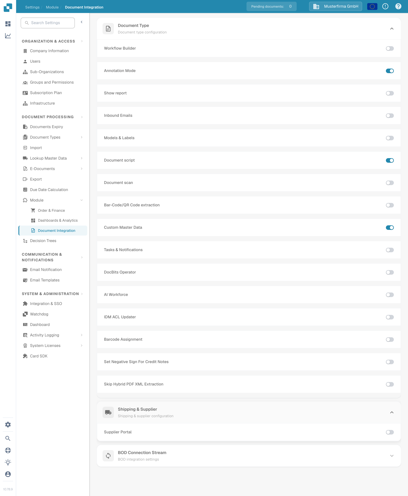

# Supplier Portal: previous interface

This page described an older DocBits screen. Its screenshots and menu names no longer match the current app. For instructions you can follow today, start with the [Supplier Portal guide](supplier-portal/README.md).

## Find the current setting

In DocBits, go to **Settings → Document Processing → Module → Document Integration** and expand **Shipping & Supplier**. The **Supplier Portal** switch is in that section. Your organization may have it switched off; ask an administrator before changing the setting.

<figure><figcaption>
The current Supplier Portal setting is under Document Integration.
</figcaption></figure>

## Continue with the current guides

- [Activate and use Supplier Portal](supplier-portal/README.md)
- [Register a supplier](supplier-portal/supplier-registration.md)
- [Configure supplier settings](../settings/supplier-setting/README.md)
- [Configure the M3 export](../settings/supplier-setting/export-configuration-for-supplier-portal-for-m3.md)

The older screenshots and instructions on this page have been removed so they cannot be mistaken for the current workflow.
