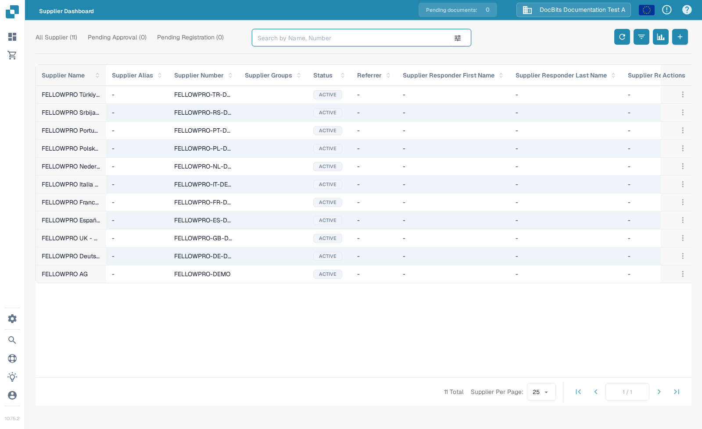
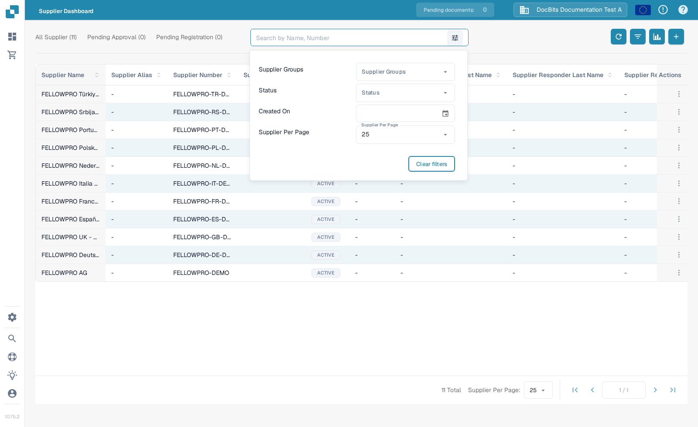
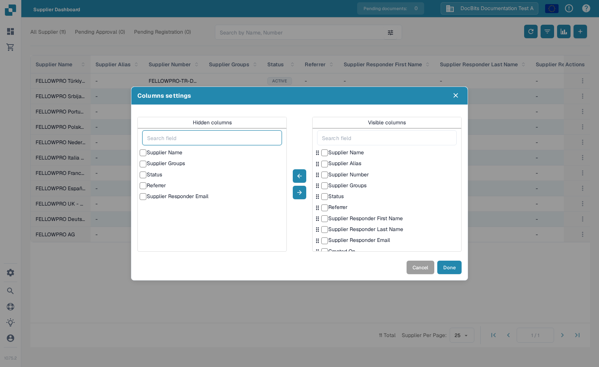
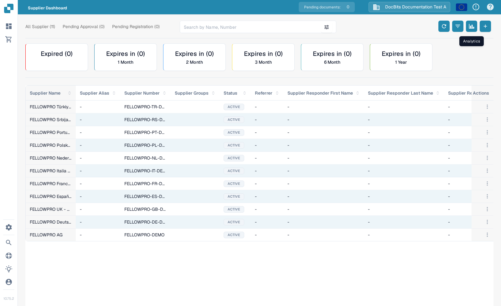
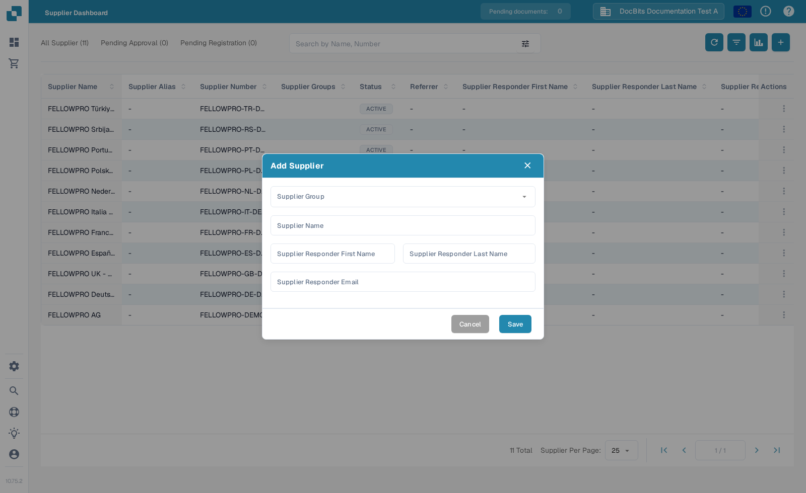
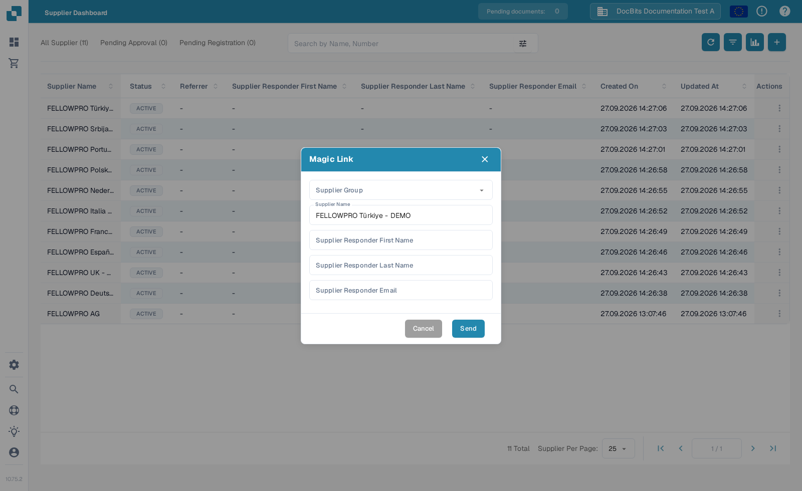

# Supplier Portal

The Supplier Portal lets invited suppliers use DocBits to follow their purchase orders and invoices. Administrators use the **Supplier Dashboard** to find suppliers, review registration status and send invitations.

## Find the portal setting

1. Open **Settings → Document Processing → Module → Document Integration**.
2. Expand **Shipping & Supplier** and find **Supplier Portal**. Turn it on if your organisation has access to the feature. Follow any subscription prompt shown by DocBits.

<figure><figcaption>The switch is off in this example organisation; the image shows where to find it.</figcaption></figure>

When the feature is enabled, **Supplier Settings** provide more configuration. Start with [Supplier General Settings](../../settings/supplier-setting/supplier-general-settings.md) for branding and legal documents, [Email Templates](../../settings/supplier-setting/editing-email-templates.md) for invitations, [Supplier Layout](../../settings/supplier-setting/supplier-layout.md) for registration fields, and [Supplier Permissions](../../settings/supplier-setting/supplier-permissions.md) for access. The [Supplier Settings overview](../../settings/supplier-setting/) links to the remaining options, including Infor M3 export configuration.

## Find suppliers

Open **Supplier Dashboard** from the left navigation. The top tabs show **All Supplier**, **Pending Approval** and **Pending Registration** with their current counts. The table shows each supplier's name, number, group, status and responder details. Select a supplier row to open its details; use the **Actions** menu for an invitation.

<figure><figcaption>The dashboard in the English Sandbox example.</figcaption></figure>

The status badge describes the supplier's current state. For example, the sample suppliers here show **ACTIVE**. The available states can depend on the registration and approval flow configured for your organisation; use the two pending tabs to focus on registrations or approvals that need attention.

### Search and filter

Type a supplier **name or number** in the search field. Select the filter icon inside the field to narrow the list by **Supplier Groups**, **Status** or **Created On**, or to change **Supplier Per Page**. Select **Clear filters** to start again. You can also sort by a table heading and use the pagination controls at the bottom.

<figure><figcaption>The current supplier filters. They do not contain purchase-order amount or delivery-number filters.</figcaption></figure>

### Dashboard controls

The four buttons to the right of the search box are, from left to right:

* **Refresh** reloads the list and current status counts.
* **Columns settings** chooses the visible table columns. Move selected columns between the lists, drag visible columns into the order you want, then select **Done**.
* **Analytics** shows supplier expiry categories above the list; select a category to narrow the results.
* **Add Supplier** opens the invitation form.

<figure><figcaption>Choose which supplier details appear in the dashboard.</figcaption></figure>

<figure><figcaption>Analytics adds expiry categories above the supplier list.</figcaption></figure>

## Invite a supplier

To add a new supplier, select **+** in the dashboard. In **Add Supplier**, choose a **Supplier Group** and enter the supplier name plus the responder's first name, last name and email address. Review the email address before selecting **Save**: saving sends the invitation through the portal. Your organisation may show additional fields in this form.

<figure><figcaption>The invitation form; this example was opened without saving or sending.</figcaption></figure>

To invite an existing supplier again, open the row's three-dot **Actions** menu and choose **Magic Link**. Check the supplier and responder details, then select **Send**. The supplier can follow the link to continue registration; see the [supplier registration guide](supplier-registration.md) for their steps.

<figure><figcaption>Review the recipient details before sending a registration link.</figcaption></figure>
