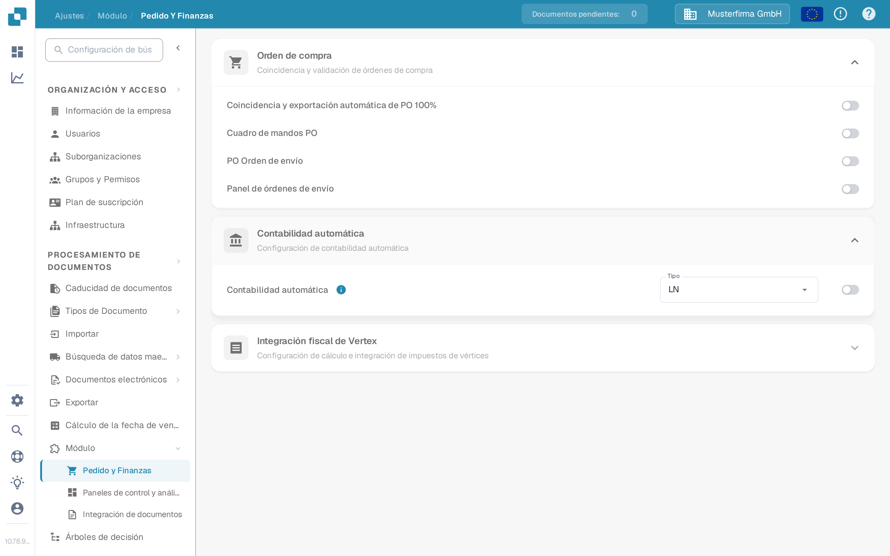
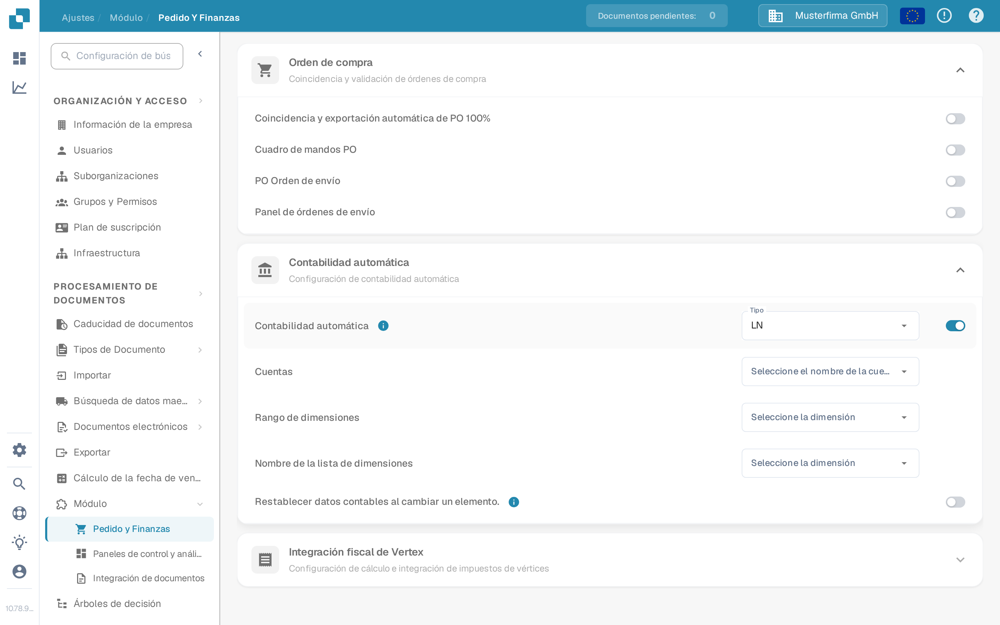

# Contabilidad Automática de Prueba

La Contabilidad Automática necesita un módulo habilitado, datos maestros de contabilidad y una factura con importes o líneas de posición utilizables. Esta guía separa la configuración que puede comprobar antes de abrir una factura de las comprobaciones que requieren una conexión a LN o M3 configurada.

## Comprobar la configuración del módulo

1. Abra **Ajustes → Módulo → Pedido y Finanzas** y expanda **Contabilidad automática**. La ruta antigua **Procesamiento de Documentos → Módulo → Pedido de compra / Contabilidad automática** ya no es la ruta que se muestra en la aplicación actual.
2. Elija el **Tipo** de su sistema conectado (**LN** o **M3**). Active **Contabilidad automática** solo cuando los datos maestros y la conexión necesarios estén listos.
3. Cuando esté activada, seleccione la lista de **Cuentas** y las listas de dimensiones adecuadas para su sistema. Para LN, los campos visibles incluyen **Rango de dimensiones** y **Nombre de la lista de dimensiones**. M3 tiene campos diferentes. Use **Restablecer datos contables al cambiar un elemento.** solo si se pretende un recálculo después de cambiar un elemento.

<figure><figcaption>
La contabilidad automática está desactivada en la organización de prueba de Sandbox en español.
</figcaption></figure>

<figure><figcaption>
Los campos que se muestran cuando la configuración está activada. Se volvió a desactivar después de esta captura; no se configuraron cuentas ni dimensiones.
</figcaption></figure>

## Probar con una factura configurada

Use una factura cuyas líneas de posición y datos maestros de contabilidad estén disponibles. Ábrala en la pantalla de validación y seleccione **Contabilidad automática**. Si la acción no aparece, compruebe la configuración del módulo y si esta factura es elegible. Valide la factura antes de navegar; la aplicación guarda y valida cuando se selecciona la acción.

En la pantalla de contabilidad, verifique lo siguiente con sus propios datos de LN o M3:

1. Ejecute **Validate Setup** donde esté disponible y resuelva la configuración de cuentas o dimensiones que falte antes de continuar. Un resultado verde solo describe las comprobaciones de su entorno.
2. Compruebe si la factura debe asignarse por su **total** o por **líneas de posición individuales**. Compare los importes de contabilidad con la factura original.
3. Si divide un importe, seleccione la cuenta prevista para cada línea dividida. Introduzca importes o porcentajes y compruebe que los valores asignados suman el importe principal. Añada o elimine una línea solo cuando sea necesario.
4. Revise cualquier **Unsettled amount** o advertencia de validación y corríjala antes de guardar o exportar. Confirme el resultado en el sistema conectado por separado.

La organización de prueba de Sandbox utilizada para las capturas de pantalla anteriores no tiene configuradas listas de cuentas y dimensiones ni líneas de posición de factura para este flujo. Por lo tanto, la pantalla de contabilidad, la división y la exportación **no se probaron ni se muestran aquí**. No utilice las capturas de configuración como prueba de que la contabilidad o la exportación tuvieron éxito.

Para la configuración específica del sistema, continúe con la [guía de LN](ln.md) o la [guía de M3](m3.md).
