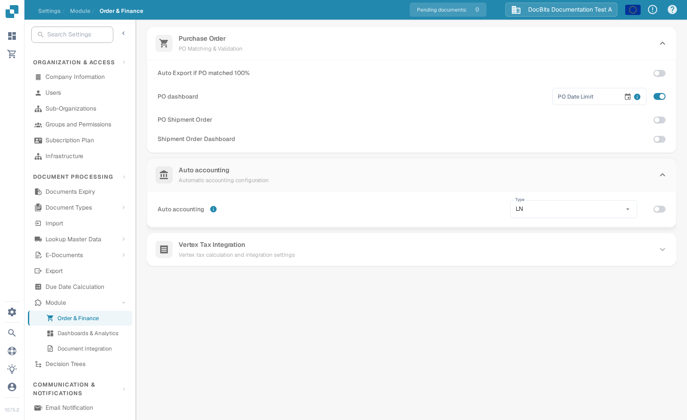
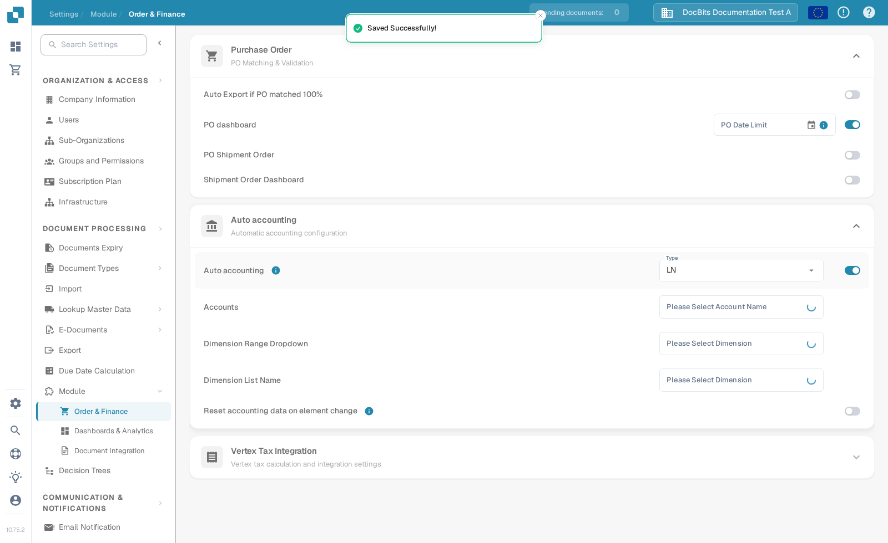

# Test Auto Accounting

Auto Accounting needs an enabled module, accounting master data and an invoice with usable amounts or line items. This guide separates the settings you can check before opening an invoice from the checks that require a configured LN or M3 connection.

## Check the module settings

1. Open **Settings → Module → Order & Finance** and expand **Auto accounting**. The older **Document Processing → Module → Purchase Order / Auto Accounting** path is no longer the route shown in the current application.
2. Choose the **Type** for your connected system (**LN** or **M3**). Turn on **Auto accounting** only when the required master data and connection are ready.
3. When enabled, select the **Accounts** list and the dimension lists appropriate to your system. For LN, the visible fields include **Dimension Range Dropdown** and **Dimension List Name**. M3 has different fields. Use **Reset accounting data on element change** only if recalculation after a changed element is intended.

<figure><figcaption>
Auto accounting is off in the English Sandbox test organisation.
</figcaption></figure>

<figure><figcaption>
The fields shown when the setting is enabled. It was switched off again after this capture; no accounts or dimensions were configured.
</figcaption></figure>

## Test with a configured invoice

Use an invoice whose line items and accounting master data are available. Open it in the validation screen and select **Auto Accounting**. If the action is missing, check the module setting and whether this invoice is eligible. Validate the invoice before navigating; the application saves and validates when the action is selected.

On the accounting screen, verify the following with your own LN or M3 data:

1. Run **Validate Setup** where available and resolve missing account or dimension configuration before proceeding. A green result only describes the checks in your environment.
2. Check whether the invoice should be assigned by its **total** or by **individual line items**. Compare the accounting amounts with the original invoice.
3. If you split an amount, select the intended account for each split row. Enter amounts or percentages and check that the allocated values add up to the parent amount. Add or remove a row only when needed.
4. Review any **Unsettled amount** or validation warning and correct it before saving or exporting. Confirm the result in the connected system separately.

The Sandbox test organisation used for the screenshots above has no configured account and dimension lists or invoice line items for this flow. The accounting screen, splitting and export were therefore **not tested or pictured here**. Do not use the settings screenshots as proof that accounting or export succeeded.

For system-specific setup, continue with the [LN guide](ln.md) or [M3 guide](m3.md).
