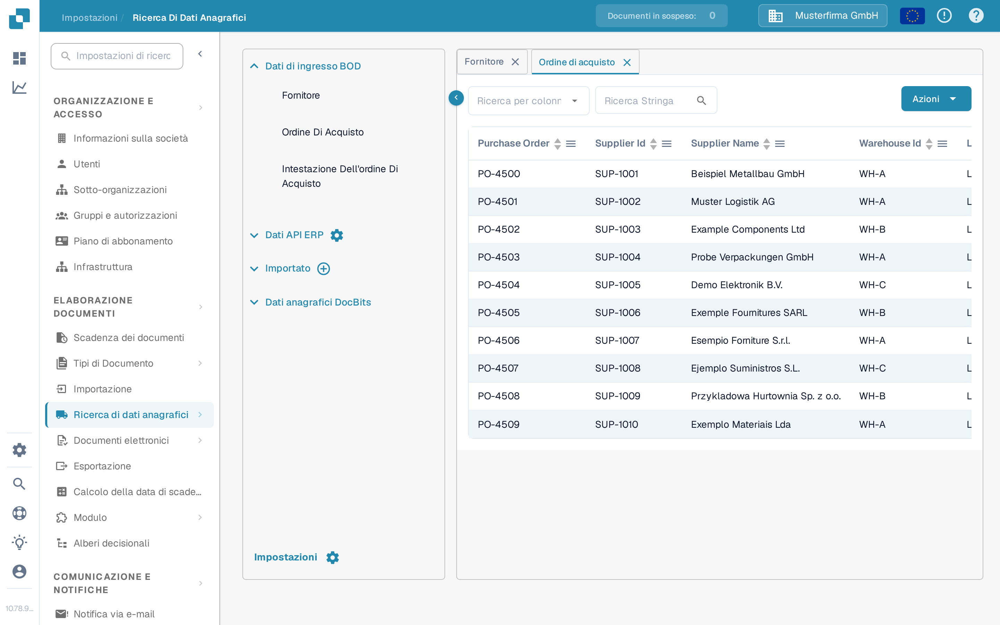

# Abbinamento PO

Per testare la configurazione dell'abbinamento PO devi creare un ordine di acquisto in LN/M3 per verificare se INFOR è sincronizzato con DocBits.&#x20;

## Creazione di un ordine di acquisto in INFOR

* LN: https://docs.infor.com/ln/10.4/en-us/lnolh/docs/ln\_10.4\_procpoug\_\_en-us.pdf&#x20;
* M3: https://docs.infor.com/m3udi/16.x/en-us/m3beud/default.html?helpcontent=ois610.html&#x20;

Dopo aver creato l'ordine di acquisto, apri **Impostazioni → Elaborazione dei documenti → [Ricerca di dati anagrafici](../../settings/document-processing/master-data-lookup.md)** e cerca il numero dell'ordine di acquisto appena creato: ora deve comparire nei dati anagrafici degli ordini di acquisto in DocBits.

<figure><figcaption>
Gli ordini di acquisto compaiono nella Ricerca di dati anagrafici.
</figcaption></figure>

Se qui vedi il tuo numero univoco di ordine di acquisto, DocBits e INFOR sono sincronizzati correttamente.

Ora carica la fattura le cui quantità e prezzi unitari corrispondono all'ordine di acquisto che hai creato. Convalida il documento e seleziona **PO Matching** nella schermata di convalida: la [Schermata di Abbinamento Ordini di Acquisto](../../../end-user-and-partner-section/end-user-section/purchase-order-matching/README.md) spiega come cercare l'ordine di acquisto, controllarne le righe e collegarle alle righe della fattura.

Le righe dell'ordine di acquisto e della fattura dovrebbero corrispondere automaticamente. Seleziona quindi l'opzione di esportazione e verifica che il documento venga esportato senza errori. Se compare un errore di esportazione, crea un ticket per il team di supporto di DocBits seguendo [Crea un ticket](../../../end-user-and-partner-section/end-user-section/technical-support-in-docbits/create-a-ticket.md).

\
