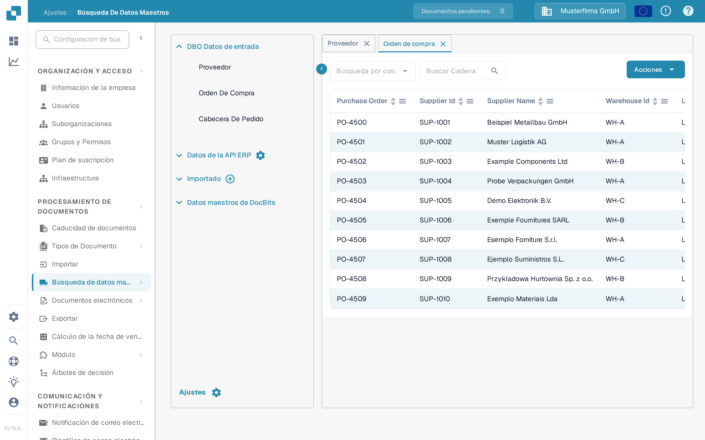

# Coincidencia de Órdenes de Compra

Para probar la configuración de Coincidencia de Órdenes de Compra (PO Matching), debe crear una orden de compra en LN/M3 para comprobar si INFOR está sincronizado con DocBits.&#x20;

## Crear una orden de compra en INFOR

* LN: https://docs.infor.com/ln/10.4/en-us/lnolh/docs/ln\_10.4\_procpoug\_\_en-us.pdf&#x20;
* M3: https://docs.infor.com/m3udi/16.x/en-us/m3beud/default.html?helpcontent=ois610.html&#x20;

Una vez creada la orden de compra, vaya a **Ajustes → Procesamiento de documentos → [Búsqueda de datos maestros](../../settings/document-processing/master-data-lookup.md)** y busque el número de orden de compra que acaba de crear: debería aparecer ya en los datos maestros de órdenes de compra de DocBits.

<figure><figcaption>
Las órdenes de compra aparecen en la Búsqueda de datos maestros.
</figcaption></figure>

Si ve aquí su número de orden de compra, DocBits e INFOR están sincronizados correctamente.

Ahora suba la factura cuyas cantidades y precios unitarios coinciden con la orden de compra que creó. Valide el documento y seleccione **PO Matching** en la pantalla de validación: la [Pantalla de Coincidencia de Órdenes de Compra](../../../end-user-and-partner-section/end-user-section/purchase-order-matching/README.md) explica cómo buscar la orden de compra, revisar sus líneas y conectarlas con las líneas de la factura.

Las líneas de la orden de compra y de la factura deberían coincidir automáticamente. Después, seleccione la opción de exportación y compruebe si el documento se exporta sin errores. Si aparece un error de exportación, cree un ticket para el equipo de soporte de DocBits siguiendo [Crear un ticket](../../../end-user-and-partner-section/end-user-section/technical-support-in-docbits/create-a-ticket.md).

\
