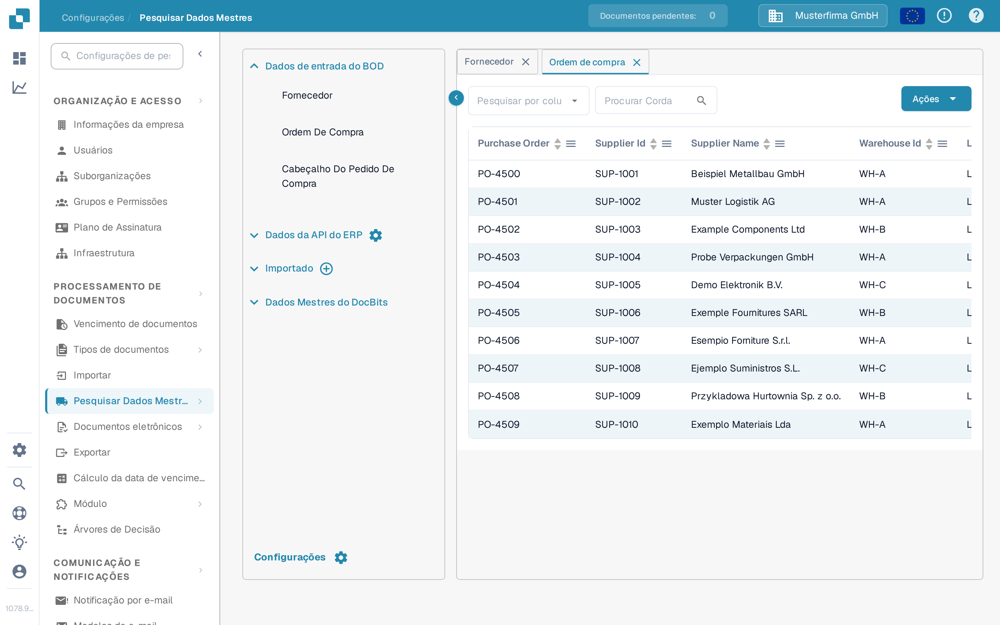

# Correspondência de Ordens de Compra (PO Matching)

Para testar a sua configuração de PO Matching, crie uma ordem de compra no LN/M3 para verificar se o INFOR está sincronizado com o DocBits.&#x20;

## Criar uma ordem de compra no INFOR

* LN: https://docs.infor.com/ln/10.4/en-us/lnolh/docs/ln\_10.4\_procpoug\_\_en-us.pdf&#x20;
* M3: https://docs.infor.com/m3udi/16.x/en-us/m3beud/default.html?helpcontent=ois610.html&#x20;

Depois de criar a ordem de compra, aceda a **Configurações → Processamento de Documentos → [Pesquisar Dados Mestres](../../settings/document-processing/master-data-lookup.md)** e pesquise o número da ordem de compra que acabou de criar: ele deve agora aparecer nos dados mestres de ordens de compra no DocBits.

<figure><figcaption>
As ordens de compra aparecem em Pesquisar Dados Mestres.
</figcaption></figure>

Se vir aqui o seu número de ordem de compra, o DocBits e o INFOR estão corretamente sincronizados.

Carregue agora a fatura cujas quantidades e preços unitários correspondem à ordem de compra que criou. Valide o documento e selecione **PO Matching** no ecrã de validação: a [Tela de Correspondência de Ordem de Compra](../../../end-user-and-partner-section/end-user-section/purchase-order-matching/README.md) explica como pesquisar a ordem de compra, verificar as linhas e associá-las às linhas da fatura.

As linhas da ordem de compra e da fatura devem corresponder automaticamente. Selecione depois a opção de exportação e verifique se o documento é exportado sem erros. Se ocorrer um erro de exportação, crie um ticket para a equipa de suporte do DocBits através de [Criar um ticket](../../../end-user-and-partner-section/end-user-section/technical-support-in-docbits/create-a-ticket.md).

\
