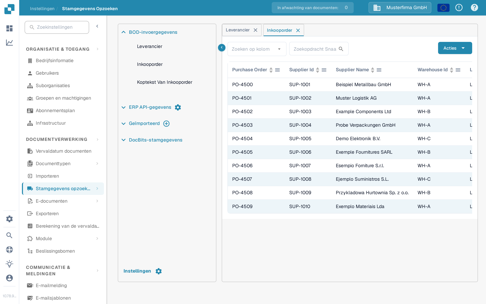

# Inkooporders matchen (PO Matching)

Om uw PO Matching-configuratie te testen, moet u een inkooporder aanmaken in LN/M3 om te controleren of INFOR is gesynchroniseerd met DocBits.&#x20;

## Een inkooporder aanmaken in INFOR

* LN: https://docs.infor.com/ln/10.4/en-us/lnolh/docs/ln\_10.4\_procpoug\_\_en-us.pdf&#x20;
* M3: https://docs.infor.com/m3udi/16.x/en-us/m3beud/default.html?helpcontent=ois610.html&#x20;

Zodra u de inkooporder hebt aangemaakt, gaat u naar **Instellingen → Documentverwerking → [Stamgegevens opzoeken](../../settings/document-processing/master-data-lookup.md)** en zoekt u het inkoopordernummer van de zojuist aangemaakte order: dit moet nu verschijnen in de stamgegevens van inkooporders in DocBits.

<figure><figcaption>
Inkooporders verschijnen in Stamgegevens opzoeken.
</figcaption></figure>

Als u hier uw inkoopordernummer ziet, zijn DocBits en INFOR correct gesynchroniseerd.

Upload nu de factuur waarvan de aantallen en eenheidsprijzen overeenkomen met de inkooporder die u hebt aangemaakt. Valideer het document en selecteer **PO Matching** op het validatiescherm: het [Scherm voor het matchen van inkooporders](../../../end-user-and-partner-section/end-user-section/purchase-order-matching/README.md) legt uit hoe u de inkooporder opzoekt, de regels controleert en deze aan de factuurregels koppelt.

De regels van de inkooporder en de factuur zouden automatisch moeten overeenkomen. Selecteer vervolgens de exportoptie en controleer of het document zonder fouten wordt geëxporteerd. Als er een exportfout optreedt, maakt u een ticket aan voor het DocBits-supportteam via [Maak een ticket aan](../../../end-user-and-partner-section/end-user-section/technical-support-in-docbits/create-a-ticket.md).

\
