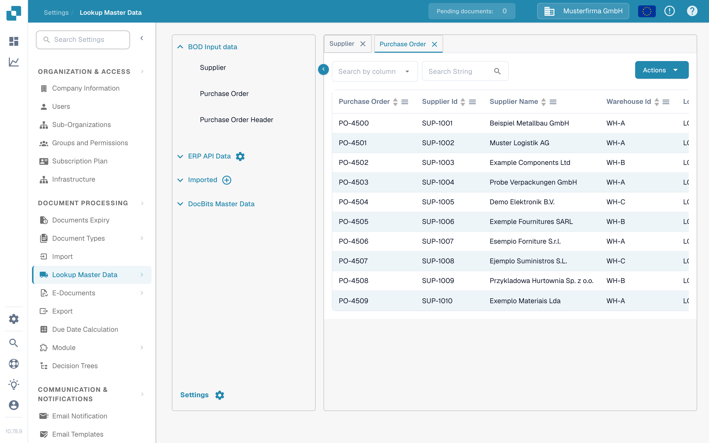

# PO Matching

When it comes to testing your PO Matching configuration, you will need to create a Purchase order in LN/M3 in order to check whether INFOR is synced with DocBits.&#x20;

## Creating a Purchase Order in INFOR

* LN: https://docs.infor.com/ln/10.4/en-us/lnolh/docs/ln\_10.4\_procpoug\_\_en-us.pdf&#x20;
* M3: https://docs.infor.com/m3udi/16.x/en-us/m3beud/default.html?helpcontent=ois610.html&#x20;

Once you have created your purchase order, go to Settings → Master Data Lookup and search for the purchase order number of the PO you just created as it should now appear in your purchase order master data in DocBits.

<figure><figcaption>
Purchase orders appear in the master data lookup.
</figcaption></figure>

You should see your unique PO number here, this means that DocBits and INFOR are correctly synced.

Now upload your invoice that matches the quantity and unit prices of the purchase order you created. Validate the document and select PO Matching on the validation screen.

The PO and invoice line items should automatically match, then simply select the export option and check whether or not the document gets exported without any errors. If you do encounter an export error, create a ticket for the DocBits support team to assist you. If you are unsure of how to create a ticket within DocBits, please consult our DocBits Overview documentation for assistance.

\

