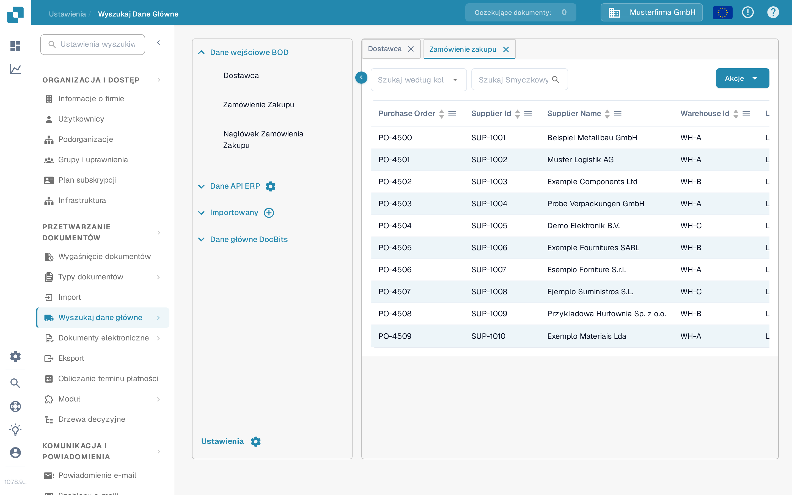

# Dopasowywanie zamówień zakupu (PO Matching)

Aby przetestować konfigurację dopasowywania zamówień zakupu (PO Matching), należy utworzyć zamówienie zakupu w systemie LN/M3, aby sprawdzić, czy INFOR jest zsynchronizowany z DocBits.&#x20;

## Tworzenie zamówienia zakupu w INFOR

* LN: https://docs.infor.com/ln/10.4/en-us/lnolh/docs/ln\_10.4\_procpoug\_\_en-us.pdf&#x20;
* M3: https://docs.infor.com/m3udi/16.x/en-us/m3beud/default.html?helpcontent=ois610.html&#x20;

Po utworzeniu zamówienia zakupu przejdź do **Ustawienia → Przetwarzanie dokumentów → [Wyszukiwanie danych podstawowych](../../settings/document-processing/master-data-lookup.md)** i wyszukaj numer zamówienia zakupu utworzonego przed chwilą zamówienia: powinno ono być już widoczne w danych podstawowych zamówień zakupu w DocBits.

<figure><figcaption>
Zamówienia zakupu pojawiają się w wyszukiwaniu danych podstawowych.
</figcaption></figure>

Jeśli widzisz tutaj swój unikalny numer zamówienia zakupu, oznacza to, że DocBits i INFOR są poprawnie zsynchronizowane.

Teraz prześlij fakturę, której ilości i ceny jednostkowe są zgodne z utworzonym zamówieniem zakupu. Zweryfikuj dokument i wybierz **PO Matching** na ekranie weryfikacji: [Ekran dopasowywania zamówień zakupu](../../../end-user-and-partner-section/end-user-section/purchase-order-matching/README.md) opisuje, jak wyszukać zamówienie, sprawdzić jego pozycje i połączyć je z pozycjami faktury.

Pozycje zamówienia zakupu i faktury powinny dopasować się automatycznie. Następnie wybierz opcję eksportu i sprawdź, czy dokument zostanie wyeksportowany bez błędów. Jeśli napotkasz błąd eksportu, utwórz zgłoszenie dla zespołu wsparcia DocBits, postępując zgodnie z instrukcją [Utwórz zgłoszenie](../../../end-user-and-partner-section/end-user-section/technical-support-in-docbits/create-a-ticket.md).

\
