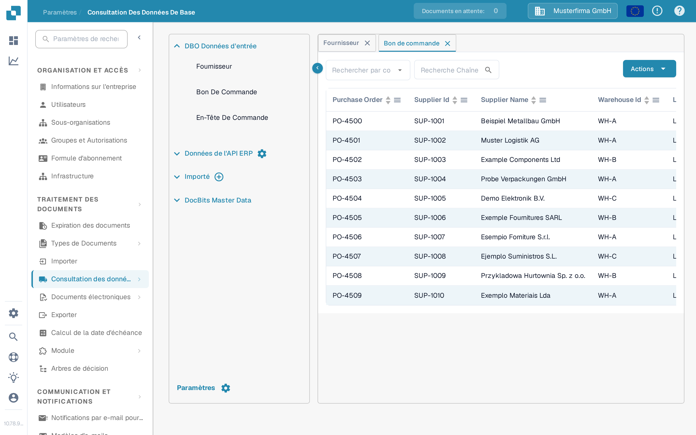

# Correspondance des bons de commande (PO)

Pour tester votre configuration de correspondance des bons de commande (PO Matching), vous devez créer un bon de commande dans LN/M3 afin de vérifier si INFOR est synchronisé avec DocBits.&#x20;

## Créer un bon de commande dans INFOR

* LN: https://docs.infor.com/ln/10.4/en-us/lnolh/docs/ln\_10.4\_procpoug\_\_en-us.pdf&#x20;
* M3: https://docs.infor.com/m3udi/16.x/en-us/m3beud/default.html?helpcontent=ois610.html&#x20;

Une fois le bon de commande créé, ouvrez **Paramètres → Traitement des documents → [Recherche de données de référence](../../settings/document-processing/master-data-lookup.md)** et recherchez le numéro du bon de commande que vous venez de créer : il doit maintenant apparaître dans les données de référence des bons de commande dans DocBits.

<figure><figcaption>
Les bons de commande apparaissent dans la Recherche de données de référence.
</figcaption></figure>

Si vous voyez ici votre numéro de bon de commande, DocBits et INFOR sont correctement synchronisés.

Téléchargez maintenant la facture dont les quantités et les prix unitaires correspondent au bon de commande que vous avez créé. Validez le document et sélectionnez **PO Matching** sur l'écran de validation : l'[Écran de Correspondance des Bons de Commande](../../../end-user-and-partner-section/end-user-section/purchase-order-matching/README.md) explique comment rechercher le bon de commande, vérifier ses lignes et les relier aux lignes de la facture.

Les lignes du bon de commande et de la facture devraient correspondre automatiquement. Sélectionnez ensuite l'option d'exportation et vérifiez si le document est exporté sans erreur. Si une erreur d'exportation apparaît, créez un ticket pour l'équipe de support DocBits en suivant [Créer un ticket](../../../end-user-and-partner-section/end-user-section/technical-support-in-docbits/create-a-ticket.md).

\
