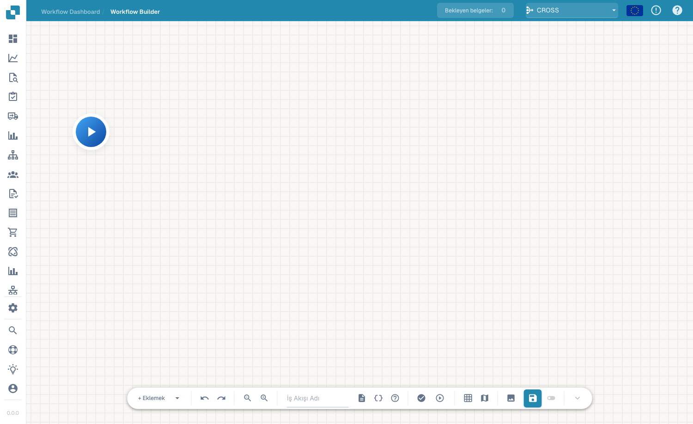
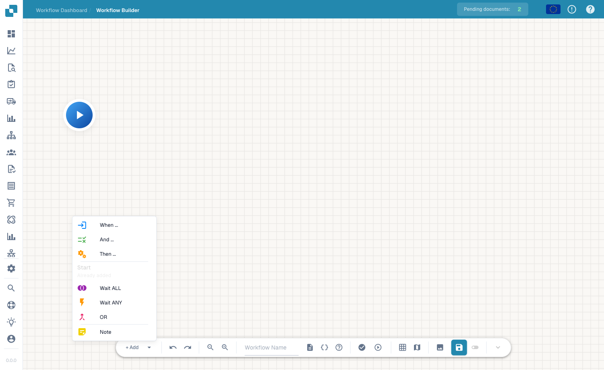

# Advanced Workflow

Le constructeur **Advanced Workflow** est un éditeur de graphe de nœuds pour les workflows nécessitant des branches, des chemins parallèles et un contrôle de flux — au-delà du modèle linéaire When/And/Then du constructeur Standard. Vous disposez des nœuds sur un canevas et les reliez pour définir le flux d'exécution.

## Comment y accéder

Ouvrez le concepteur Advanced Workflow depuis la zone des workflows (le canevas du constructeur avancé). Vous partez d'un nœud **Start** et construisez le flux en ajoutant des nœuds.

<figure><figcaption>
Le canevas de l'Advanced Workflow — un graphe de nœuds avec des commandes de zoom, d'exécution, de grille et d'enregistrement. Donnez un nom au workflow dans la barre d'outils.
</figcaption></figure>

## Ajouter des nœuds

Cliquez sur **+ Add** pour ouvrir le menu des nœuds. En plus des cartes habituelles **When**, **And** et **Then**, le constructeur avancé ajoute des nœuds de contrôle de flux :

<figure><figcaption>
Le menu de nœuds <strong>+ Add</strong> : When / And / Then ainsi que Wait ALL, Wait ANY, OR et Note.
</figcaption></figure>

- **When / And / Then** — les mêmes cartes de condition et d'action que dans le constructeur Standard.
- **Wait ALL** — attend que *toutes* les branches entrantes soient terminées avant de continuer.
- **Wait ANY** — continue dès qu'une *quelconque* branche entrante est terminée.
- **OR** — fait bifurquer le flux vers des chemins alternatifs.
- **Note** — une annotation en texte libre sur le canevas (n'affecte pas l'exécution).

Exécutez le flux avec la commande de lecture, validez-le, puis enregistrez avec le bouton d'enregistrement de la barre d'outils.

## Étapes suivantes

- Découvrez ce que fait chaque carte dans la section **Cards**.
- Pour des automatisations linéaires simples, le constructeur **Standard Workflow** est plus rapide à configurer.
