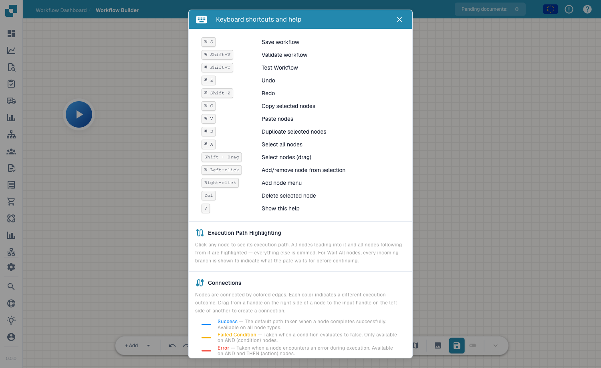

# Toolbar & Canvas

The Advanced Workflow toolbar runs along the bottom of the canvas and gives you everything you need to build, navigate and manage the flow.

## Toolbar controls

- **+ Add** — open the node menu to add a node (see [Nodes](nodes.md)).
- **Undo / Redo** — step backward or forward through your changes.
- **Zoom in / Zoom out** — change the canvas zoom level.
- **Workflow name** — name the workflow inline.
- **Edit description** — add a description for the workflow.
- **Variables** — open the [Variables](variables.md) panel.
- **Help** — open the keyboard shortcuts and help dialog.
- **Validate / Test** — check and run the flow (see [Validation & Testing](validation-and-testing.md)).
- **Snap to grid** — toggle snapping of nodes to the grid for tidy layouts.
- **Mini-map** — toggle a small overview map for navigating large graphs.
- **Save** — save the workflow. An **auto-save** indicator shows when the flow was last saved automatically.

## Keyboard shortcuts

Press <kbd>?</kbd> on the canvas to open the shortcuts and help dialog at any time.

<figure><figcaption>
The keyboard shortcuts and help dialog — shortcuts, execution-path highlighting and connection colours.
</figcaption></figure>

| Shortcut | Action |
|---|---|
| <kbd>Cmd/Ctrl</kbd> + <kbd>S</kbd> | Save workflow |
| <kbd>Cmd/Ctrl</kbd> + <kbd>Shift</kbd> + <kbd>V</kbd> | Validate workflow |
| <kbd>Cmd/Ctrl</kbd> + <kbd>Shift</kbd> + <kbd>T</kbd> | Test workflow |
| <kbd>Cmd/Ctrl</kbd> + <kbd>Z</kbd> / <kbd>Shift</kbd> + <kbd>Z</kbd> | Undo / Redo |
| <kbd>Cmd/Ctrl</kbd> + <kbd>C</kbd> / <kbd>V</kbd> / <kbd>D</kbd> | Copy / Paste / Duplicate selected nodes |
| <kbd>Cmd/Ctrl</kbd> + <kbd>A</kbd> | Select all nodes |
| <kbd>Shift</kbd> + Drag | Select nodes (drag) |
| <kbd>Cmd/Ctrl</kbd> + Left-click | Add/remove node from selection |
| Right-click | Add node menu |
| <kbd>Del</kbd> | Delete selected node |
| <kbd>?</kbd> | Show this help |

## Next steps

- Build the flow with [Nodes](nodes.md) and [Variables](variables.md).
