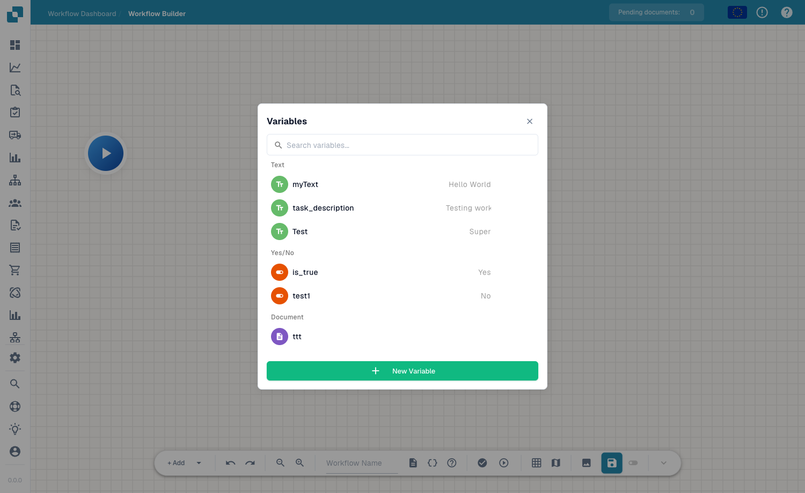

# Promenljive

**Variables** vam omogućavaju da jednom sačuvate vrednosti i ponovo ih koristite u čvorovima naprednog toka rada — na primer prag, fiksnog primaoca ili vrednost koju očitate iz dokumenta i prosledite kasnijem čvoru. Otvorite panel promenljivih pomoću dugmeta **variables** (ikona `{ }`) na traci sa alatkama.

<figure><figcaption>
Panel Variables — promenljive grupisane po tipu, sa pretragom i opcijom <strong>New Variable</strong>.
</figcaption></figure>

## Tipovi promenljivih

Promenljive su grupisane po svom tipu:

- **Text** — tekstualna vrednost (npr. opis ili fiksna oznaka).
- **Yes/No** — logička zastavica (Yes / No).
- **Document** — referenca na dokument ili polje dokumenta.

Koristite polje za pretragu da biste brzo pronašli promenljivu kada lista naraste.

## Kreiranje promenljive

Kliknite na **New Variable**, dajte joj ime i tip i postavite njenu vrednost. Promenljiva tada postaje dostupna za referenciranje iz kartica na vašim čvorovima, tako da konfiguraciju možete držati na jednom mestu i menjati je bez uređivanja svakog čvora.

## Sledeći koraci

- Pogledajte kako čvorovi koriste ove vrednosti u odeljku [Čvorovi](nodes.md).
- Validirajte i pokrenite tok rada u [Validaciji i testiranju](validation-and-testing.md).
