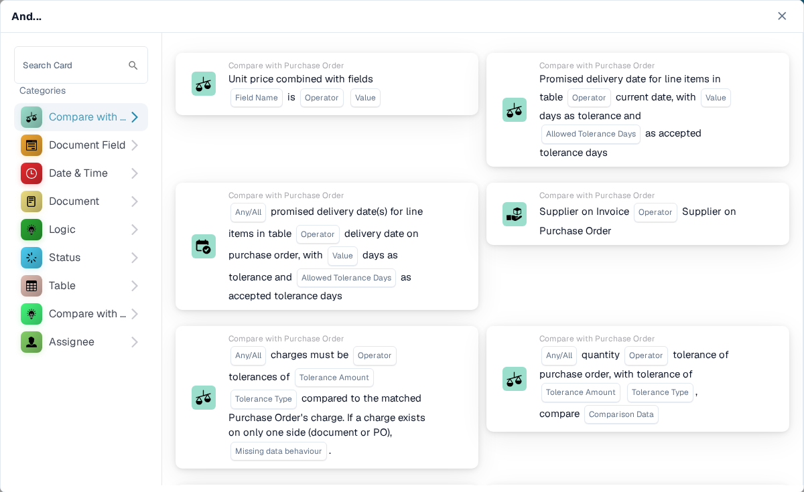
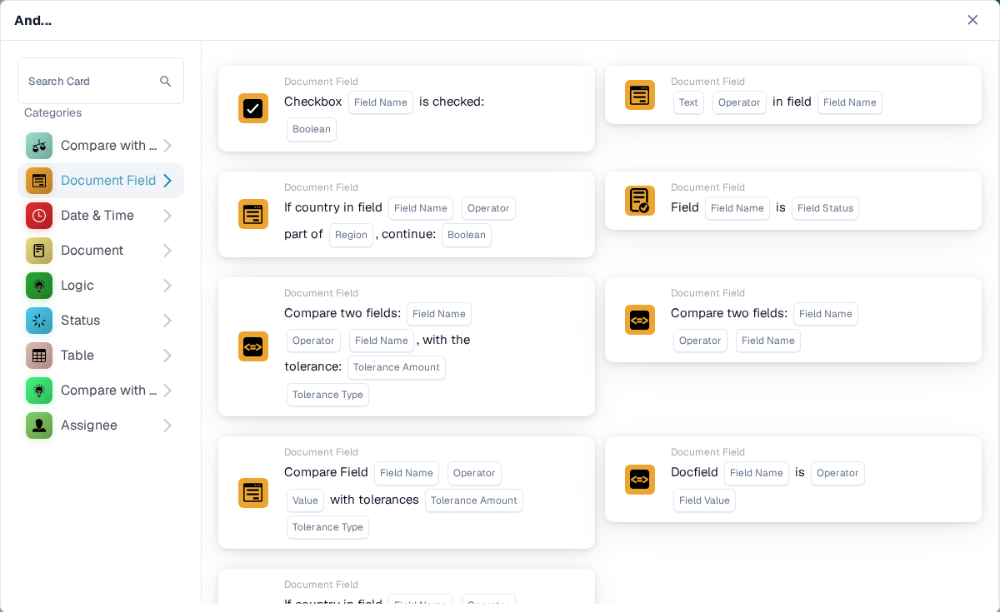
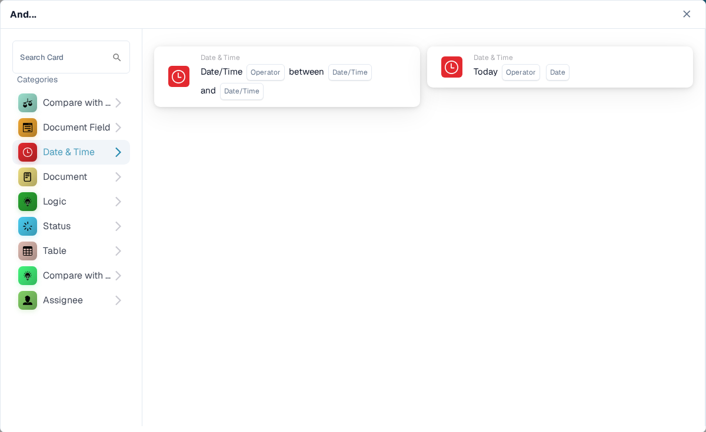
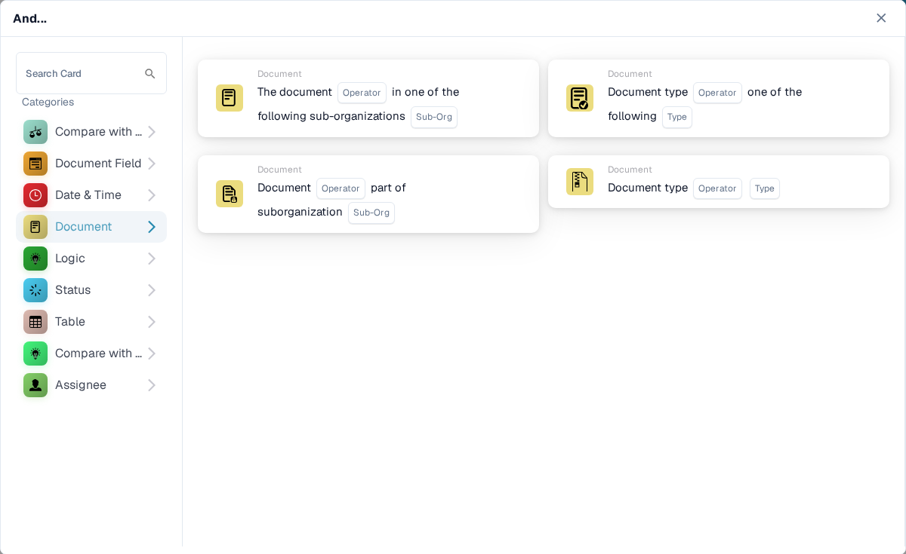
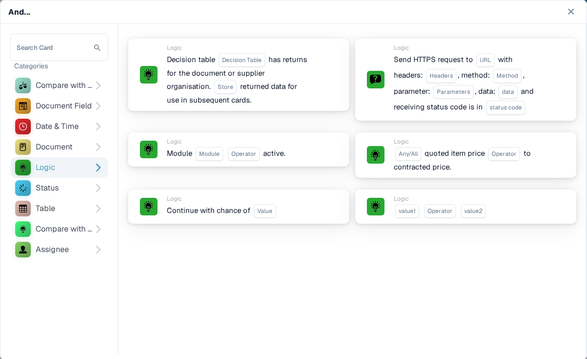
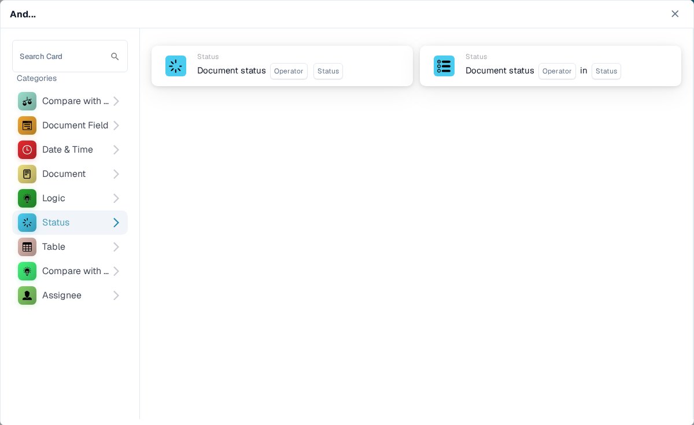
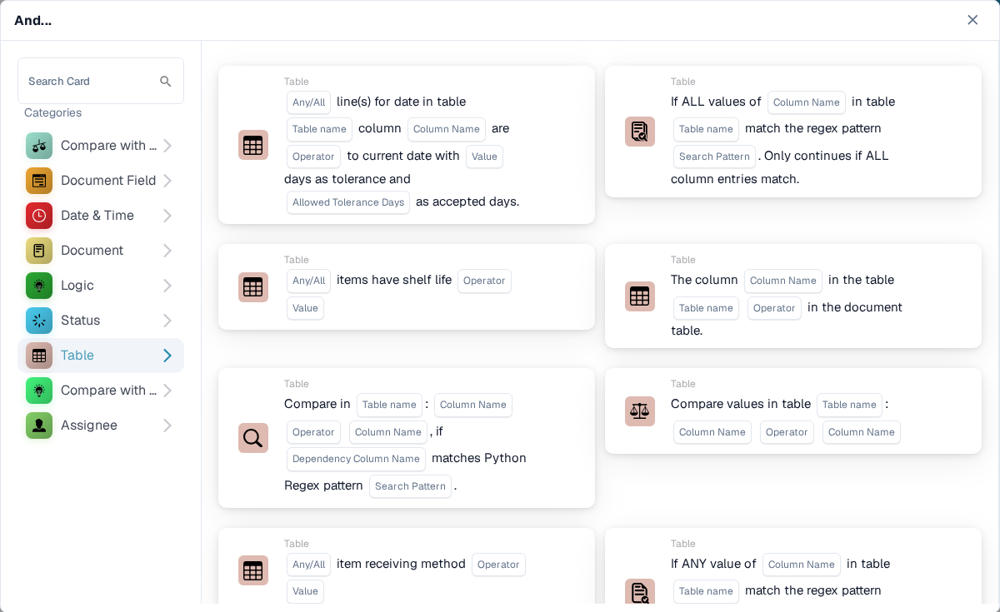
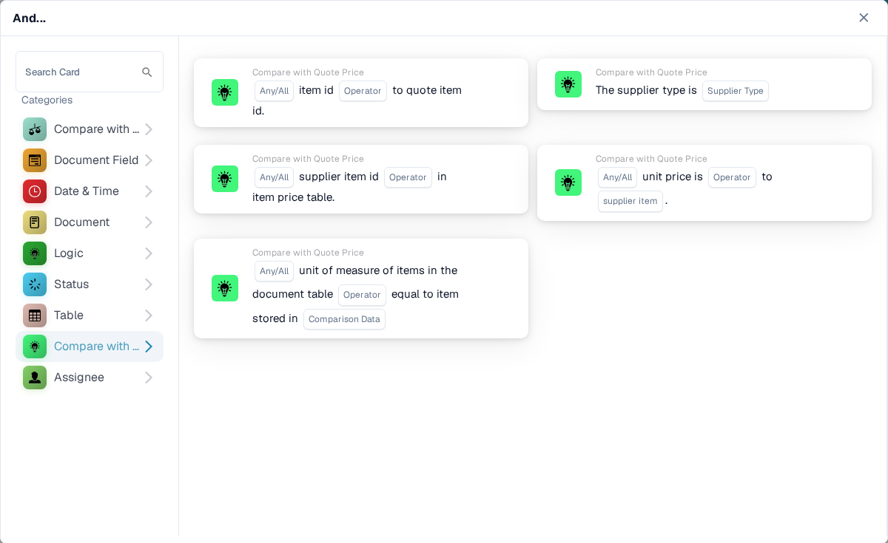
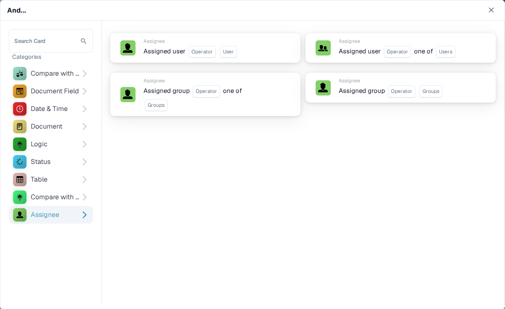

# And: choose a condition card

Use an **And** card to decide whether a workflow should continue after its **When** trigger. Add the checks you need before the **Then** action. Each card shows fields to fill in, such as **Operator**, **Field Name**, or **Value**; the screenshots show the available card templates, not completed rules.

In the **Workflow Builder**, select **Add Card** under **And...**. Choose a category on the left, or type a card name in **Search Card**. Select a card preview to add it to the workflow. You can scroll the preview list to see more cards. Use **×** to close the picker without choosing another card. After configuring the cards, save the workflow. See [Workflow](../README.md) for the surrounding **When**, **And**, and **Then** steps.

## Compare with Purchase Order

Use these cards to compare order or invoice data with a purchase order, such as unit price, promised delivery date, charges, or quantity. Choose the fields, operator, and any tolerance that the selected card asks for. See [Compare with Purchase Order](compare-with-purchase-order/README.md) for the individual cards.

<figure><figcaption>Compare with Purchase Order category in the English Sandbox.</figcaption></figure>

## Document Field

Choose this category to check a checkbox or field status, compare a field with a value, or compare two fields. Fill in the **Field Name** and **Operator** placeholders on the chosen card. Some comparisons also ask for a tolerance. See [Document Field](document-field/README.md).

<figure><figcaption>Document Field checks use values from the current document.</figcaption></figure>

## Date & Time

Use **Date & Time** to compare a date or time with a range, or compare **Today** with a chosen date. Select the **Operator** and date values in the card. See [Date & Time](date-and-time/README.md).

<figure><figcaption>Date & Time offers a range check and a check against today.</figcaption></figure>

## Document

Use these cards when a workflow should depend on the **document type** or **sub-organization**. Choose the type or organization named in the card. See [Document](document/README.md).

<figure><figcaption>Document conditions check type or sub-organization.</figcaption></figure>

## Logic

This category includes checks using a decision table, an HTTPS response, module availability, a quoted item price, a chance value, or two values. Open the specific card and fill in its named placeholders; for example, the HTTPS card asks for a URL, method, and accepted status code. See [Logic](logic/README.md).

<figure><figcaption>Logic offers several different condition types; choose the one that matches your rule.</figcaption></figure>

## Status

Use **Status** to check whether a document has a chosen status or whether its status is in a selected set. Choose the **Operator** and **Status** in the card. See [Status](status/README.md).

<figure><figcaption>Status conditions check the current document state.</figcaption></figure>

## Table

These cards examine document table rows. The visible options include date checks, text patterns, shelf life, and comparisons between columns. Select the **Table name** and **Column Name** before choosing an operator or pattern. See [Table](table/README.md).

<figure><figcaption>Table conditions use rows and columns from a document table.</figcaption></figure>

## Compare with Quote Price

Use these cards to compare an item with quoted price data. The visible choices cover item ID, supplier type, supplier item ID, unit price, and unit of measure. The **Operator** and data placeholders depend on the card you select.

<figure><figcaption>Compare with Quote Price is a separate category in the current card picker.</figcaption></figure>

## Assignee

Use **Assignee** when the condition depends on the assigned user or group. Choose whether to compare with one user or group or a selected set. See [Assignee](assignee/README.md).

<figure><figcaption>Assignee conditions check the user or group assigned to the document.</figcaption></figure>
