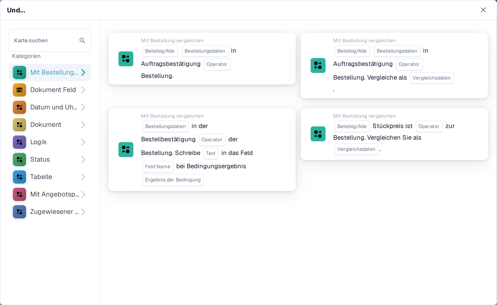
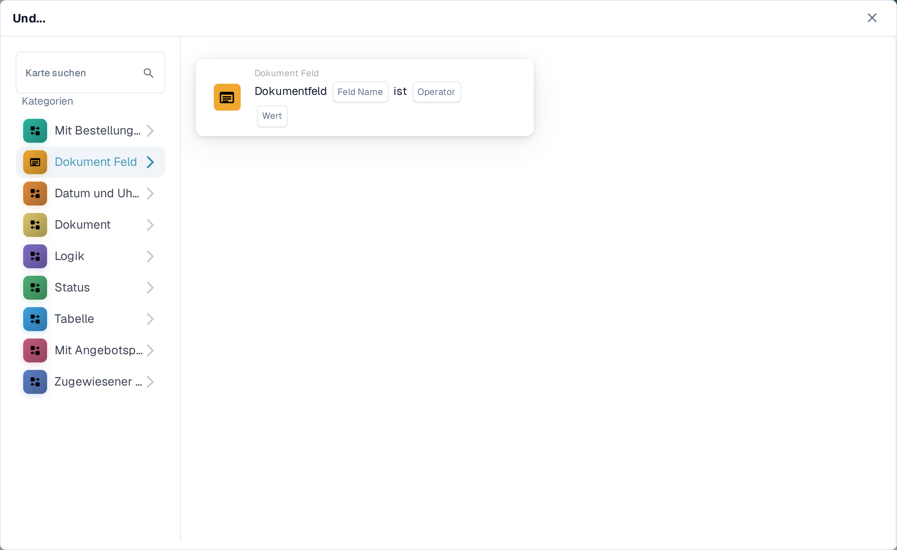
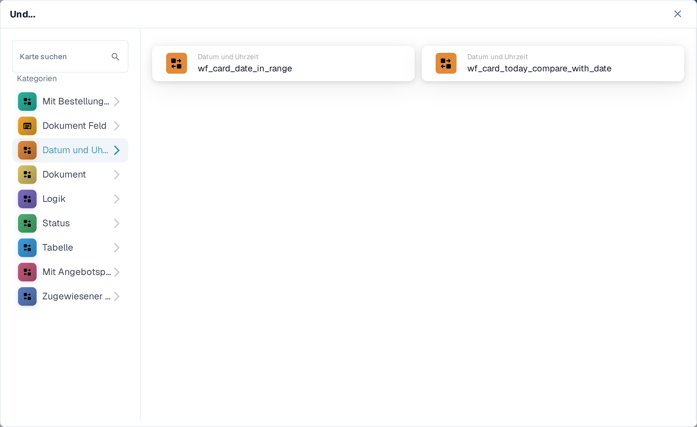
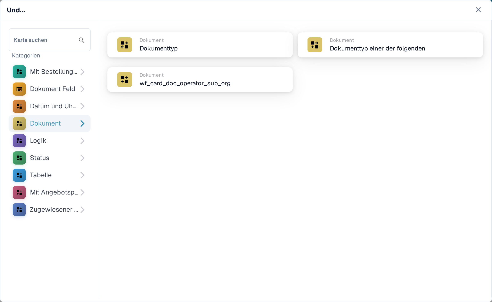
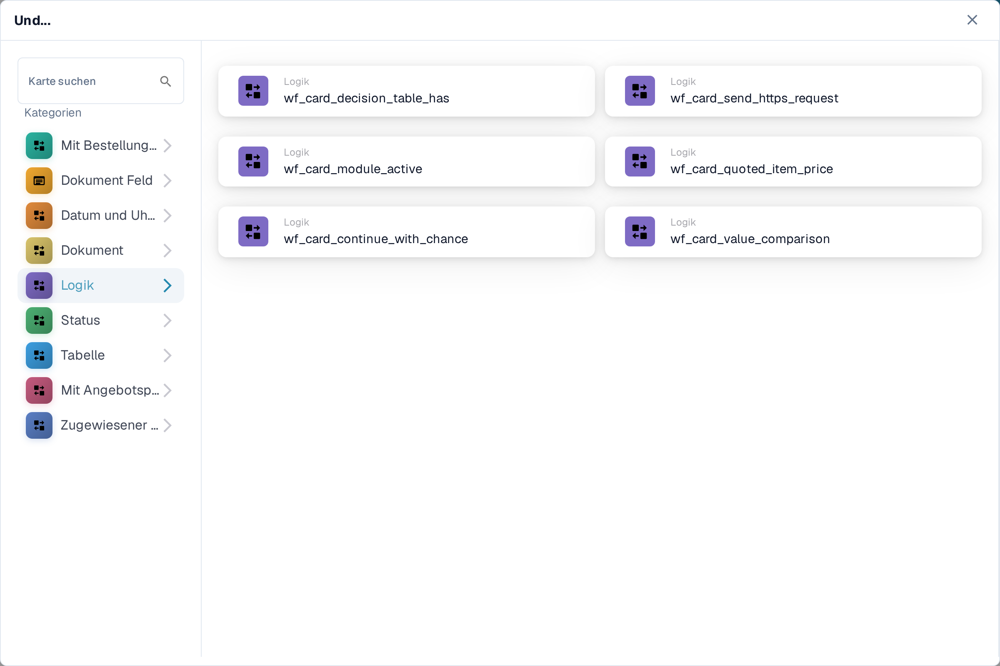
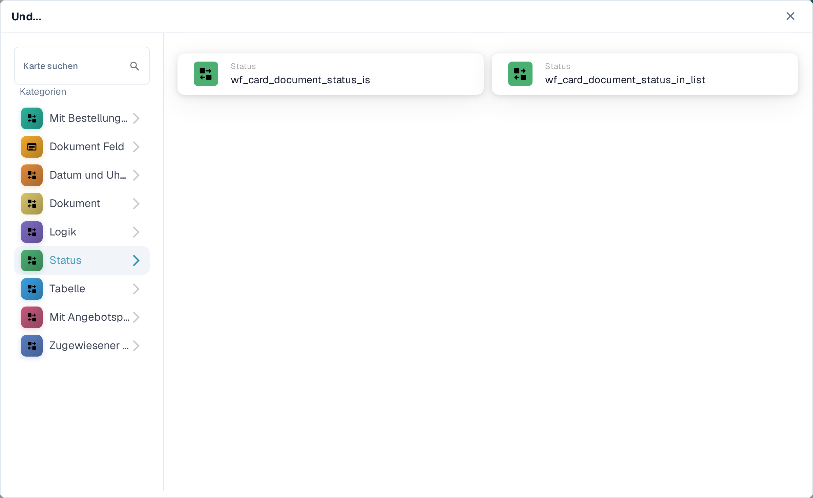
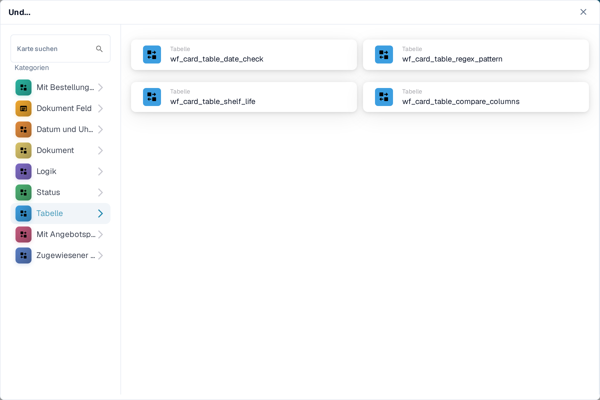
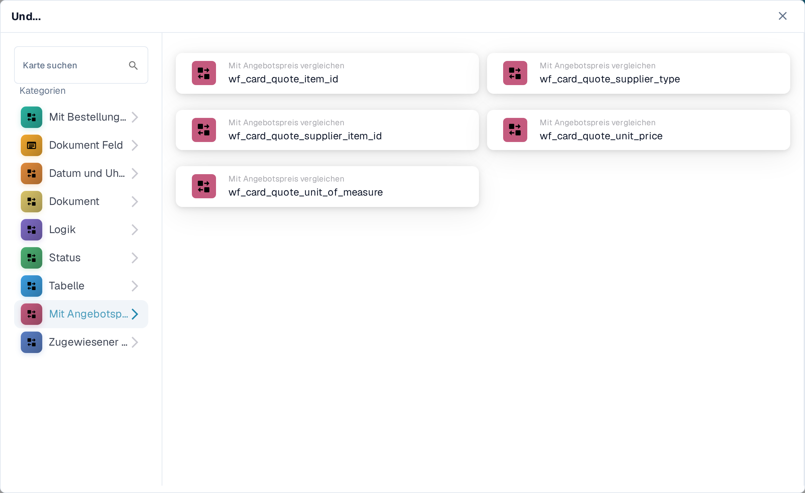
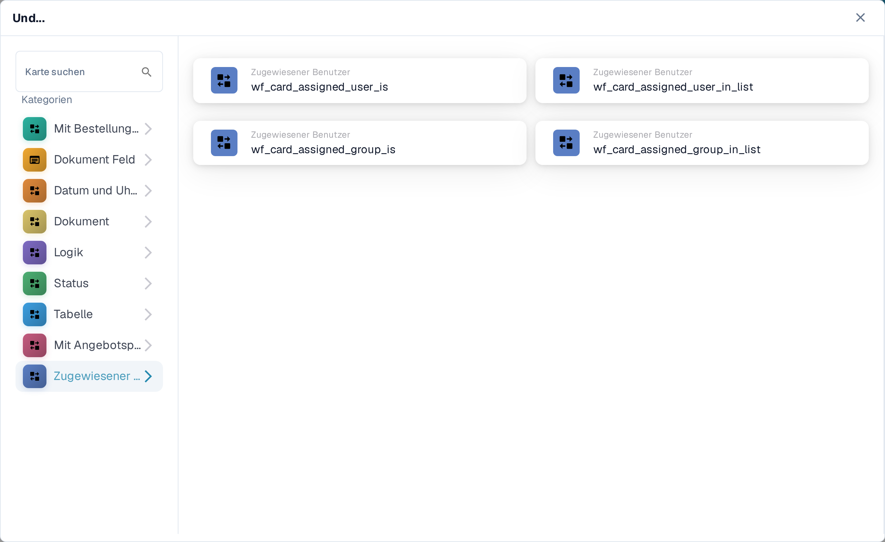

# And: Bedingungskarte auswählen

Eine **And**-Karte entscheidet, ob ein Workflow nach seinem **When**-Auslöser fortgesetzt wird. Fügen Sie die benötigten Prüfungen vor der **Then**-Aktion hinzu. Jede Karte zeigt auszufüllende Felder wie **Operator**, **Feld Name** oder **Wert**; die Screenshots zeigen die verfügbaren Kartenvorlagen, keine fertigen Regeln.

Wählen Sie im **Workflow Builder** unter **Und...** die Option **Karte hinzufügen**. Wählen Sie links eine Kategorie oder geben Sie einen Kartennamen in **Karte suchen** ein. Wählen Sie eine Kartenvorschau aus, um sie dem Workflow hinzuzufügen. Sie können die Vorschau-Liste scrollen, um weitere Karten zu sehen. Wählen Sie **×**, um die Auswahl zu schließen, ohne eine weitere Karte zu wählen. Nach dem Konfigurieren der Karten speichern Sie den Workflow. Siehe [Workflow](../README.md) für die umgebenden Schritte **When**, **And** und **Then**.

## Mit Bestellung vergleichen

Nutzen Sie diese Karten, um Bestell- oder Rechnungsdaten mit einer Bestellung zu vergleichen, etwa Stückpreis, zugesagten Liefertermin, Nebenkosten oder Menge. Wählen Sie die Felder, den Operator und die Toleranz, die die gewählte Karte verlangt. Siehe [Compare with Purchase Order](compare-with-purchase-order/README.md) für die einzelnen Karten.

<figure><figcaption>Die Kategorie <strong>Mit Bestellung vergleichen</strong> in der deutschen Sandbox.</figcaption></figure>

## Dokument Feld

Wählen Sie diese Kategorie, um ein Kontrollkästchen oder einen Feldstatus zu prüfen, ein Feld mit einem Wert zu vergleichen oder zwei Felder zu vergleichen. Füllen Sie auf der gewählten Karte die Platzhalter **Feld Name** und **Operator** aus. Manche Vergleiche verlangen zusätzlich eine Toleranz. Siehe [Document Field](document-field/README.md).

<figure><figcaption>Prüfungen im Bereich <strong>Dokument Feld</strong> verwenden Werte aus dem aktuellen Dokument.</figcaption></figure>

## Datum und Uhrzeit

Mit **Datum und Uhrzeit** vergleichen Sie ein Datum oder eine Uhrzeit mit einem Bereich oder vergleichen **Heute** mit einem gewählten Datum. Wählen Sie **Operator** und Datumswerte in der Karte. Siehe [Date & Time](date-and-time/README.md).

<figure><figcaption><strong>Datum und Uhrzeit</strong> bietet eine Bereichsprüfung und eine Prüfung gegen heute.</figcaption></figure>

## Dokument

Nutzen Sie diese Karten, wenn ein Workflow vom **Dokumenttyp** oder von der **Unterorganisation** abhängen soll. Wählen Sie den Typ oder die Organisation, die in der Karte genannt wird. Siehe [Document](document/README.md).

<figure><figcaption>Bedingungen der Kategorie <strong>Dokument</strong> prüfen den Typ oder die Unterorganisation.</figcaption></figure>

## Logik

Diese Kategorie enthält Prüfungen mit einer Entscheidungstabelle, einer HTTPS-Antwort, der Verfügbarkeit eines Moduls, einem Angebotspreis eines Artikels, einem Zufallswert oder zwei Werten. Öffnen Sie die jeweilige Karte und füllen Sie ihre benannten Platzhalter aus; die HTTPS-Karte fragt zum Beispiel nach URL, Methode und akzeptiertem Statuscode. Siehe [Logic](logic/README.md).

<figure><figcaption><strong>Logik</strong> bietet mehrere Bedingungstypen; wählen Sie den passenden für Ihre Regel.</figcaption></figure>

## Status

Mit **Status** prüfen Sie, ob ein Dokument einen gewählten Status hat oder ob sein Status in einer ausgewählten Menge liegt. Wählen Sie **Operator** und **Status** in der Karte. Siehe [Status](status/README.md).

<figure><figcaption>Status-Bedingungen prüfen den aktuellen Zustand des Dokuments.</figcaption></figure>

## Tabelle

Diese Karten untersuchen Zeilen einer Dokumenttabelle. Die sichtbaren Optionen umfassen Datumsprüfungen, Textmuster, Haltbarkeit und Vergleiche zwischen Spalten. Wählen Sie **Tabellenname** und **Spaltenname**, bevor Sie einen Operator oder ein Muster wählen. Siehe [Table](table/README.md).

<figure><figcaption>Tabellen-Bedingungen verwenden Zeilen und Spalten einer Dokumenttabelle.</figcaption></figure>

## Mit Angebotspreis vergleichen

Nutzen Sie diese Karten, um einen Artikel mit Angebotspreis-Daten zu vergleichen. Die sichtbaren Optionen decken Artikel-ID, Lieferantentyp, Lieferanten-Artikel-ID, Stückpreis und Maßeinheit ab. Die Platzhalter für **Operator** und Daten hängen von der gewählten Karte ab.

<figure><figcaption><strong>Mit Angebotspreis vergleichen</strong> ist eine eigene Kategorie im aktuellen Karten-Picker.</figcaption></figure>

## Zugewiesener Benutzer

Nutzen Sie **Zugewiesener Benutzer**, wenn die Bedingung vom zugewiesenen Benutzer oder von der Gruppe abhängt. Wählen Sie, ob mit einem einzelnen Benutzer oder einer Gruppe oder mit einer ausgewählten Menge verglichen werden soll. Siehe [Assignee](assignee/README.md).

<figure><figcaption>Bedingungen der Kategorie <strong>Zugewiesener Benutzer</strong> prüfen den dem Dokument zugewiesenen Benutzer oder die Gruppe.</figcaption></figure>
