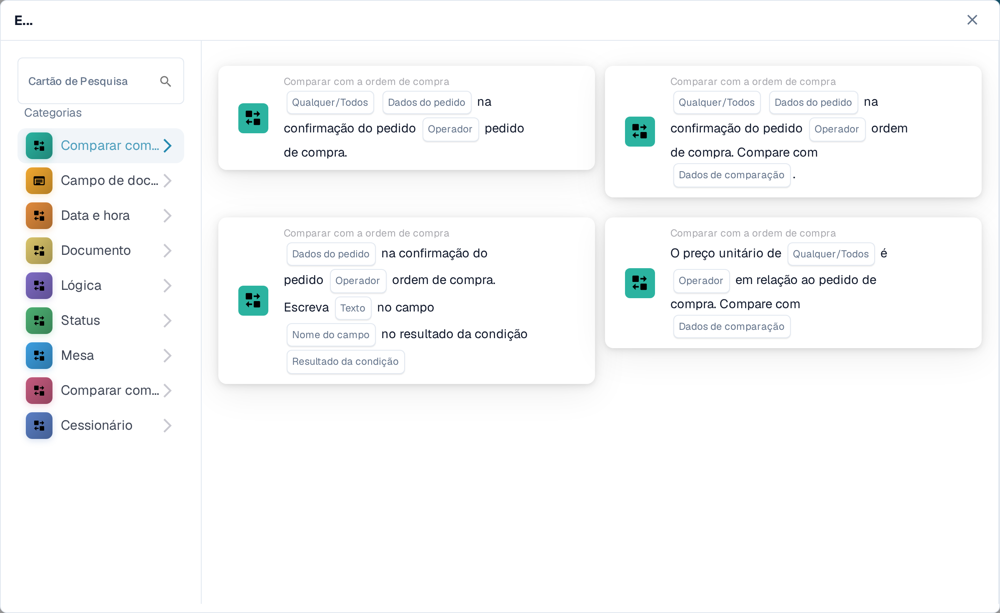
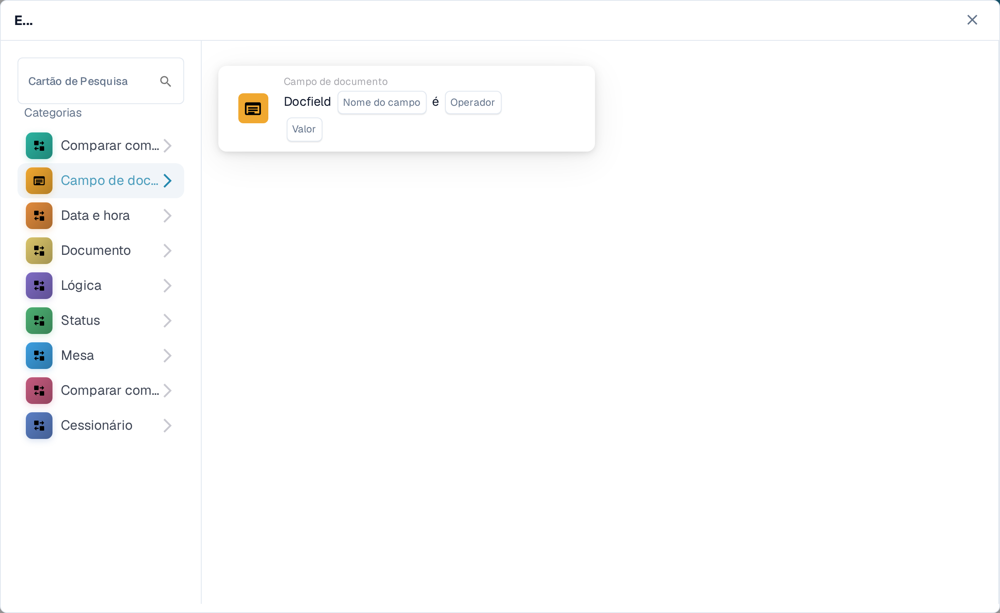
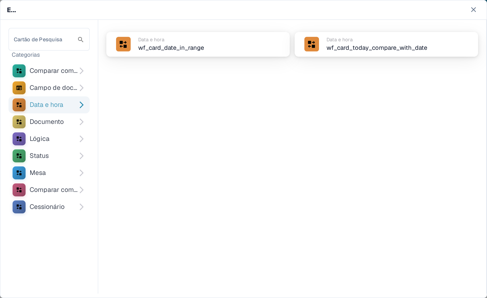
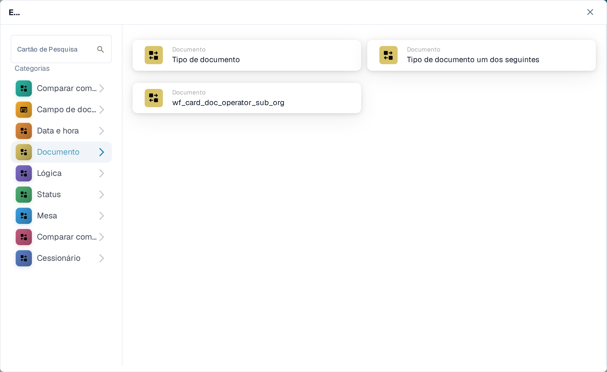
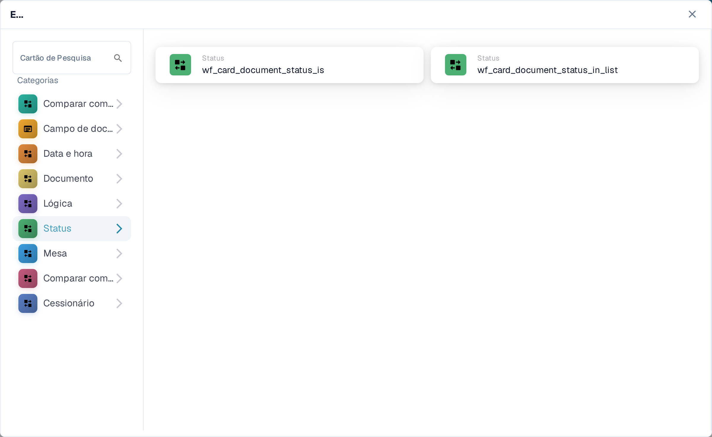

# E: escolher um cartão de condição

Use um cartão **E** para decidir se um fluxo de trabalho deve continuar depois do seu gatilho **Quando**. Adicione as verificações necessárias antes da ação **Então**. Cada cartão mostra campos a preencher, como **Operador**, **Nome do campo** ou **Valor**; as capturas de tela mostram os modelos de cartão disponíveis, não regras concluídas.

No **Construtor De Fluxo De Trabalho**, selecione **Adicionar cartão** em **E....**. Escolha uma categoria à esquerda em **Categorias** ou digite um nome de cartão em **Cartão de Pesquisa**. Selecione uma pré-visualização de cartão para adicioná-la ao fluxo de trabalho. Você pode rolar a lista de pré-visualizações para ver mais cartões. Use **×** para fechar o seletor sem escolher outro cartão. Depois de configurar os cartões, salve o fluxo de trabalho. Consulte [Fluxo de trabalho](../README.md) para ver as etapas **Quando**, **E** e **Então** no conjunto.

## Comparar com a ordem de compra

Use estes cartões para comparar dados do pedido ou da fatura com uma ordem de compra, como preço unitário, data de entrega prometida, encargos ou quantidade. Escolha os campos, o operador e a tolerância que o cartão selecionado pedir. Consulte [Comparar com a ordem de compra](compare-with-purchase-order/README.md) para ver os cartões individuais.

<figure><figcaption>
Categoria Comparar com a ordem de compra no Sandbox em português.
</figcaption></figure>

## Campo de documento

Escolha esta categoria para verificar uma caixa de seleção ou o estado de um campo, comparar um campo com um valor ou comparar dois campos. Preencha os marcadores **Nome do campo** e **Operador** no cartão escolhido. Algumas comparações também pedem uma tolerância. Consulte [Campo de documento](document-field/README.md).

<figure><figcaption>
As verificações de Campo de documento usam valores do documento atual.
</figcaption></figure>

## Data e hora

Use **Data e hora** para comparar uma data ou hora com um intervalo, ou comparar o dia de hoje com uma data escolhida. Selecione o **Operador** e os valores de data no cartão. Consulte [Data e hora](date-and-time/README.md).

<figure><figcaption>
Data e hora oferece uma verificação de intervalo e uma comparação com o dia de hoje.
</figcaption></figure>

## Documento

Use estes cartões quando o fluxo de trabalho depender do **tipo de documento** ou da **suborganização**. Escolha o tipo ou a organização indicado no cartão. Consulte [Documento](document/README.md).

<figure><figcaption>
As condições de Documento verificam o tipo ou a suborganização.
</figcaption></figure>

## Lógica

Esta categoria inclui verificações com uma tabela de decisão, uma resposta HTTPS, a disponibilidade de um módulo, o preço de um item cotado, um valor de probabilidade ou dois valores. Abra o cartão específico e preencha os seus marcadores com nome; por exemplo, o cartão HTTPS pede um URL, um método e um código de estado aceito. Consulte [Lógica](logic/README.md).

<figure><figcaption>
Lógica oferece vários tipos de condição; escolha o que corresponde à sua regra.
</figcaption></figure>

## Status

Use **Status** para verificar se um documento tem um status escolhido ou se o seu status está num conjunto selecionado. Escolha o **Operador** e o **Status** no cartão. Consulte [Status](status/README.md).

<figure><figcaption>
As condições de Status verificam o estado atual do documento.
</figcaption></figure>

## Mesa

Estes cartões examinam as linhas de uma tabela do documento. As opções visíveis incluem verificações de data, padrões de texto, vida útil e comparações entre colunas. Selecione o **nome da tabela** e o **Nome da coluna** antes de escolher um operador ou padrão. Consulte [Mesa](table/README.md).

<figure><figcaption>
As condições de Mesa usam linhas e colunas de uma tabela do documento.
</figcaption></figure>

## Comparar com o preço de cotação

Use estes cartões para comparar um item com dados de preço de cotação. As escolhas visíveis cobrem ID do item, tipo de fornecedor, ID do item do fornecedor, preço unitário e unidade de medida. O **Operador** e os marcadores de dados dependem do cartão selecionado.

<figure><figcaption>
Comparar com o preço de cotação é uma categoria separada no seletor de cartões atual.
</figcaption></figure>

## Cessionário

Use **Cessionário** quando a condição depender do usuário ou grupo atribuído. Escolha se deseja comparar com um usuário ou grupo ou com um conjunto selecionado. Consulte [Cessionário](assignee/README.md).

<figure><figcaption>
As condições de Cessionário verificam o usuário ou grupo atribuído ao documento.
</figcaption></figure>
