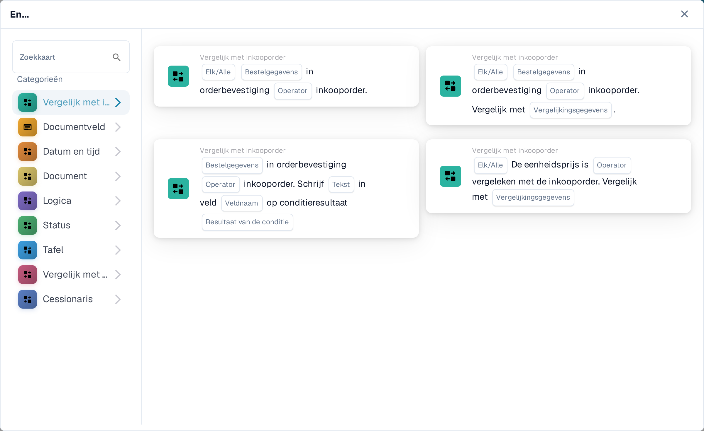
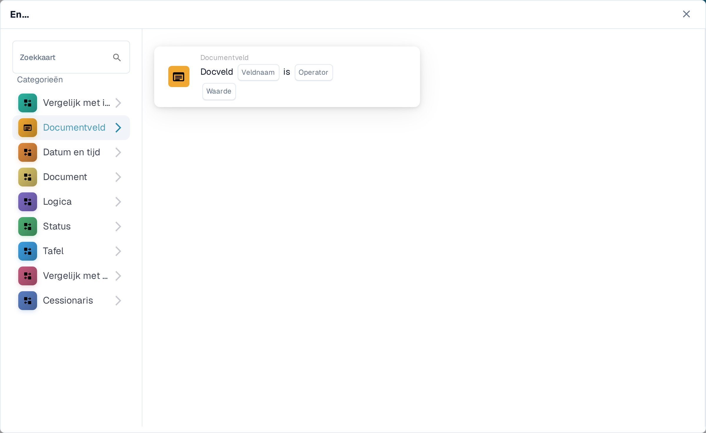
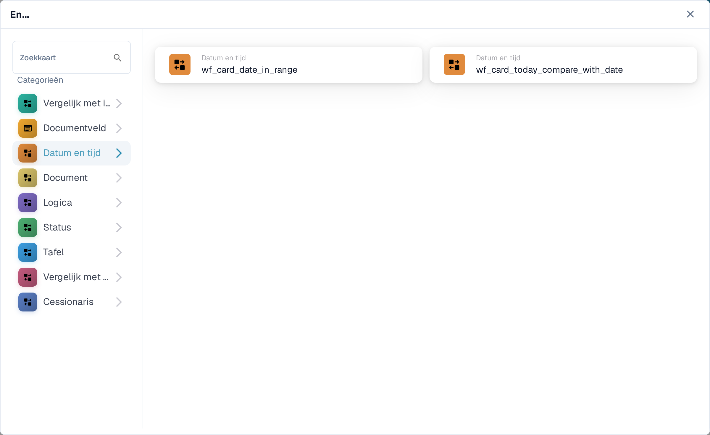
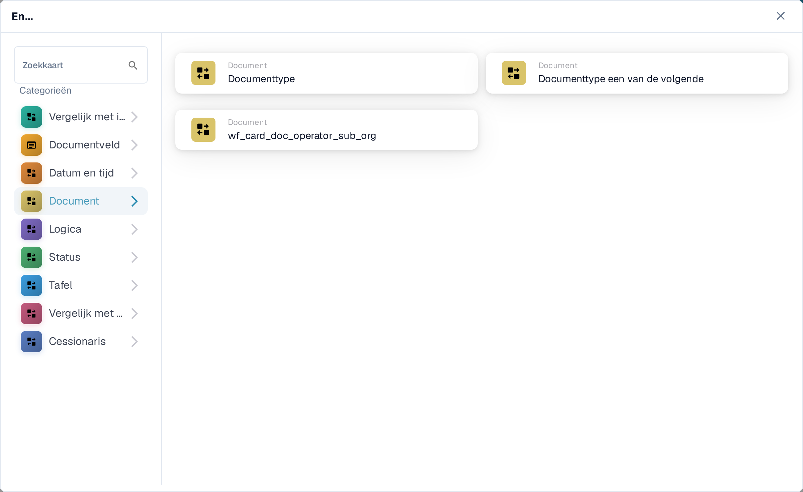
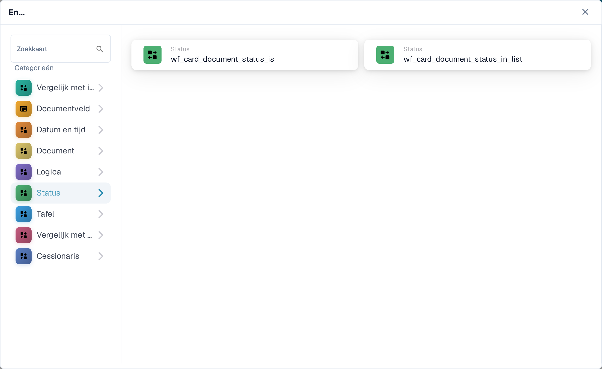
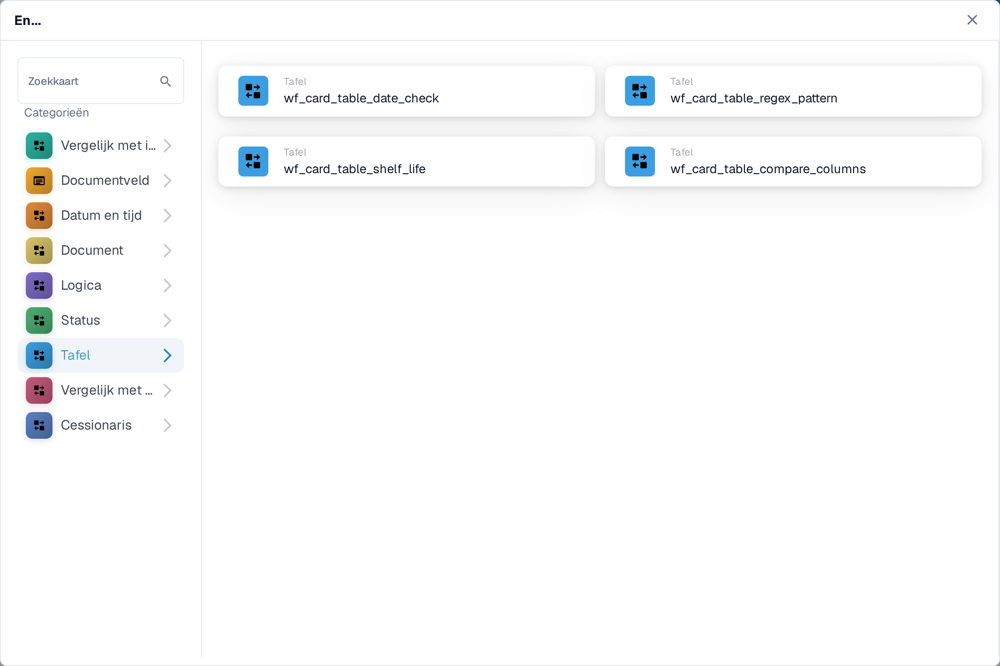
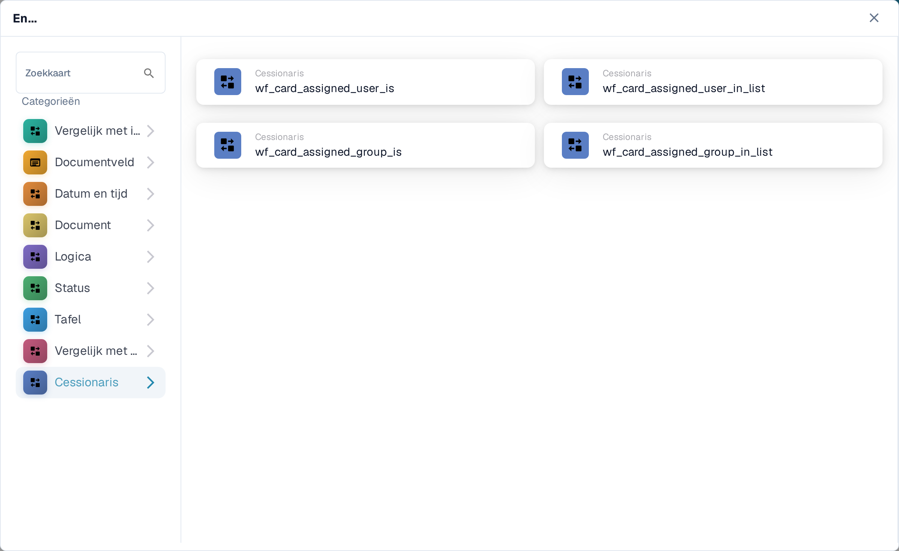

# And: een conditiekaart kiezen

Gebruik een **And**-kaart om te bepalen of een workflow doorgaat na de **When**-trigger. Voeg de controles toe die je nodig hebt vóór de **Then**-actie. Elke kaart toont velden om in te vullen, zoals **Operator**, **Veldnaam** of **Waarde**; de schermafbeeldingen tonen de beschikbare kaartsjablonen, geen voltooide regels.

Kies in de **Workflow Builder** **Kaart toevoegen** onder **En....**. Kies links een categorie of typ een kaartnaam in **Zoekkaart**. Selecteer een kaartvoorbeeld om die aan de workflow toe te voegen. Je kunt door de voorbeeldlijst scrollen om meer kaarten te zien. Gebruik **×** om de keuzelijst te sluiten zonder een andere kaart te kiezen. Sla de workflow op nadat je de kaarten hebt ingesteld. Zie [Workflow](../README.md) voor de omringende **When**-, **En**- en **Dan**-stappen.

## Vergelijk met inkooporder

Gebruik deze kaarten om order- of factuurgegevens te vergelijken met een inkooporder, zoals eenheidsprijs, beloofde leverdatum, toeslagen of hoeveelheid. Kies de velden, de operator en eventuele tolerantie die de geselecteerde kaart vraagt. Zie [Vergelijk met inkooporder](compare-with-purchase-order/README.md) voor de losse kaarten.

<figure><figcaption>Categorie Vergelijk met inkooporder in de Nederlandse Sandbox.</figcaption></figure>

## Documentveld

Kies deze categorie om een selectievakje of veldstatus te controleren, een veld met een waarde te vergelijken of twee velden met elkaar te vergelijken. Vul **Veldnaam** en **Operator** in op de gekozen kaart. Sommige vergelijkingen vragen ook om een tolerantie. Zie [Documentveld](document-field/README.md).

<figure><figcaption>Documentveld-controles gebruiken waarden uit het huidige document.</figcaption></figure>

## Datum en tijd

Gebruik **Datum en tijd** om een datum of tijd met een bereik te vergelijken, of **Vandaag** met een gekozen datum. Kies de **Operator** en datumwaarden op de kaart. Zie [Datum en tijd](date-and-time/README.md).

<figure><figcaption>Datum en tijd biedt een bereikcontrole en een controle tegen vandaag.</figcaption></figure>

## Document

Gebruik deze kaarten als een workflow afhangt van het **documenttype** of de **suborganisatie**. Kies het type of de organisatie die op de kaart wordt genoemd. Zie [Document](document/README.md).

<figure><figcaption>Documentcondities controleren type of suborganisatie.</figcaption></figure>

## Logica

Deze categorie bevat controles met een beslistabel, een HTTPS-antwoord, modulebeschikbaarheid, een offerteprijs, een kanswaarde of twee waarden. Open de specifieke kaart en vul de genoemde velden in; bijvoorbeeld de HTTPS-kaart vraagt om een URL, een methode en een geaccepteerde statuscode. Zie [Logica](logic/README.md).

<figure><figcaption>Logica biedt verschillende conditietypes; kies degene die bij je regel past.</figcaption></figure>

## Status

Gebruik **Status** om te controleren of een document een gekozen status heeft of of de status in een geselecteerde reeks zit. Kies de **Operator** en **Status** op de kaart. Zie [Status](status/README.md).

<figure><figcaption>Statuscondities controleren de huidige documentstatus.</figcaption></figure>

## Tafel

Deze kaarten onderzoeken tabelrijen van het document. De zichtbare opties zijn datumcontroles, tekstpatronen, houdbaarheid en vergelijkingen tussen kolommen. Kies eerst de **Tabelnaam** en **Kolomnaam** voordat je een operator of patroon kiest. Zie [Tafel](table/README.md).

<figure><figcaption>Tafelcondities gebruiken rijen en kolommen uit een documenttabel.</figcaption></figure>

## Vergelijk met offerteprijs

Gebruik deze kaarten om een artikel te vergelijken met offertegegevens. De zichtbare keuzes betreffen artikel-ID, leverancierstype, leveranciersartikel-ID, eenheidsprijs en eenheid. De **Operator** en datavelden hangen af van de kaart die je kiest.

<figure><figcaption>Vergelijk met offerteprijs is een aparte categorie in de huidige kaartkiezer.</figcaption></figure>

## Cessionaris

Gebruik **Cessionaris** wanneer de conditie afhangt van de toegewezen gebruiker of groep. Kies of je met één gebruiker of groep wilt vergelijken of met een geselecteerde reeks. Zie [Cessionaris](assignee/README.md).

<figure><figcaption>Cessionaris-condities controleren de gebruiker of groep die aan het document is toegewezen.</figcaption></figure>
