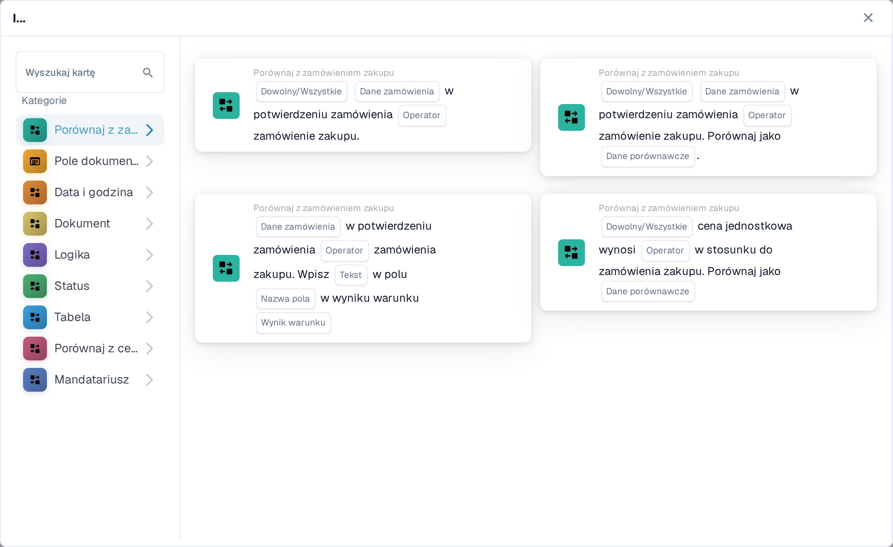
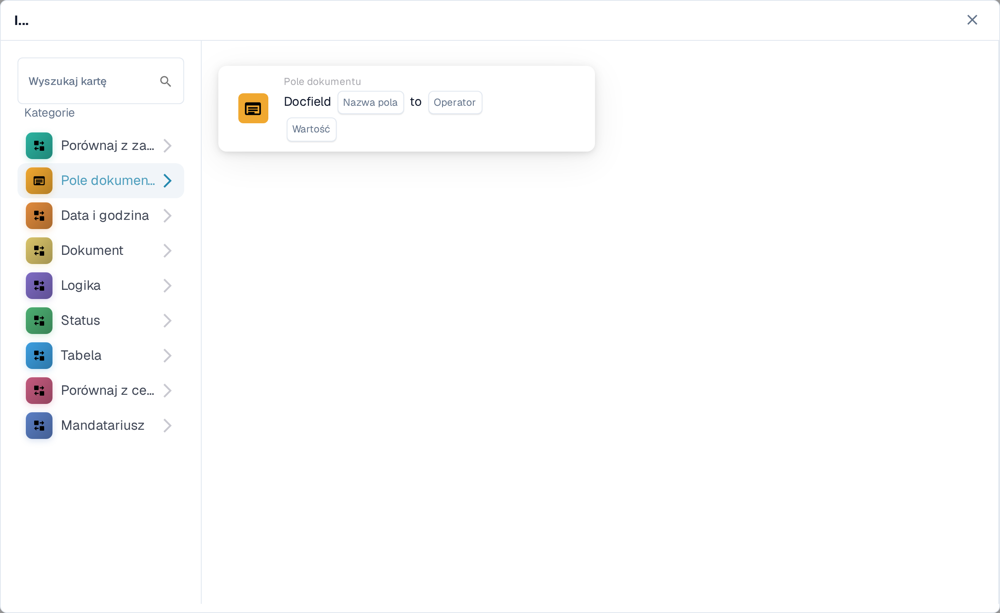
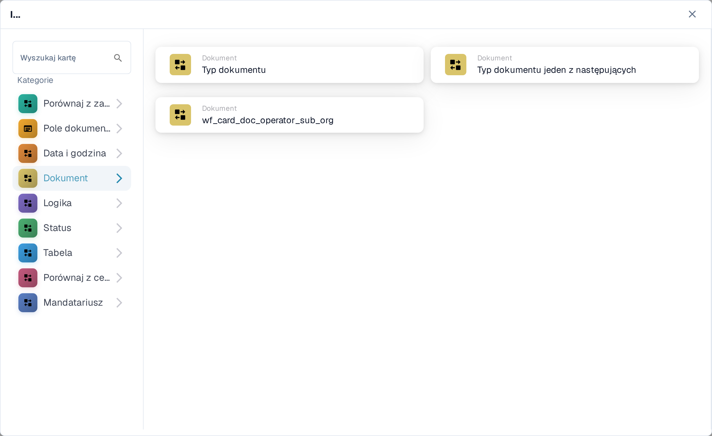
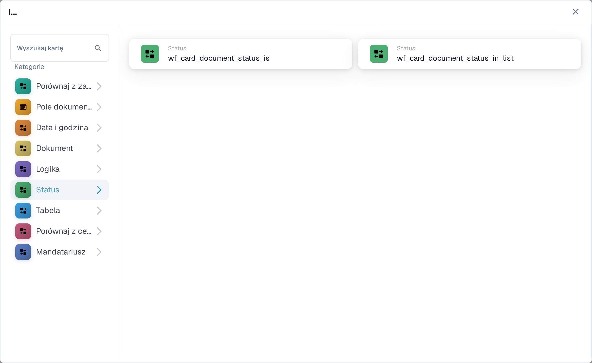
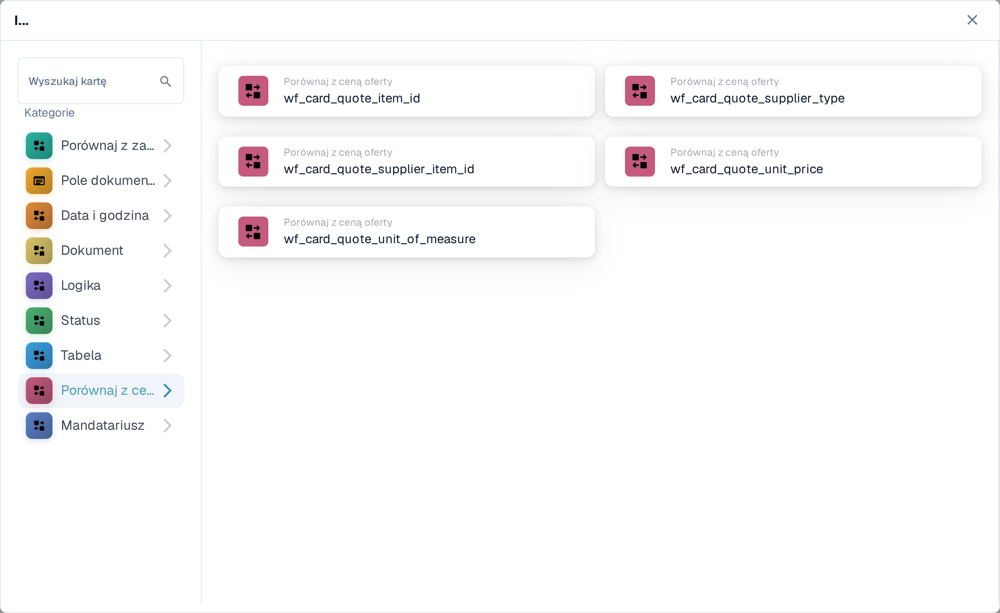

# And: wybór karty warunku

Karty **And** (I) służą do decydowania, czy przepływ pracy ma być kontynuowany po wyzwalaczu **When** (Gdy). Dodaj potrzebne sprawdzenia przed akcją **Then** (Następnie). Każda karta pokazuje pola do wypełnienia, takie jak **Operator**, **Nazwa pola** czy **Wartość**; zrzuty ekranu pokazują dostępne szablony kart, a nie ukończone reguły.

W **Konstruktorze Przepływu Pracy** wybierz **Dodaj kartę** pod sekcją **I...** (And...). Wybierz kategorię po lewej stronie albo wpisz nazwę karty w polu **Wyszukaj kartę**. Wybierz podgląd karty, aby dodać ją do przepływu pracy. Listę podglądów można przewijać, aby zobaczyć więcej kart. Użyj przycisku **×**, aby zamknąć wybór bez dodawania kolejnej karty. Po skonfigurowaniu kart zapisz przepływ pracy. Zobacz [Przepływ pracy](../README.md), aby poznać otaczające kroki **Gdy**, **I** i **Następnie**.

## Porównaj z zamówieniem zakupu

Użyj tych kart, aby porównać dane zamówienia lub faktury z zamówieniem zakupu, na przykład cenę jednostkową, obiecany termin dostawy, opłaty lub ilość. Wybierz pola, operatora i ewentualną tolerancję, o które prosi wybrana karta. Zobacz [Porównaj z zamówieniem zakupu](compare-with-purchase-order/README.md), aby poznać poszczególne karty.

<figure><figcaption>Kategoria Porównaj z zamówieniem zakupu w Sandboxie w języku polskim.</figcaption></figure>

## Pole dokumentu

Wybierz tę kategorię, aby sprawdzić stan pola wyboru lub pola, porównać pole z wartością albo porównać dwa pola. Wypełnij symbole zastępcze **Nazwa pola** i **Operator** na wybranej karcie. Niektóre porównania wymagają także tolerancji. Zobacz [Pole dokumentu](document-field/README.md).

<figure><figcaption>Sprawdzenia Pole dokumentu używają wartości z bieżącego dokumentu.</figcaption></figure>

## Data i godzina

Użyj kategorii **Data i godzina**, aby porównać datę lub godzinę z zakresem albo porównać **Today** (Dziś) z wybraną datą. Wybierz **Operator** i wartości daty na karcie. Zobacz [Data i godzina](date-and-time/README.md).

<figure><figcaption>Data i godzina oferuje sprawdzenie zakresu oraz porównanie z dniem dzisiejszym.</figcaption></figure>

## Dokument

Użyj tych kart, gdy przepływ pracy ma zależeć od **typu dokumentu** lub **suborganizacji**. Wybierz typ lub organizację wskazaną na karcie. Zobacz [Dokument](document/README.md).

<figure><figcaption>Warunki Dokument sprawdzają typ lub suborganizację.</figcaption></figure>

## Logika

Ta kategoria obejmuje sprawdzenia z użyciem tabeli decyzyjnej, odpowiedzi HTTPS, dostępności modułu, ceny pozycji z oferty, wartości prawdopodobieństwa lub dwóch wartości. Otwórz konkretną kartę i wypełnij jej nazwane symbole zastępcze; na przykład karta HTTPS wymaga adresu URL, metody i akceptowanego kodu statusu. Zobacz [Logika](logic/README.md).

<figure><figcaption>Logika oferuje kilka różnych typów warunków; wybierz ten, który pasuje do Twojej reguły.</figcaption></figure>

## Status

Użyj kategorii **Status**, aby sprawdzić, czy dokument ma wybrany status albo czy jego status należy do wybranego zestawu. Wybierz **Operator** i **Status** na karcie. Zobacz [Status](status/README.md).

<figure><figcaption>Warunki Status sprawdzają bieżący stan dokumentu.</figcaption></figure>

## Tabela

Te karty badają wiersze tabeli dokumentu. Widoczne opcje obejmują sprawdzenia dat, wzorce tekstu, termin przydatności oraz porównania między kolumnami. Wybierz **Nazwę tabeli** i **nazwę kolumny**, zanim wybierzesz operatora lub wzorzec. Zobacz [Tabela](table/README.md).

<figure><figcaption>Warunki Tabela używają wierszy i kolumn z tabeli dokumentu.</figcaption></figure>

## Porównaj z ceną oferty

Użyj tych kart, aby porównać pozycję z danymi cenowymi oferty. Widoczne opcje obejmują identyfikator pozycji, typ dostawcy, identyfikator pozycji dostawcy, cenę jednostkową i jednostkę miary. **Operator** i symbole zastępcze danych zależą od wybranej karty.

<figure><figcaption>Porównaj z ceną oferty to osobna kategoria w bieżącym wyborze kart.</figcaption></figure>

## Mandatariusz (osoba przypisana)

Użyj kategorii **Mandatariusz**, gdy warunek zależy od przypisanego użytkownika lub grupy. Wybierz, czy porównywać z jednym użytkownikiem lub grupą, czy z wybranym zestawem. Zobacz [Mandatariusz](assignee/README.md).

<figure><figcaption>Warunki Mandatariusz sprawdzają użytkownika lub grupę przypisaną do dokumentu.</figcaption></figure>
