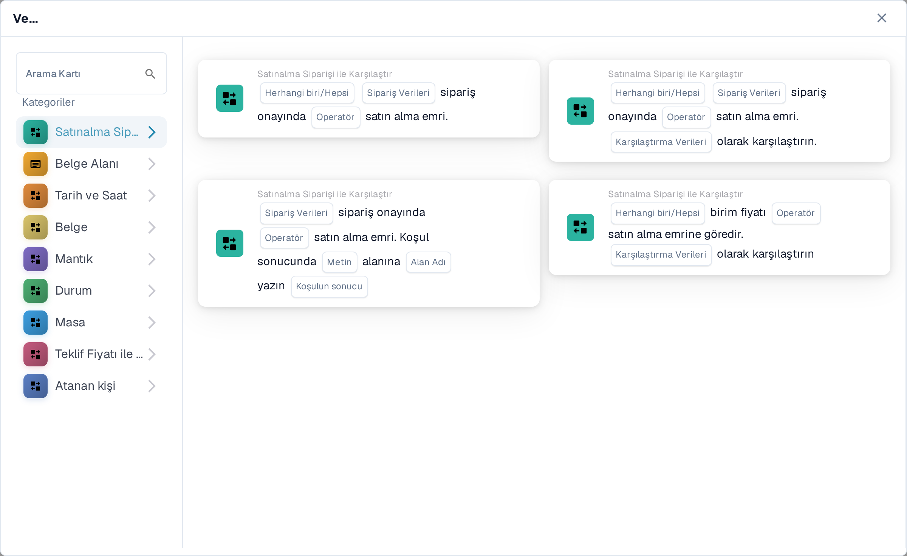
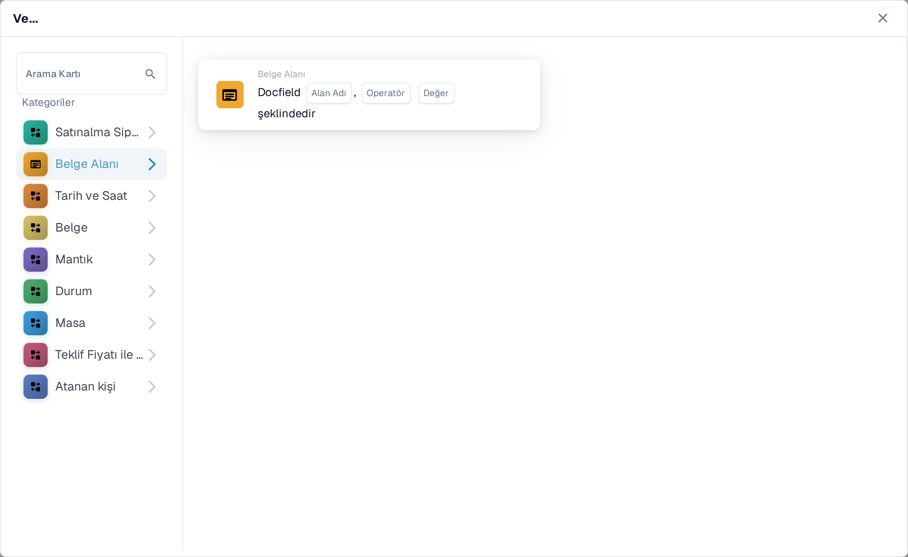
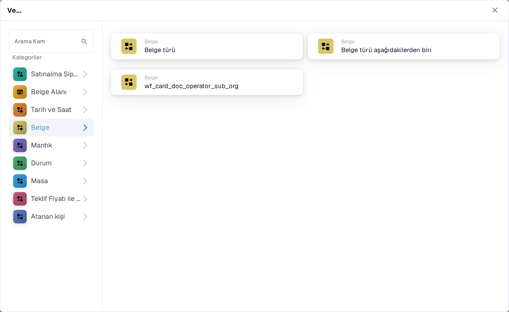
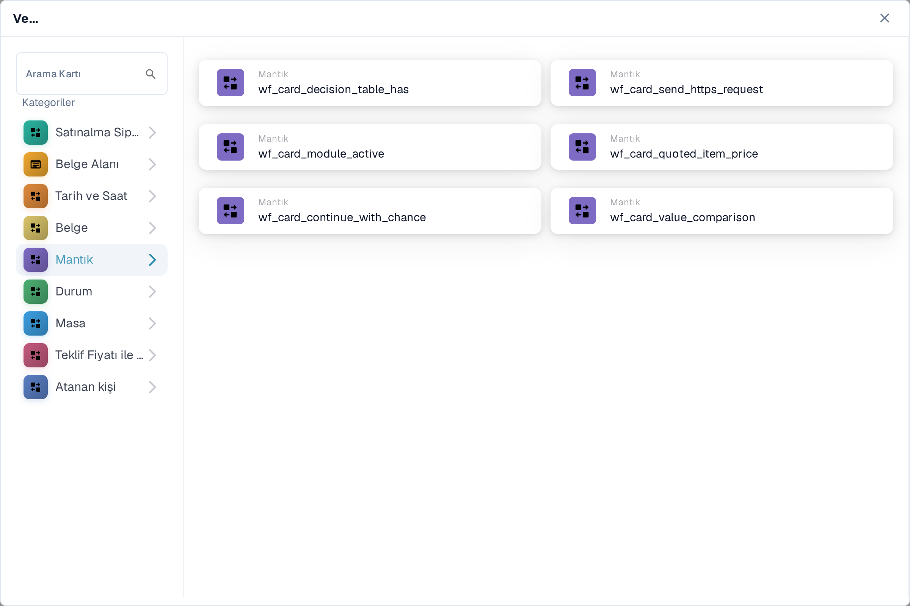
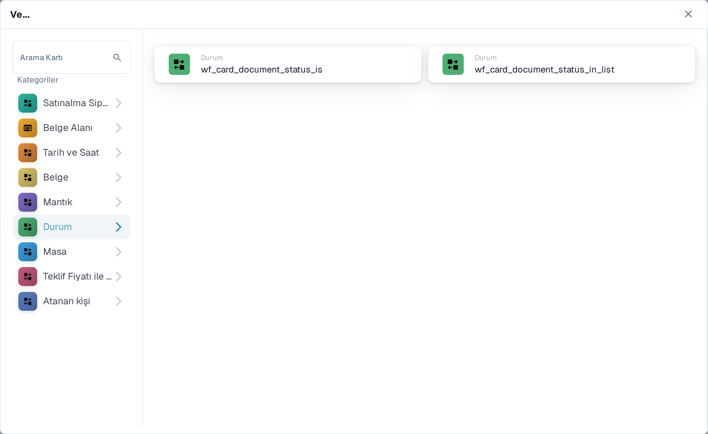
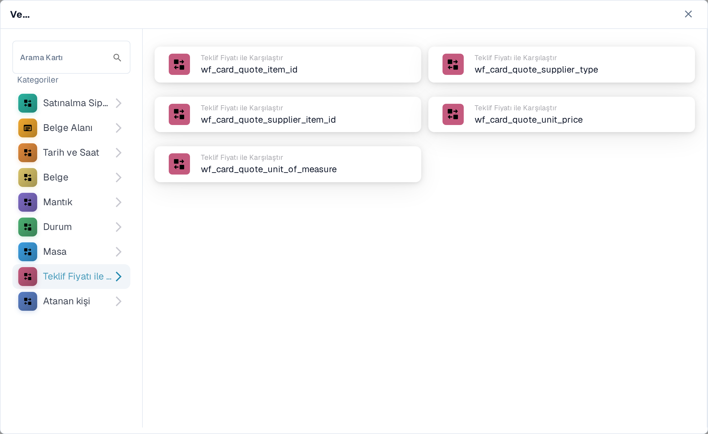
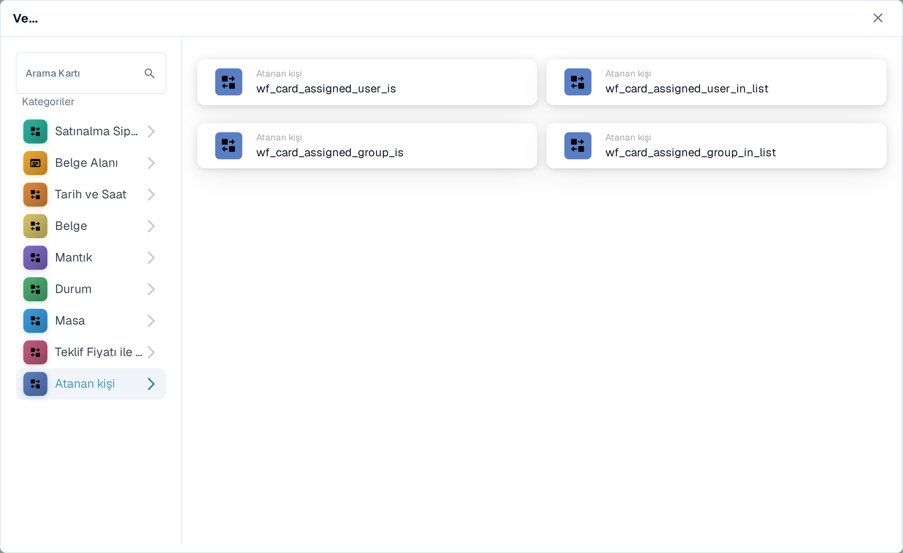

# And: bir koşul kartı seçin

İş akışının **Ne zaman** tetikleyicisinden sonra devam edip etmeyeceğine karar vermek için bir **Ve** kartı kullanın. **Daha sonra** eyleminden önce ihtiyaç duyduğunuz kontrolleri ekleyin. Her kart, **Operatör**, **Alan Adı** veya **Değer** gibi doldurulacak alanlar gösterir; ekran görüntüleri tamamlanmış kuralları değil, kullanılabilir kart şablonlarını gösterir.

**İş Akışı Oluşturucu** bölümünde **Ve....** altındaki **Kart Ekle** seçeneğini seçin. Soldan bir kategori seçin veya **Arama Kartı** alanına bir kart adı yazın. İş akışına eklemek için bir kart önizlemesi seçin. Daha fazla kart görmek için önizleme listesini kaydırabilirsiniz. Başka bir kart seçmeden seçiciyi kapatmak için **×** kullanın. Kartları yapılandırdıktan sonra iş akışını kaydedin. Çevreleyen **Ne zaman**, **Ve** ve **Daha sonra** adımları için [İş Akışı](../README.md) sayfasına bakın.

## Satınalma Siparişi ile Karşılaştır

Sipariş veya fatura verilerini bir satınalma siparişiyle karşılaştırmak için bu kartları kullanın; örneğin birim fiyat, vaat edilen teslimat tarihi, masraflar veya miktar. Seçilen kartın istediği alanları, operatörü ve varsa toleransı seçin. Tek tek kartlar için [Satınalma Siparişi ile Karşılaştır](compare-with-purchase-order/README.md) sayfasına bakın.

<figure><figcaption>
Türkçe Sandbox'ta Satınalma Siparişi ile Karşılaştır kategorisi.
</figcaption></figure>

## Belge Alanı

Bir onay kutusunu veya alan durumunu denetlemek, bir alanı bir değerle karşılaştırmak ya da iki alanı karşılaştırmak için bu kategoriyi seçin. Seçilen kartta **Alan Adı** ve **Operatör** yer tutucularını doldurun. Bazı karşılaştırmalar ayrıca bir tolerans ister. Bkz. [Belge Alanı](document-field/README.md).

<figure><figcaption>
Belge Alanı kontrolleri geçerli belgedeki değerleri kullanır.
</figcaption></figure>

## Tarih ve Saat

Bir tarih veya saati bir aralıkla karşılaştırmak ya da **Bugün** ile seçilen bir tarihi karşılaştırmak için **Tarih ve Saat** kullanın. Kartta **Operatör** ve tarih değerlerini seçin. Bkz. [Tarih ve Saat](date-and-time/README.md).

<figure><figcaption>
Tarih ve Saat bir aralık kontrolü ve bugüne göre bir kontrol sunar.
</figcaption></figure>

## Belge

Bir iş akışı **belge türüne** veya **alt kuruluşa** bağlı olması gerektiğinde bu kartları kullanın. Kartta adı geçen türü veya kuruluşu seçin. Bkz. [Belge](document/README.md).

<figure><figcaption>
Belge koşulları türü veya alt kuruluşu denetler.
</figcaption></figure>

## Mantık

Bu kategori karar tablosu, bir HTTPS yanıtı, modül kullanılabilirliği, teklif edilen bir ürün fiyatı, bir şans değeri veya iki değer kullanan kontrolleri içerir. İlgili kartı açın ve adlandırılmış yer tutucularını doldurun; örneğin HTTPS kartı URL, yöntem ve kabul edilen durum kodunu sorar. Bkz. [Mantık](logic/README.md).

<figure><figcaption>
Mantık birkaç farklı koşul türü sunar; kuralınıza uyanı seçin.
</figcaption></figure>

## Durum

Bir belgenin seçilen bir duruma sahip olup olmadığını veya durumunun seçili bir küme içinde olup olmadığını denetlemek için **Durum** kullanın. Kartta **Operatör** ve **Durum** seçin. Bkz. [Durum](status/README.md).

<figure><figcaption>
Durum koşulları belgenin geçerli durumunu denetler.
</figcaption></figure>

## Masa

Bu kartlar belge tablosu satırlarını inceler. Görünen seçenekler tarih kontrollerini, metin kalıplarını, raf ömrünü ve sütunlar arası karşılaştırmaları içerir. Bir operatör veya kalıp seçmeden önce **Tablo adı** ve **Sütun Adı** seçin. Bkz. [Masa](table/README.md).

<figure><figcaption>
Masa koşulları bir belge tablosunun satırlarını ve sütunlarını kullanır.
</figcaption></figure>

## Teklif Fiyatı ile Karşılaştır

Bir ürünü teklif fiyatı verileriyle karşılaştırmak için bu kartları kullanın. Görünen seçenekler ürün kimliği, tedarikçi türü, tedarikçi ürün kimliği, birim fiyat ve ölçü birimini kapsar. **Operatör** ve veri yer tutucuları seçtiğiniz karta bağlıdır.

<figure><figcaption>
Teklif Fiyatı ile Karşılaştır, geçerli kart seçicide ayrı bir kategoridir.
</figcaption></figure>

## Atanan kişi

Koşul atanan kullanıcıya veya gruba bağlı olduğunda **Atanan kişi** kullanın. Tek bir kullanıcı ya da grupla mı yoksa seçili bir kümeyle mi karşılaştırılacağını seçin. Bkz. [Atanan kişi](assignee/README.md).

<figure><figcaption>
Atanan kişi koşulları belgeye atanan kullanıcıyı veya grubu denetler.
</figcaption></figure>
