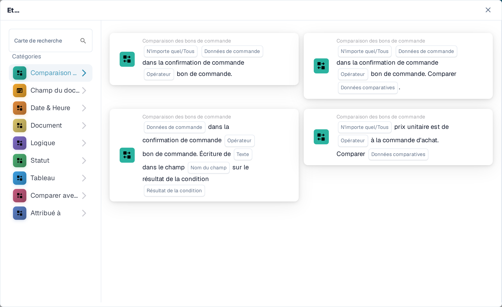
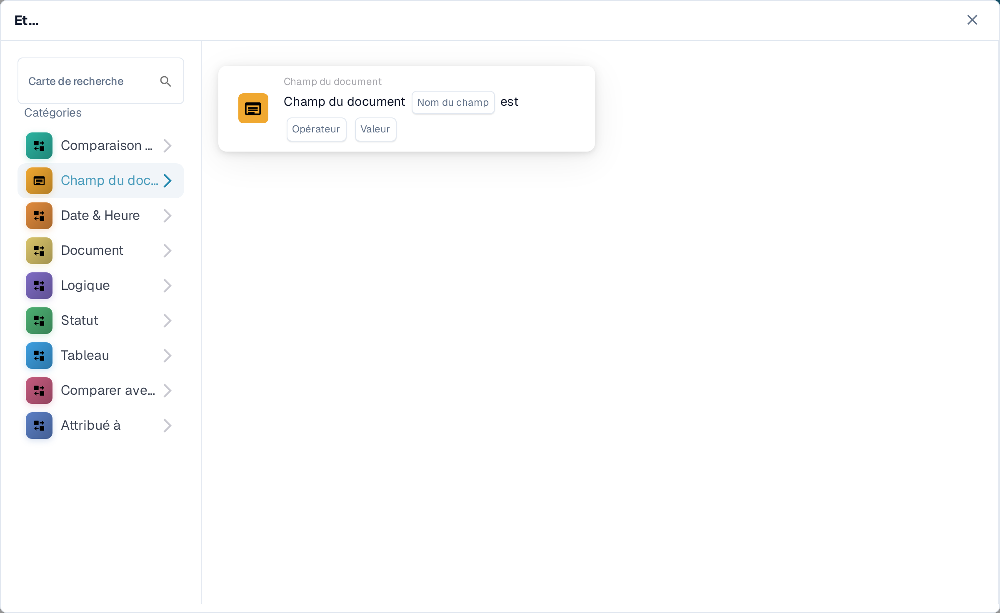
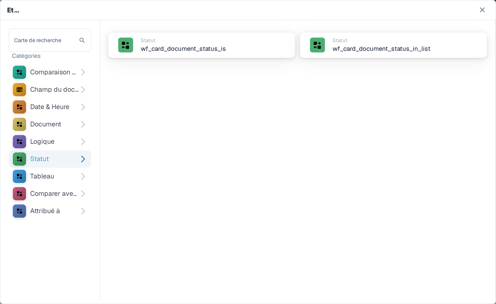
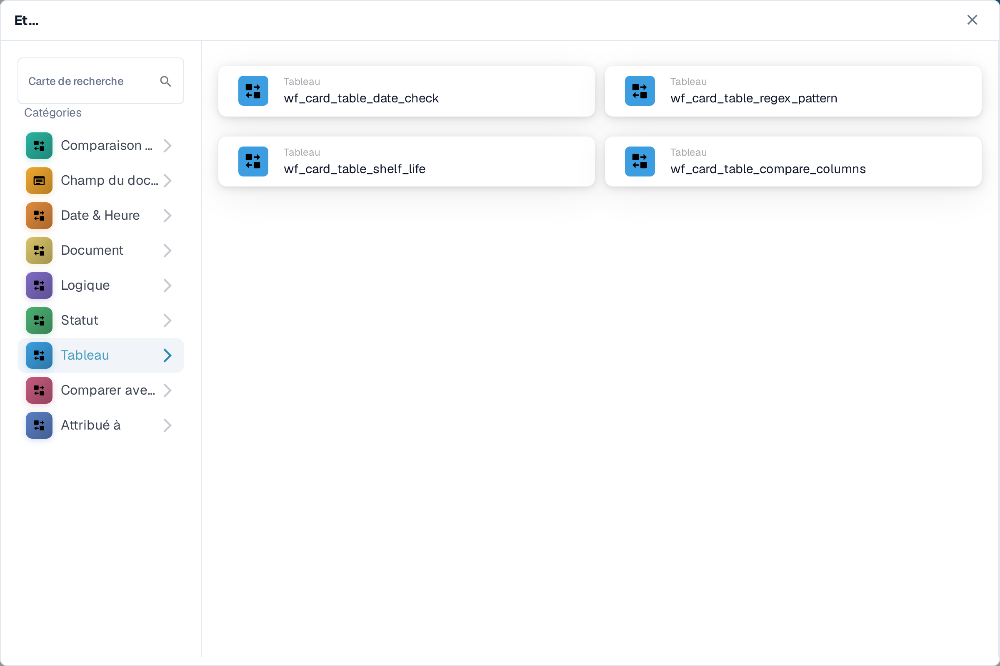

# And : choisir une carte de condition

Utilisez une carte **And** (« Et ») pour décider si un workflow doit se poursuivre après son déclencheur **When** (« Quand »). Ajoutez les contrôles nécessaires avant l'action **Then** (« Alors »). Chaque carte affiche des champs à remplir, comme **Opérateur**, **Nom du champ** ou **Valeur** ; les captures d'écran montrent les modèles de cartes disponibles, et non des règles complétées.

Dans le **Constructeur De Flux De Travail**, sélectionnez **Ajouter une carte** sous **Et....**. Choisissez une catégorie à gauche, ou saisissez le nom d'une carte dans **Carte de recherche**. Sélectionnez l'aperçu d'une carte pour l'ajouter au workflow. Vous pouvez faire défiler la liste des aperçus pour voir davantage de cartes. Utilisez **×** pour fermer le sélecteur sans choisir une autre carte. Après avoir configuré les cartes, enregistrez le workflow avec **Enregistrer le flux de travail**. Voir [Workflow](../README.md) pour les étapes environnantes **Quand**, **Et** et **Alors**.

## Comparaison des bons de commande

Utilisez ces cartes pour comparer les données d'une commande ou d'une facture avec un bon de commande, comme le prix unitaire, la date de livraison promise, les frais ou la quantité. Choisissez les champs, l'opérateur et toute tolérance demandés par la carte sélectionnée. Voir [Comparaison des bons de commande](compare-with-purchase-order/README.md) pour les différentes cartes.

<figure><figcaption>
La catégorie Comparaison des bons de commande dans la Sandbox en français.
</figcaption></figure>

## Champ du document

Choisissez cette catégorie pour vérifier une case à cocher ou le statut d'un champ, comparer un champ avec une valeur ou comparer deux champs. Remplissez les espaces réservés **Nom du champ** et **Opérateur** sur la carte choisie. Certaines comparaisons demandent aussi une tolérance. Voir [Champ du document](document-field/README.md).

<figure><figcaption>
Les contrôles Champ du document utilisent les valeurs du document en cours.
</figcaption></figure>

## Date & Heure

Utilisez **Date & Heure** pour comparer une date ou une heure avec une plage, ou pour comparer **Aujourd'hui** avec une date choisie. Sélectionnez l'**Opérateur** et les valeurs de date dans la carte. Voir [Date & Heure](date-and-time/README.md).

<figure><figcaption>
Date & Heure propose un contrôle de plage et un contrôle par rapport à aujourd'hui.
</figcaption></figure>

## Document

Utilisez ces cartes lorsqu'un workflow doit dépendre du **type de document** ou de la **sous-organisation**. Choisissez le type ou l'organisation nommé dans la carte. Voir [Document](document/README.md).

<figure><figcaption>
Les conditions Document vérifient le type ou la sous-organisation.
</figcaption></figure>

## Logique

Cette catégorie regroupe des contrôles utilisant une table de décision, une réponse HTTPS, la disponibilité d'un module, un prix d'article cité, une valeur de chance ou deux valeurs. Ouvrez la carte concernée et remplissez ses espaces réservés nommés ; par exemple, la carte HTTPS demande une URL, une méthode et un code de statut accepté. Voir [Logique](logic/README.md).

<figure><figcaption>
Logique propose plusieurs types de conditions différents ; choisissez celle qui correspond à votre règle.
</figcaption></figure>

## Statut

Utilisez **Statut** pour vérifier si un document possède un statut choisi ou si son statut fait partie d'un ensemble sélectionné. Choisissez l'**Opérateur** et le **Statut** dans la carte. Voir [Statut](status/README.md).

<figure><figcaption>
Les conditions Statut vérifient l'état actuel du document.
</figcaption></figure>

## Tableau

Ces cartes examinent les lignes de tableau d'un document. Les options visibles incluent des vérifications de date, des motifs de texte, la durée de conservation et des comparaisons entre colonnes. Sélectionnez le **Nom de la table** et le **Nom de la colonne** avant de choisir un opérateur ou un motif. Voir [Tableau](table/README.md).

<figure><figcaption>
Les conditions Tableau utilisent les lignes et les colonnes d'un tableau de document.
</figcaption></figure>

## Comparer avec le prix du devis

Utilisez ces cartes pour comparer un article avec les données d'un prix cité. Les choix visibles couvrent l'ID d'article, le type de fournisseur, l'ID d'article du fournisseur, le prix unitaire et l'unité de mesure. L'**Opérateur** et les espaces réservés de données dépendent de la carte que vous sélectionnez.

<figure><figcaption>
Comparer avec le prix du devis est une catégorie distincte dans le sélecteur de cartes actuel.
</figcaption></figure>

## Attribué à

Utilisez **Attribué à** lorsque la condition dépend de l'utilisateur ou du groupe attribué. Choisissez de comparer avec un seul utilisateur ou groupe, ou avec un ensemble sélectionné. Voir [Attribué à](assignee/README.md).

<figure><figcaption>
Les conditions Attribué à vérifient l'utilisateur ou le groupe attribué au document.
</figcaption></figure>
