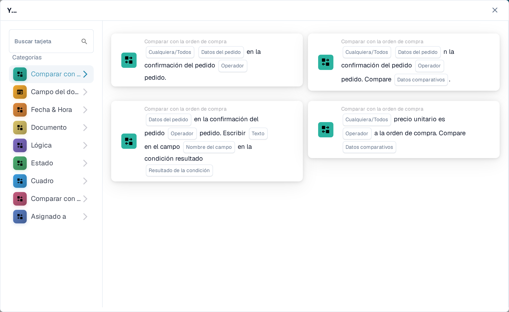
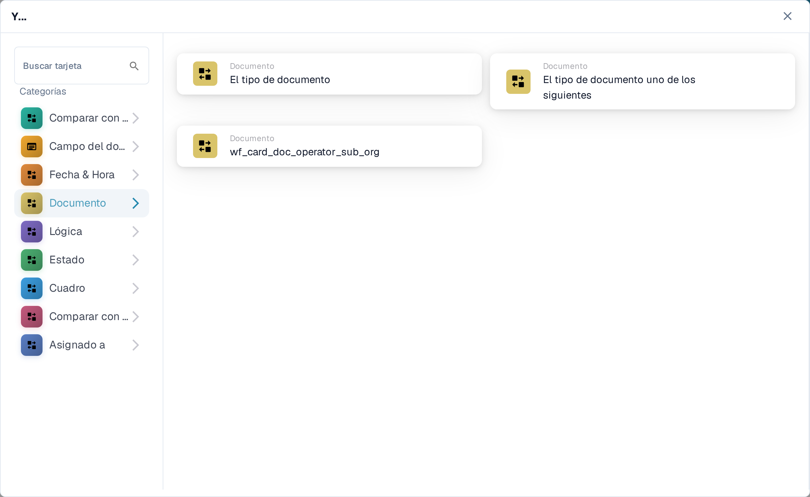
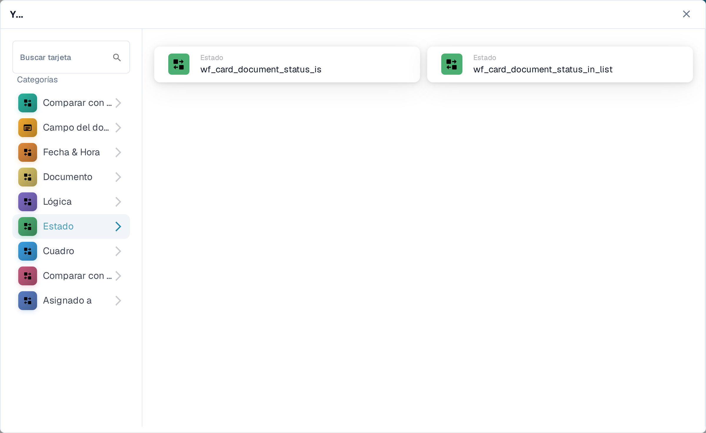
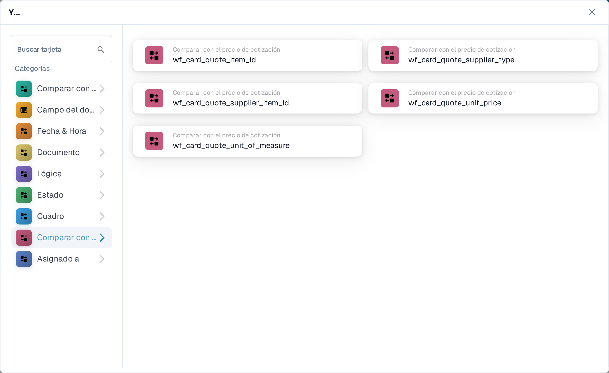

# Y: elegir una tarjeta de condición

Use una tarjeta **Y** para decidir si un flujo de trabajo debe continuar después de su activador **En**. Añada las comprobaciones que necesite antes de la acción **Entonces**. Cada tarjeta muestra campos que se rellenan, como **Operador**, **Datos del pedido** o **Texto**; las capturas de pantalla muestran las plantillas de tarjetas disponibles, no reglas guardadas.

En el **Constructor De Flujo De Trabajo**, seleccione **Añadir tarjeta** bajo **Y....**. Elija una categoría a la izquierda en **Categorías** o escriba un nombre de tarjeta en **Buscar tarjeta**. Seleccione una vista previa de tarjeta para añadirla al flujo de trabajo. Puede desplazar la lista de vistas previas para ver más tarjetas. Use **×** para cerrar el selector sin elegir otra tarjeta. Tras configurar las tarjetas, guarde el flujo de trabajo. Consulte [Workflow](../README.md) para conocer los pasos **En**, **Y** y **Entonces** en conjunto.

## Comparar con la orden de compra

Use estas tarjetas para comparar datos del pedido o de la factura con una orden de compra, como el precio unitario, la fecha de entrega prometida, los cargos o la cantidad. Rellene los campos, el operador y la tolerancia que pida la tarjeta seleccionada. Consulte [Compare with Purchase Order](compare-with-purchase-order/README.md) para ver las tarjetas individuales.

<figure><figcaption>Categoría Comparar con la orden de compra en el Sandbox en español.</figcaption></figure>

## Campo del documento

Elija esta categoría para comprobar una casilla o el estado de un campo, comparar un campo con un valor o comparar dos campos. Rellene los marcadores **Nombre del campo** y **Operador** de la tarjeta elegida. Algunas comparaciones también piden una tolerancia. Consulte [Document Field](document-field/README.md).

<figure><figcaption>Las comprobaciones de Campo del documento usan valores del documento actual.</figcaption></figure>

## Fecha & Hora

Use **Fecha & Hora** para comparar una fecha u hora con un rango, o comparar el día de hoy con una fecha elegida. Seleccione el **Operador** y los valores de fecha en la tarjeta. Consulte [Date & Time](date-and-time/README.md).

<figure><figcaption>Fecha & Hora ofrece una comprobación de rango y una comparación con el día de hoy.</figcaption></figure>

## Documento

Use estas tarjetas cuando el flujo de trabajo deba depender del **tipo de documento** o de la **suborganización**. Elija el tipo u organización indicado en la tarjeta. Consulte [Document](document/README.md).

<figure><figcaption>Las condiciones de Documento comprueban el tipo o la suborganización.</figcaption></figure>

## Lógica

Esta categoría incluye comprobaciones con una tabla de decisión, una respuesta HTTPS, la disponibilidad de un módulo, el precio de un artículo cotizado, un valor de probabilidad o dos valores. Abra la tarjeta concreta y rellene sus marcadores con nombre; por ejemplo, la tarjeta HTTPS pide una URL, un método y un código de estado aceptado. Consulte [Logic](logic/README.md).

<figure><figcaption>Lógica ofrece varios tipos de condición; elija la que coincida con su regla.</figcaption></figure>

## Estado

Use **Estado** para comprobar si un documento tiene un estado elegido o si su estado está dentro de un conjunto seleccionado. Elija el **Operador** y el **Estado** en la tarjeta. Consulte [Status](status/README.md).

<figure><figcaption>Las condiciones de Estado comprueban el estado actual del documento.</figcaption></figure>

## Cuadro

Estas tarjetas examinan las filas de una tabla del documento. Las opciones visibles incluyen comprobaciones de fecha, patrones de texto, vida útil y comparaciones entre columnas. Seleccione el nombre de la tabla y de la columna antes de elegir un operador o patrón. Consulte [Table](table/README.md).

<figure><figcaption>Las condiciones de Cuadro usan filas y columnas de una tabla del documento.</figcaption></figure>

## Comparar con el precio de cotización

Use estas tarjetas para comparar un artículo con datos de precios cotizados. Las opciones visibles cubren el ID del artículo, el tipo de proveedor, el ID del artículo del proveedor, el precio unitario y la unidad de medida. El **Operador** y los marcadores de datos dependen de la tarjeta que seleccione.

<figure><figcaption>Comparar con el precio de cotización es una categoría propia del selector de tarjetas actual.</figcaption></figure>

## Asignado a

Use **Asignado a** cuando la condición dependa del usuario o grupo asignado. Elija si se compara con un usuario o grupo concreto o con un conjunto seleccionado. Consulte [Assignee](assignee/README.md).

<figure><figcaption>Las condiciones de Asignado a comprueban el usuario o grupo asignado al documento.</figcaption></figure>
