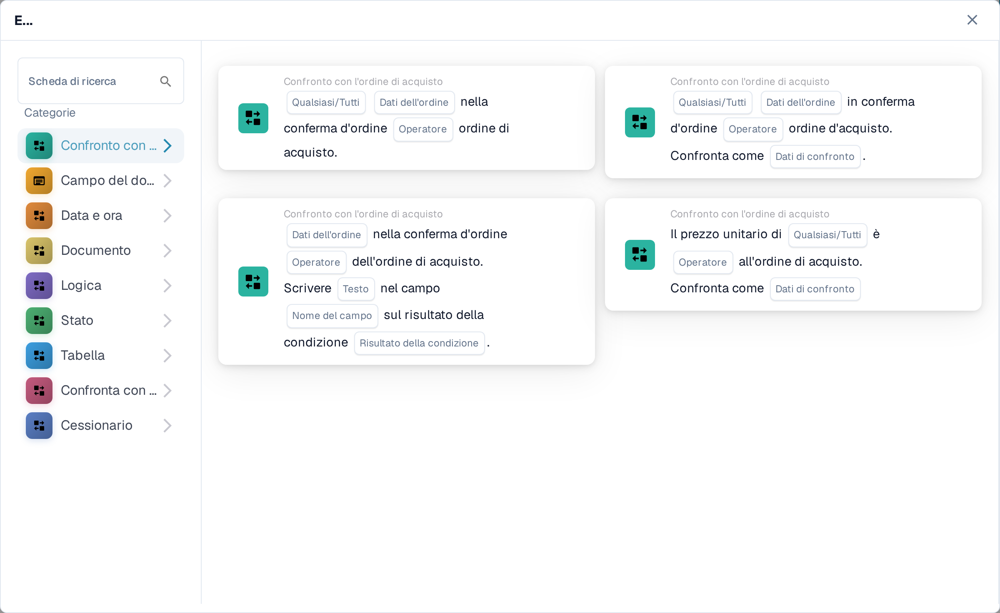
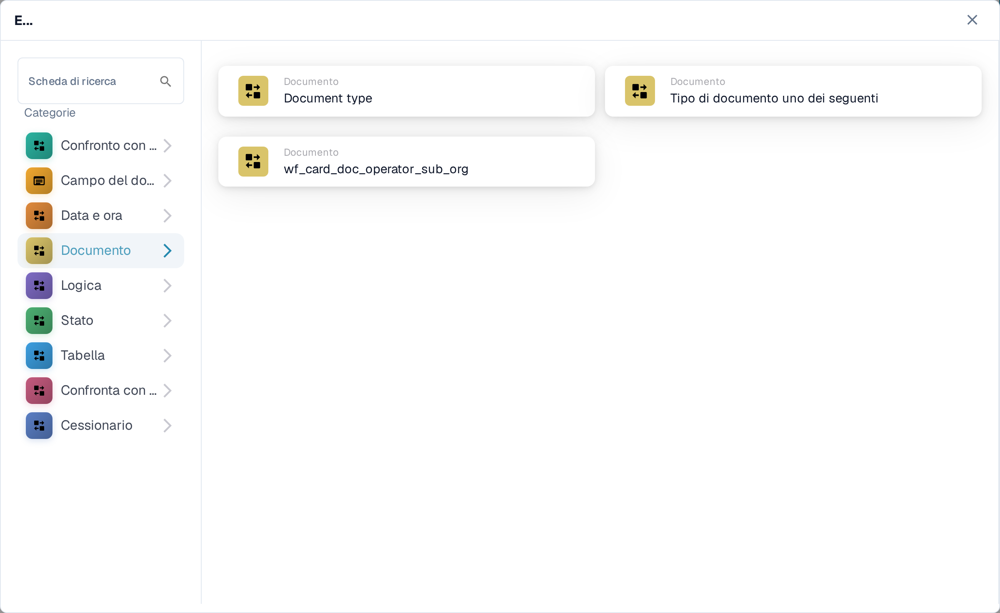

# And: scegliere una scheda di condizione

Usare una scheda **And** per decidere se un workflow deve continuare dopo il trigger **Quando**. Aggiungere i controlli necessari prima dell'azione **Poi**. Ogni scheda mostra i campi da compilare, ad esempio **Operatore**, **Nome del campo** o **Valore**; gli screenshot mostrano i modelli di scheda disponibili, non regole completate.

Nel **Costruttore Di Flussi Di Lavoro**, selezionare **Aggiungi scheda** sotto **E....**. Scegliere una categoria a sinistra oppure digitare il nome di una scheda in **Scheda di ricerca**. Selezionare un'anteprima di scheda per aggiungerla al workflow. È possibile scorrere l'elenco delle anteprime per vedere altre schede. Usare **×** per chiudere il selettore senza scegliere un'altra scheda. Dopo aver configurato le schede, salvare il workflow. Vedere [Workflow](../README.md) per i passaggi circostanti **Quando**, **E** e **Poi**.

## Confronto con l'ordine di acquisto

Usare queste schede per confrontare i dati dell'ordine o della fattura con un ordine di acquisto, ad esempio prezzo unitario, data di consegna promessa, spese o quantità. Scegliere i campi, l'operatore e l'eventuale tolleranza richiesti dalla scheda selezionata. Vedere [Confronto con l'ordine di acquisto](compare-with-purchase-order/README.md) per le singole schede.

<figure><figcaption>Categoria Confronto con l'ordine di acquisto nel Sandbox in italiano.</figcaption></figure>

## Campo del documento

Scegliere questa categoria per verificare lo stato di una casella di controllo o di un campo, confrontare un campo con un valore oppure confrontare due campi. Compilare i segnaposto **Nome del campo** e **Operatore** sulla scheda scelta. Alcuni confronti richiedono anche una tolleranza. Vedere [Campo del documento](document-field/README.md).

<figure><figcaption>I controlli Campo del documento usano i valori del documento corrente.</figcaption></figure>

## Data e ora

Usare **Data e ora** per confrontare una data o un'ora con un intervallo oppure confrontare **Oggi** con una data scelta. Selezionare **Operatore** e valori della data nella scheda. Vedere [Data e ora](date-and-time/README.md).

<figure><figcaption>Data e ora offre un controllo su intervallo e un confronto con oggi.</figcaption></figure>

## Documento

Usare queste schede quando un workflow dipende dal **tipo di documento** o dalla **sotto-organizzazione**. Scegliere il tipo o l'organizzazione indicati nella scheda. Vedere [Documento](document/README.md).

<figure><figcaption>Le condizioni Documento controllano tipo o sotto-organizzazione.</figcaption></figure>

## Logica

Questa categoria include controlli che usano una tabella decisionale, una risposta HTTPS, la disponibilità di un modulo, un prezzo dell'articolo quotato, un valore di probabilità o due valori. Aprire la scheda specifica e compilare i segnaposto indicati; ad esempio, la scheda HTTPS richiede un URL, un metodo e un codice di stato accettato. Vedere [Logica](logic/README.md).

<figure><figcaption>Logica offre diversi tipi di condizioni; scegliere quella adatta alla propria regola.</figcaption></figure>

## Stato

Usare **Stato** per verificare se un documento ha uno stato scelto o se il suo stato appartiene a un insieme selezionato. Scegliere **Operatore** e **Stato** nella scheda. Vedere [Stato](status/README.md).

<figure><figcaption>Le condizioni Stato controllano lo stato corrente del documento.</figcaption></figure>

## Tabella

Queste schede esaminano le righe della tabella di un documento. Le opzioni visibili includono controlli su date, pattern di testo, scadenza e confronti tra colonne. Selezionare **Nome della tabella** e **Nome della colonna** prima di scegliere un operatore o un pattern. Vedere [Tabella](table/README.md).

<figure><figcaption>Le condizioni Tabella usano righe e colonne della tabella di un documento.</figcaption></figure>

## Confronta con il prezzo dell'offerta

Usare queste schede per confrontare un articolo con i dati del prezzo quotato. Le scelte visibili riguardano ID articolo, tipo di fornitore, ID articolo del fornitore, prezzo unitario e unità di misura. **Operatore** e segnaposto dei dati dipendono dalla scheda selezionata.

<figure><figcaption>Confronta con il prezzo dell'offerta è una categoria separata nell'attuale selettore di schede.</figcaption></figure>

## Cessionario

Usare **Cessionario** quando la condizione dipende dall'utente o dal gruppo assegnato. Scegliere se confrontare con un solo utente o gruppo oppure con un insieme selezionato. Vedere [Cessionario](assignee/README.md).

<figure><figcaption>Le condizioni Cessionario controllano l'utente o il gruppo assegnato al documento.</figcaption></figure>
