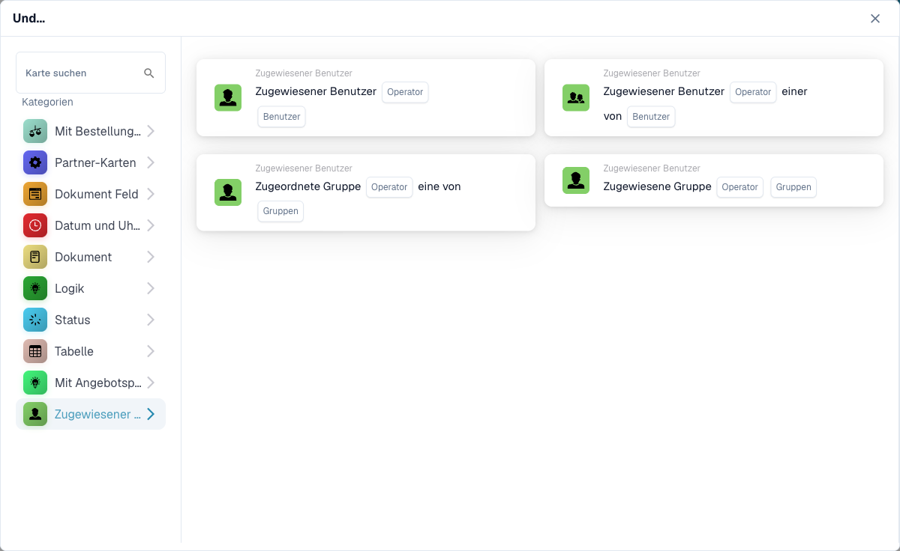

# Assignee

Die **Zugewiesener Benutzer**-Karten im **Add Card**-Picker des Workflow-Builders (öffnen über die **Und**-Gruppe → **Karte hinzufügen**):

<figure><figcaption>
Die Karten der Kategorie <strong>Zugewiesener Benutzer</strong>.
</figcaption></figure>

