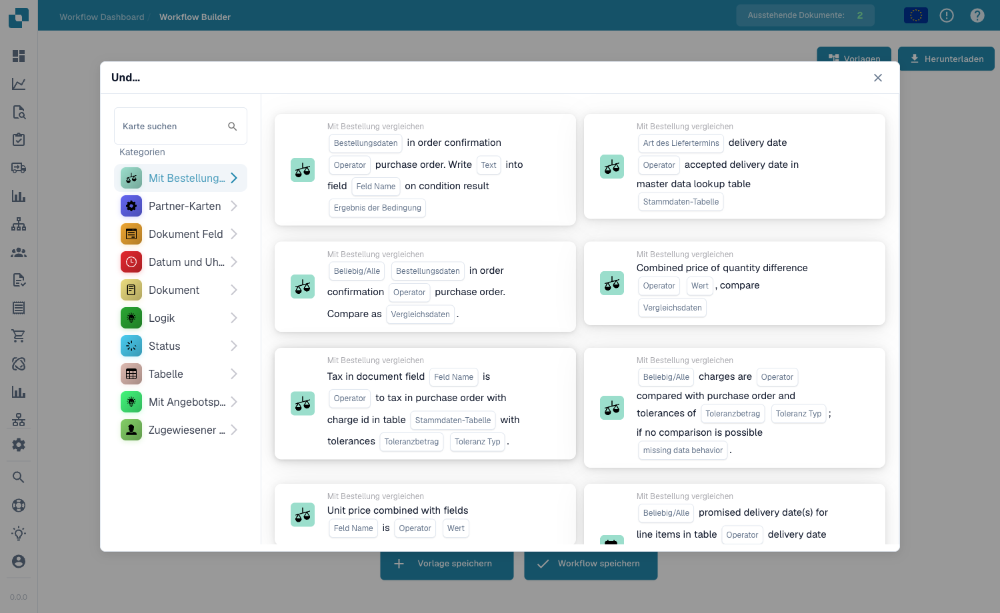

# Compare with Purchase Order

Die **Mit Bestellung vergleichen**-Karten im **Add Card**-Picker des Workflow-Builders (öffnen über die **Und**-Gruppe → **Karte hinzufügen**):

<figure><figcaption>
Die Karten der Kategorie <strong>Mit Bestellung vergleichen</strong>.
</figcaption></figure>

