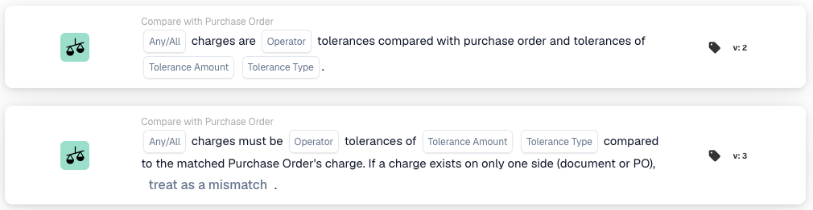

# Any / All Charges

<figure><figcaption>
La scheda nella libreria delle schede. Versione 2 in alto, versione 3 in basso.
</figcaption></figure>

## **Scopo:**

Questa scheda di workflow confronta gli addebiti accessori di un documento con gli addebiti accessori dell'ordine di acquisto corrispondente, entro una tolleranza definita. Risponde a una sola domanda: documento e ordine di acquisto concordano sugli addebiti accessori? Viene confrontato ogni addebito che l'abbinamento dell'ordine di acquisto ha appaiato, per cui sulla scheda non occorre indicare alcun nome di campo.

Questa scheda si distingue da **Compare Total Charges**, che confronta un singolo campo del documento con un unico addebito individuato tramite un Charge ID. Usare questa scheda quando tutti gli addebiti appaiati del documento devono essere verificati in una sola volta.

L'abbinamento dell'ordine di acquisto deve essere eseguito prima di questa scheda. Se il documento non ha un ordine di acquisto corrispondente, la scheda arresta il workflow e segnala dati mancanti.

## **Componenti della scheda:**

1. **Qualsiasi/Tutti:**
   * **Descrizione**: Come i singoli confronti di addebito vengono riuniti nell'unico risultato della scheda.
   * **Opzioni**:
     * **Qualsiasi**: almeno un addebito deve soddisfare il confronto.
     * **Tutti**: ogni addebito deve soddisfare il confronto.
2. **Operatore:**
   * **Descrizione**: Come l'importo dell'addebito del documento viene confrontato con l'importo dell'ordine di acquisto per lo stesso addebito.
   * **Opzioni**:
     * **entro**: i due importi devono concordare, ammessa la tolleranza.
     * **All'esterno**: i due importi devono differire di più della tolleranza.
3. **Tolleranza Importo:**
   * **Descrizione**: Lo scostamento ammesso tra l'addebito del documento e l'addebito dell'ordine di acquisto.
4. **Tipo di tolleranza:**
   * **Descrizione**: Come viene interpretato l'importo di tolleranza.
   * **Opzioni**:
     * **Percentuale**: una percentuale dell'addebito dell'ordine di acquisto.
     * **Valore**: un importo fisso.
5. **Comportamento relativo ai dati mancanti (solo versione 3):**
   * **Descrizione**: Cosa fare quando un addebito è presente solo su un lato, nel documento o nell'ordine di acquisto, così che non esiste una controparte con cui confrontarlo. L'opzione si trova alla fine della frase della versione 3.
   * **Opzioni**:
     * **trattarlo come una discrepanza**: il workflow si arresta. È l'impostazione predefinita.
     * **ignorarlo e trattarlo come corrispondente**: il workflow prosegue come se l'addebito avesse concordato.

## **Funzionalità:**

La scheda percorre i passaggi seguenti.

1. **Richiede un ordine di acquisto corrispondente.** Senza ordine di acquisto corrispondente la scheda si arresta immediatamente e segnala dati mancanti.
2. **Legge la tolleranza** da **Tolleranza Importo** e **Tipo di tolleranza** sulla scheda.
3. **La versione 3 classifica ogni riga di ordine di acquisto appaiata** in una di quattro situazioni, chiedendo soltanto se ciascun lato porta un qualsiasi addebito: addebiti su entrambi i lati, nessun addebito su alcuno dei due lati, addebiti solo nel documento, o addebiti solo nell'ordine di acquisto. Una riga che non può essere ricondotta ai dati dell'ordine di acquisto del documento è un errore di dati e la scheda si arresta.
4. **Un addebito presente su un solo lato decide l'intera scheda.** Appena una riga appaiata porta addebiti su un lato e nessuno sull'altro, **Comportamento relativo ai dati mancanti** decide il risultato e nessun addebito viene confrontato, nemmeno gli addebiti delle righe correttamente appaiate. Operatore e tolleranza non vengono consultati.
5. **Se nessuna riga porta addebiti su alcuno dei due lati**, entrambi i lati concordano che non vi sono addebiti accessori. L'operatore **All'esterno** non risulta perciò soddisfatto, poiché nulla differisce oltre la tolleranza, e il workflow si arresta. Qualsiasi altro operatore considera l'accordo soddisfatto e il workflow prosegue. **Comportamento relativo ai dati mancanti** non ha alcun effetto qui.
6. **Altrimenti ogni addebito viene confrontato**, importo del documento contro importo dell'ordine di acquisto, con operatore e tolleranza. Un importo di addebito che non è un numero arresta la scheda con dati mancanti.
7. **I confronti vengono riuniti e combinati una sola volta.** Ogni addebito di ogni riga appaiata contribuisce a un unico insieme di risultati, che l'impostazione **Qualsiasi/Tutti** riduce all'unico risultato della scheda. La riunione è a livello di documento, non per riga, così che **Qualsiasi** significa qualsiasi addebito in qualsiasi punto del documento. Se il risultato combinato è vero il workflow prosegue, altrimenti si arresta con una condizione non soddisfatta.

Tre conseguenze vale la pena conoscere prima di configurare la scheda.

* **entro con una tolleranza di 0 richiede l'uguaglianza esatta.** I due importi devono concordare al centesimo.
* **Un addebito presente su un solo lato prevale su tutto il resto.** Poiché il passaggio 4 viene eseguito prima di qualsiasi confronto, **ignorarlo e trattarlo come corrispondente** salta anche la verifica degli importi di ogni addebito correttamente appaiato del documento. Mantenere **trattarlo come una discrepanza** se gli importi devono essere verificati.
* **trattarlo come una discrepanza arresta il workflow come errore, non come condizione non soddisfatta.** Nonostante la formulazione, la scheda segnala dati mancanti, che il registro del workflow e il test della scheda mostrano in rosso e non in arancione come una condizione non soddisfatta. Il workflow si arresta in entrambi i casi.

## **Installazione e configurazione:**

Aggiungere la scheda come condizione And dopo l'abbinamento dell'ordine di acquisto. Scegliere se ogni addebito o qualsiasi addebito deve soddisfare il confronto, scegliere l'operatore **entro** o **All'esterno** e inserire importo e tipo di tolleranza. Nella versione 3, scegliere cosa deve avvenire quando gli addebiti compaiono su un solo lato.

Per provare una configurazione senza attendere un documento, aprire il menu della scheda nel Workflow Builder, scegliere **Scheda di prova**, scegliere un documento e poi **Test sul documento**. Il registro della scheda elenca ogni addebito confrontato con entrambi gli importi, l'operatore e la tolleranza usata, e annota anche quale valore di **Comportamento relativo ai dati mancanti** ha deciso il risultato quando un addebito era presente su un solo lato.

## **Scenario di esempio:**

Una conferma d'ordine porta un addebito di trasporto di 100,00 e la riga di ordine di acquisto corrispondente porta lo stesso addebito di trasporto di 100,00. Con **Tutti**, l'operatore **entro** e una tolleranza di 0 come valore, gli importi sono uguali, la scheda è soddisfatta e il workflow prosegue.

Con 120,00 sulla conferma d'ordine contro 100,00 sull'ordine di acquisto, la stessa configurazione non è soddisfatta e il workflow si arresta con una condizione non soddisfatta.

Se né la conferma d'ordine né l'ordine di acquisto porta alcun addebito, l'operatore **entro** lo considera un accordo e il workflow prosegue, mentre **All'esterno** lo arresta.

Se la conferma d'ordine porta un addebito di trasporto e l'ordine di acquisto nessuno, l'operatore non si applica più. Con **trattarlo come una discrepanza** il workflow si arresta, così che qualcuno possa verificare perché l'addebito figura su un solo lato.

## **Differenze tra le versioni:**

La versione 3 è quella usata dalle schede nuove. La versione 2 resta supportata nei workflow esistenti. Entrambe le versioni confrontano addebito per addebito e combinano i risultati a livello di documento con l'impostazione **Qualsiasi/Tutti**, ma la versione 2 non ha una classificazione per casi, il che cambia ciò che avviene appena gli addebiti non sono presenti su entrambi i lati:

* La versione 2 non ha l'opzione **Comportamento relativo ai dati mancanti**. La sua frase termina dopo il tipo di tolleranza.
* La versione 2 non classifica le righe appaiate e perciò non riconosce un addebito presente su un solo lato. Confronta l'importo presente contro lo 0,00 mantenuto per il lato mancante, e l'operatore decide: **entro** non è soddisfatto e il workflow si arresta, **All'esterno** è soddisfatto e il workflow prosegue. Il registro della scheda mostra il confronto contro 0,00.
* Se nessuno dei due lati porta addebiti, la versione 2 non ha nulla da confrontare e segnala dati mancanti invece di considerare l'assenza su entrambi i lati come un accordo.

## **Conclusione:**

La scheda "Any / All Charges" automatizza la verifica che gli addebiti accessori fatturati o confermati corrispondano agli addebiti accessori ordinati. Poiché l'assenza di addebiti su entrambi i lati vale come accordo nella versione 3, i documenti senza addebiti accessori passano senza intervento manuale, mentre gli addebiti che compaiono su un solo lato vengono trattenuti per la verifica, a meno che ciò non sia deliberatamente consentito.
