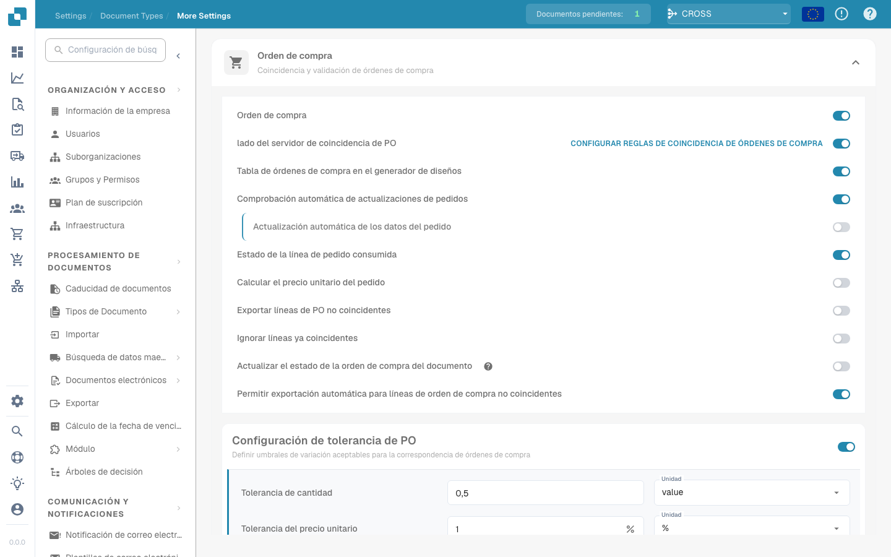

# Combined Price of Quantity Difference

<figure><figcaption></figcaption></figure>

<figure><figcaption></figcaption></figure>

## **Doel**:

Deze workflow-kaart evalueert de gecombineerde prijs van een hoeveelheidsverschil en vergelijkt deze met een opgegeven waarde. Hij helpt acties te automatiseren op basis van prijs- en hoeveelheidsafwijkingen over gerelateerde documenten heen, wat de inkoop- en ontvangstworkflows verbetert. **Version 4** breidt deze functionaliteit uit door vergelijkingen mogelijk te maken tussen verschillende entiteiten zoals de inkooporder, de ontvangen hoeveelheden en het document zelf, wat meer flexibiliteit en controle aan de workflow toevoegt.

## **Onderdelen van de kaart**:

1. **Operator**:&#x20;
   * **Beschrijving:** De voorwaarde voor het vergelijken van de gecombineerde prijs met een opgegeven waarde.
   * **Opties:**
     * **Equals (=)**: Controleert of de gecombineerde prijs overeenkomt met de opgegeven waarde.
     * **Not Equals (≠)**: Zorgt ervoor dat de gecombineerde prijs verschilt van de opgegeven waarde.
     * **Greater Than (>)**: Verifieert of de gecombineerde prijs groter is dan de opgegeven waarde.
     * **Greater or Equals (≥)**: Controleert of de gecombineerde prijs groter dan of gelijk is aan de opgegeven waarde.
     * **Lesser Than (<)**: Verifieert of de gecombineerde prijs kleiner is dan de opgegeven waarde.
     * **Lesser or Equals (≤)**: Controleert of de gecombineerde prijs kleiner dan of gelijk is aan de opgegeven waarde
2. **Value**:&#x20;
   * **Beschrijving:** Geeft de waarde op waarmee de gecombineerde prijs van het hoeveelheidsverschil wordt vergeleken.
   * **Detail:** De waarde moet een numerieke waarde zijn.

## **Aanvullende onderdelen in Version 4**:

* **Comparison Type**: Selecteert de te vergelijken entiteiten. De opties zijn:
  * **Purchase Order to Document**: Vergelijkt de hoeveelheden en prijzen tussen de inkooporder en het gerelateerde document.
  * **Received to Document**: Vergelijkt de ontvangen hoeveelheden met de hoeveelheden in het document.
  * **Purchase Order to Received**: Vergelijkt de inkooporderhoeveelheden met de ontvangen hoeveelheden.

## **Functionaliteit**:

* **Voorwaarde-evaluatie**: Berekent de gecombineerde prijs door het hoeveelheidsverschil te vermenigvuldigen met de prijs per eenheid en vergelijkt deze met de opgegeven waarde met behulp van de geselecteerde operator.\
  **Version 4** voegt de optie toe om aanvullende entiteiten te vergelijken op basis van de configuratie van de gebruiker, zoals inkooporder tot ontvangen of inkooporder tot document.
* **Actie-uitvoering**: Op basis van de vraag of de gecombineerde prijs aan de opgegeven voorwaarde voldoet, gaat de workflow verder met true- of false-voorwaarden om acties te triggeren of de workflow te stoppen. **Version 4** maakt ook dynamischere actie-uitvoering mogelijk, waarbij het voorwaardetype (bijv. inkooporder tot ontvangen) de volgende stap beïnvloedt.

## **Opzet en configuratie**:

* **Version 3**: Gebruikers configureren de kaart door de documentvelden voor het hoeveelheidsverschil en de prijs per eenheid te selecteren. Vervolgens wordt de operator gekozen om te definiëren hoe de gecombineerde prijs met de opgegeven waarde wordt vergeleken. Ten slotte stellen gebruikers de doorgaan-voorwaarde (true of false) in, die de volgende stap in de workflow bepaalt.
* **Version 4**: Naast de configuratie in **Version 3** hebben gebruikers een aanvullende optie om de **Comparison Type** te configureren. Hiermee wordt gedefinieerd welke entiteiten worden vergeleken, zoals **Purchase Order to Document**, **Received to Document** of **Purchase Order to Received**.

## **Voorbeeldscenario**:

* Een factuur toont 50 eenheden van een product à $100 per stuk, in totaal $5000. De gerelateerde inkooporder autoriseerde een aankoop van $4500 voor 45 eenheden. Het hoeveelheidsverschil is 5 eenheden en de gecombineerde prijs van het verschil is $500. De kaart vergelijkt de inkooporderhoeveelheid (45 eenheden) met de ontvangen hoeveelheid (50 eenheden) en controleert of de gecombineerde prijs groter is dan $400 (de opgegeven waarde). Met de operator **Greater Than (>)** identificeert de kaart de afwijking en markeert deze voor beoordeling door het financiële team.

## **Conclusie**:

**Version 3** van de workflow-kaart "Combined Price of Quantity Difference" biedt een eenvoudige benadering voor het vergelijken van hoeveelheidsafwijkingen en het triggeren van acties op basis van prijsdrempels.\
**Version 4** breidt deze functionaliteit uit door vergelijkingen tussen verschillende entiteiten (inkooporder, ontvangen, document) mogelijk te maken, wat meer flexibiliteit en controle over de workflow biedt. Organisaties kunnen nu complexere scenario's automatiseren en strakkere controle over hun inkoop- en ontvangstprocessen afdwingen.
