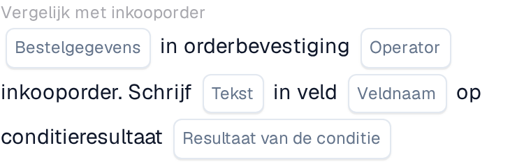
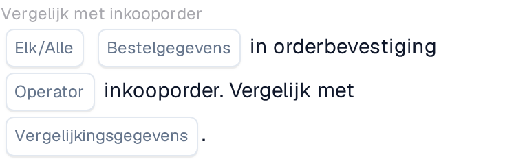

# Orderbevestiging vergelijken met een inkooporder

Gebruik **Vergelijk met inkooporder** in de Workflow Builder wanneer een orderbevestiging met de bijbehorende inkooporder gecontroleerd moet worden. Voeg de kaart toe onder **En....**, kies vervolgens de bestelgegevens, een operator en wat er met het resultaat moet gebeuren. De onderstaande afbeeldingen tonen twee beschikbare kaartversies in de Nederlandse interface. De velden zijn nog tijdelijke aanduidingen; stel ze in voor uw eigen workflow voordat u opslaat.

## Het resultaat in een veld schrijven

<figure><figcaption>Versie 2: tekst schrijven in een veld op basis van het resultaat van de conditie.</figcaption></figure>

Kies **Bestelgegevens** uit de orderbevestiging en een **Operator** voor de vergelijking met de inkooporder. Voer de **Tekst** in die u wilt schrijven, selecteer de **Veldnaam** en kies het **Resultaat van de conditie** dat het schrijven moet activeren.

## De gegevens vergelijken

<figure><figcaption>Versie 4: geselecteerde gegevens van de orderbevestiging vergelijken met de gegevens van de inkooporder.</figcaption></figure>

Kies **Elk/Alle** om te bepalen of een of alle geselecteerde voorwaarden moeten overeenkomen. Selecteer daarna de **Bestelgegevens**, de **Operator** en de **Vergelijkingsgegevens** voor de vergelijking met de inkooporder.

Zie [Workflow](../../README.md) en [Vergelijk met inkooporder](README.md) voor de stappen ervoor en erna.
