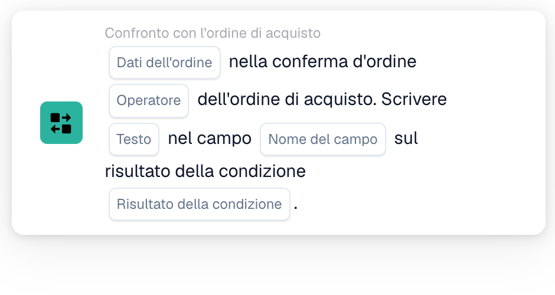
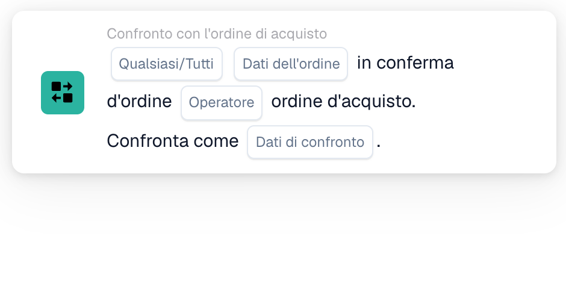

# Confrontare una conferma d'ordine con un ordine di acquisto

Usa **Confronto con l'ordine di acquisto** nel Workflow Builder quando una conferma d'ordine deve essere verificata rispetto al suo ordine di acquisto. Aggiungi la scheda sotto **E....**, poi scegli i dati dell'ordine, un operatore e cosa deve accadere con il risultato. Gli screenshot qui sotto mostrano due versioni disponibili della scheda nell'interfaccia italiana. I loro campi sono ancora segnaposto; impostali per il tuo workflow prima di salvare.

## Scrivere il risultato in un campo

<figure><figcaption>Versione 2: scrivere un testo in un campo in base al risultato della condizione.</figcaption></figure>

Scegli **Dati dell'ordine** dalla conferma d'ordine e un **Operatore** per il confronto con l'ordine di acquisto. Inserisci il **Testo** da scrivere, seleziona il **Nome del campo** e scegli il **Risultato della condizione** che deve attivare la scrittura.

## Confrontare i dati

<figure><figcaption>Versione 4: confrontare i dati selezionati della conferma d'ordine con i dati dell'ordine di acquisto.</figcaption></figure>

Scegli **Qualsiasi/Tutti** per decidere se deve corrispondere una sola condizione selezionata o tutte. Poi seleziona **Dati dell'ordine**, **Operatore** e **Dati di confronto** per il confronto con l'ordine di acquisto.

Per i passaggi circostanti, vedi [Flusso di lavoro](../../README.md) e [Confronto con l'ordine di acquisto](README.md).
