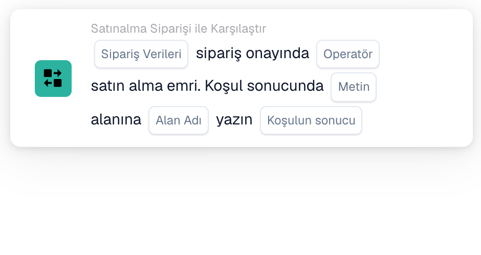

# Sipariş onayını satınalma siparişiyle karşılaştırma

Bir sipariş onayının kendi satınalma siparişine göre kontrol edilmesi gerektiğinde Workflow Builder'da **Satınalma Siparişi ile Karşılaştır** kartını kullanın. Kartı **Ve....** altına ekleyin, ardından sipariş verilerini, bir operatörü ve sonuçla ne olması gerektiğini seçin. Aşağıdaki ekran görüntüleri arayüzde kullanılabilir iki kart sürümünü gösterir. Alanları hâlâ yer tutucudur; kaydetmeden önce kendi iş akışınız için ayarlayın.

## Sonucu bir alana yazma

<figure><figcaption>Sürüm 2: koşul sonucuna göre bir alana metin yazma.</figcaption></figure>

Sipariş onayından **Sipariş Verileri**'ni ve satınalma siparişiyle karşılaştırma için bir **Operatör** seçin. Yazılacak **Metin**'i girin, **Alan Adı**'nı seçin ve yazmayı tetikleyecek **Koşulun sonucu**'nu belirleyin.

## Verileri karşılaştırma

<figure><figcaption>Sürüm 4: seçilen sipariş onayı verilerini satınalma siparişi verileriyle karşılaştırma.</figcaption></figure>

Seçilen koşullardan birinin mi yoksa tümünün mü eşleşmesi gerektiğine karar vermek için **Herhangi biri/Hepsi**'yi seçin. Ardından satınalma siparişi karşılaştırması için **Sipariş Verileri**, **Operatör** ve **Karşılaştırma Verileri**'ni seçin.

Çevredeki adımlar için bkz. [İş Akışı](../../README.md) ve [Satınalma Siparişi ile Karşılaştır](README.md).
