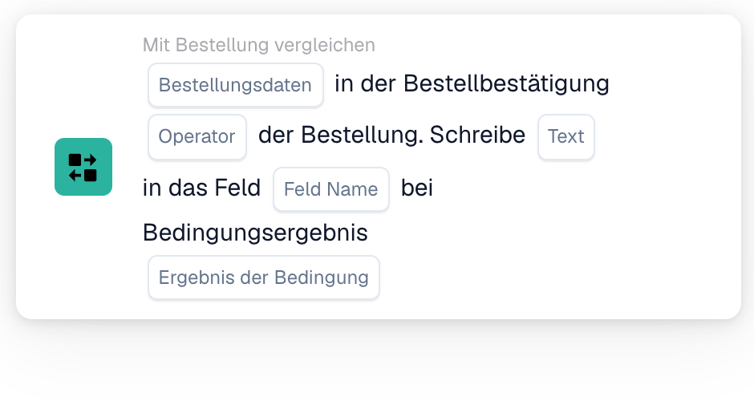
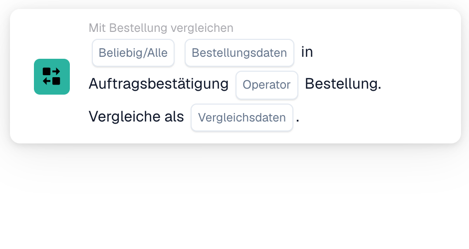

# Auftragsbestätigung mit Bestellung vergleichen

Verwenden Sie **Mit Bestellung vergleichen** im Workflow-Builder, wenn eine Auftragsbestätigung gegen ihre Bestellung geprüft werden soll. Fügen Sie die Karte unter **Und...** hinzu und wählen Sie die Bestelldaten, einen Operator und das Verhalten bei einem Treffer. Die folgenden Abbildungen zeigen zwei verfügbare Kartenversionen in der deutschen Oberfläche. Ihre Felder sind noch Platzhalter; legen Sie sie für Ihren eigenen Workflow fest, bevor Sie speichern.

## Das Ergebnis in ein Feld schreiben

<figure><figcaption>Version 2: Text in ein Feld schreiben, abhängig vom Bedingungsergebnis.</figcaption></figure>

Wählen Sie **Bestellungsdaten** aus der Auftragsbestätigung und einen **Operator** für den Vergleich mit der Bestellung. Geben Sie den **Text** ein, der geschrieben werden soll, wählen Sie das **Feld Name** und das **Ergebnis der Bedingung**, das das Schreiben auslösen soll.

## Die Daten vergleichen

<figure><figcaption>Version 4: ausgewählte Daten der Auftragsbestätigung mit Bestelldaten vergleichen.</figcaption></figure>

Wählen Sie **Beliebig/Alle**, um festzulegen, ob eine oder alle ausgewählten Bedingungen übereinstimmen müssen. Wählen Sie anschließend die **Bestellungsdaten**, den **Operator** und die **Vergleichsdaten** für den Bestellvergleich.

Die umgebenden Schritte finden Sie unter [Workflow](../../README.md) und [Mit Bestellung vergleichen](README.md).
