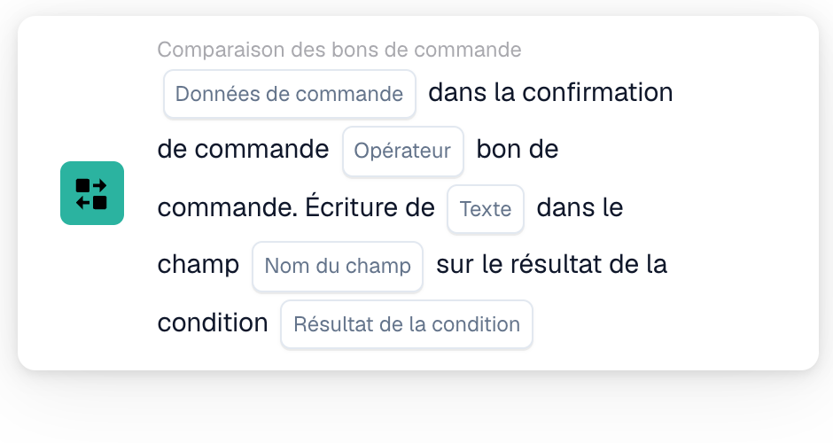
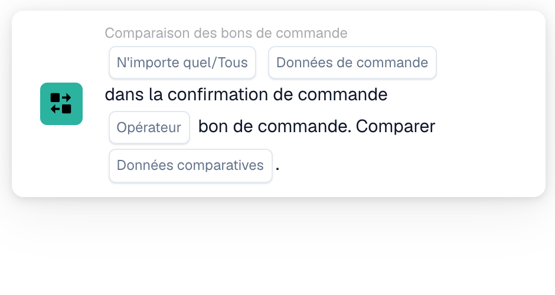

# Comparer une confirmation de commande avec un bon de commande

Utilisez **Comparaison des bons de commande** dans le Constructeur de flux de travail lorsqu'une confirmation de commande doit être vérifiée par rapport à son bon de commande. Ajoutez la carte sous **Et....**, puis choisissez les données de commande, un opérateur et ce qui doit se produire avec le résultat. Les captures ci-dessous montrent deux versions disponibles de la carte dans l'interface en français. Leurs champs sont encore des espaces réservés ; configurez-les pour votre propre flux de travail avant d'enregistrer.

## Écrire le résultat dans un champ

<figure><figcaption>Version 2 : écrire un texte dans un champ selon le résultat de la condition.</figcaption></figure>

Choisissez **Données de commande** dans la confirmation de commande et un **Opérateur** pour la comparaison avec le bon de commande. Saisissez le **Texte** à écrire, sélectionnez le **Nom du champ** et choisissez le **Résultat de la condition** qui doit déclencher l'écriture.

## Comparer les données

<figure><figcaption>Version 4 : comparer les données sélectionnées de la confirmation de commande avec les données du bon de commande.</figcaption></figure>

Choisissez **N'importe quel/Tous** pour décider si une ou toutes les conditions sélectionnées doivent correspondre. Sélectionnez ensuite les **Données de commande**, l'**Opérateur** et les **Données comparatives** pour la comparaison avec le bon de commande.

Pour les étapes environnantes, voir [Flux de travail](../../README.md) et [Comparaison des bons de commande](README.md).
