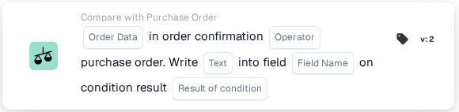
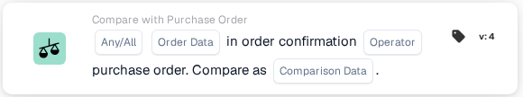

# Compare an order confirmation with a purchase order

Use **Compare with Purchase Order** in the Workflow Builder when an order confirmation needs to be checked against its purchase order. Add the card under **And...**, then choose the order data, an operator, and what should happen with the result. The screenshots below show two available card versions in the English interface. Their fields are still placeholders; set them for your own workflow before saving.

## Write the result into a field

<figure><figcaption>Version 2: write text into a field based on the condition result.</figcaption></figure>

Choose **Order Data** from the order confirmation and an **Operator** for the comparison with the purchase order. Enter the **Text** to write, select the **Field Name**, and choose the **Result of condition** that should trigger the write.

## Compare the data

<figure><figcaption>Version 4: compare selected order confirmation data with purchase order data.</figcaption></figure>

Choose **Any/All** to decide whether one or all selected conditions must match. Then select the **Order Data**, **Operator**, and **Comparison Data** for the purchase order comparison.

For the surrounding steps, see [Workflow](../../README.md) and [Compare with Purchase Order](README.md).
