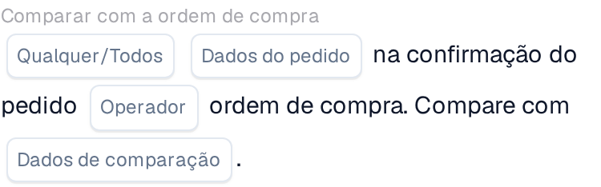

# Comparar uma confirmação de pedido com um pedido de compra

Use **Comparar com a ordem de compra** no Workflow Builder quando uma confirmação de pedido precisar de ser verificada em relação ao respetivo pedido de compra. Adicione o cartão sob **E...**, depois escolha os dados do pedido, um operador e o que deve acontecer com o resultado. As capturas de tela abaixo mostram duas versões disponíveis do cartão na interface em português. Os campos ainda são marcadores de posição; configure-os para o seu próprio fluxo de trabalho antes de guardar.

## Escrever o resultado num campo

<figure><figcaption>Versão 2: escrever texto num campo com base no resultado da condição.</figcaption></figure>

Escolha **Dados do pedido** na confirmação do pedido e um **Operador** para a comparação com o pedido de compra. Introduza o **Texto** a escrever, selecione o **Nome do campo** e escolha o **Resultado da condição** que deve acionar a escrita.

## Comparar os dados

<figure><figcaption>Versão 4: comparar dados selecionados da confirmação do pedido com os dados do pedido de compra.</figcaption></figure>

Escolha **Qualquer/Todos** para decidir se uma ou todas as condições selecionadas devem corresponder. Depois selecione os **Dados do pedido**, o **Operador** e os **Dados de comparação** para a comparação com o pedido de compra.

Para os passos seguintes, veja [Fluxo de trabalho](../../README.md) e [Comparar com a ordem de compra](README.md).
