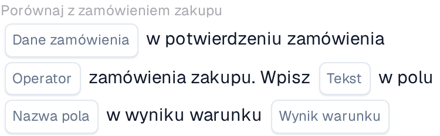
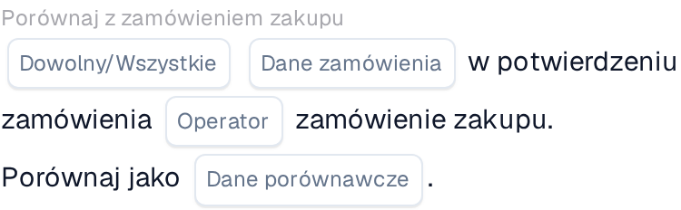

# Porównanie potwierdzenia zamówienia z zamówieniem zakupu

Użyj karty **Porównaj z zamówieniem zakupu** w Konstruktorze przepływu pracy, gdy potwierdzenie zamówienia musi zostać sprawdzone względem swojego zamówienia zakupu. Dodaj kartę w grupie **I...**, a następnie wybierz dane zamówienia, operator i to, co ma się stać z wynikiem. Poniższe zrzuty ekranu pokazują dwie dostępne wersje karty w polskim interfejsie. Ich pola są jeszcze symbolami zastępczymi; ustaw je dla własnego przepływu pracy przed zapisaniem.

## Zapisz wynik w polu

<figure><figcaption>Wersja 2: zapisz tekst w polu na podstawie wyniku warunku.</figcaption></figure>

Wybierz **Dane zamówienia** z potwierdzenia zamówienia i **Operator** do porównania z zamówieniem zakupu. Wpisz **Tekst** do zapisania, wybierz **Nazwę pola** i wskaż **Wynik warunku**, który ma wywołać zapis.

## Porównaj dane

<figure><figcaption>Wersja 4: porównaj wybrane dane potwierdzenia zamówienia z danymi zamówienia zakupu.</figcaption></figure>

Wybierz **Dowolny/Wszystkie**, aby zdecydować, czy jedna, czy wszystkie wybrane warunki muszą być spełnione. Następnie wybierz **Dane zamówienia**, **Operator** i **Dane porównawcze** do porównania z zamówieniem zakupu.

Opis kroków otaczających tę kartę znajdziesz w sekcjach [Przepływ pracy](../../README.md) oraz [Porównaj z zamówieniem zakupu](README.md).
