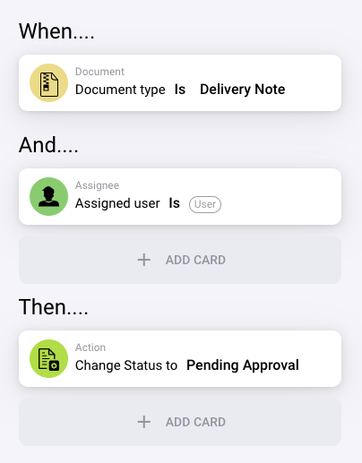

# Unit Price Combined with Fields

<figure><figcaption></figcaption></figure>

## **Doel:**

Deze workflow-kaart is ontworpen om te evalueren of de eenheidsprijs, gecombineerd met een opgegeven veldwaarde (zoals hoeveelheid, korting of aanvullende kosten), aan een gedefinieerde voorwaarde voldoet. De kaart vergelijkt de eenheidsprijs en veldwaarde met een opgegeven drempel om te helpen ervoor te zorgen dat de prijs overeenkomt met de verwachtingen. Deze vergelijking kan acties triggeren op basis van specifieke voorwaarden, zoals het markeren van afwijkingen of het automatiseren van goedkeuringsprocessen in inkoop- of ontvangstworkflows.

## **Onderdelen van de kaart:**

1. **Field Name**
   * **Beschrijving:** Geeft het documentveld op dat de waarde bevat die met de eenheidsprijs wordt gecombineerd.
   * **Detail:** Dit moet exact overeenkomen met de identifier van het eerste veld binnen het document.
2. **Operator**
   * **Beschrijving:** Definieert de voorwaarde die wordt toegepast op de vergelijking tussen de gecombineerde waarde en de opgegeven waarde.
   * **Opties:**
     * **Equals (=):** Controleert of de gecombineerde waarde van de eenheidsprijs en het veld overeenkomt met de opgegeven waarde.
     * **Not Equals (≠):** Zorgt ervoor dat de gecombineerde waarde van de eenheidsprijs en het veld verschilt van de opgegeven waarde.
     * **Greater Than (>):** Verifieert of de gecombineerde waarde groter is dan de opgegeven waarde.
     * **Greater or Equals (≥):** Controleert of de gecombineerde waarde groter dan of gelijk is aan de opgegeven waarde.
     * **Lesser Than (<):** Verifieert of de gecombineerde waarde kleiner is dan de opgegeven waarde.
     * **Lesser or Equals (≤):** Controleert of de gecombineerde waarde kleiner dan of gelijk is aan de opgegeven waarde.
3. **Value**
   * **Beschrijving:** Geeft de waarde op waarmee de gecombineerde eenheidsprijs en veldwaarde worden vergeleken.
   * **Detail:** De waarde moet een numerieke waarde zijn.

## **Functionaliteit:**

* **Voorwaarde-evaluatie:** Het systeem evalueert de gecombineerde eenheidsprijs en veldwaarde op basis van de geselecteerde operator en vergelijkt deze met de opgegeven waarde. Het resultaat van deze evaluatie bepaalt of de voorwaarde true of false is.
* **Actie-uitvoering:**
  * **True-voorwaarde:** Als de vergelijking true oplevert (bijv. de gecombineerde waarde overschrijdt de opgegeven waarde), gaat de workflow verder met de true-voorwaarde. Dit kan acties triggeren zoals goedkeuring, documentroutering of het toepassen van verwerkingsregels.
  * **False-voorwaarde:** Als de vergelijking false oplevert (bijv. de gecombineerde waarde voldoet niet aan de voorwaarde), gaat de workflow verder met de false-voorwaarde. Dit kan een melding triggeren, het document ter handmatige beoordeling verzenden of de workflow stoppen.

## **Opzet en configuratie:**

* Gebruikers beginnen met het selecteren van het documentveld of de documentvelden die de waarde(n) bevatten die met de eenheidsprijs worden gecombineerd. Na het selecteren van het veld kiezen ze de juiste operator om te definiëren hoe de gecombineerde waarde met de opgegeven waarde wordt vergeleken. Vervolgens kunnen ze de waarde instellen.

## **Voorbeeldscenario:**

* Een factuur vermeldt 50 eenheden van een product à $20 per stuk, in totaal $1000. Het gerelateerde document heeft een hoeveelheidsveld met de waarde 10. Met de operator "Greater Than" vergelijkt de kaart de gecombineerde waarde van de eenheidsprijs ($20) en de hoeveelheid (10), wat gelijk is aan $200. De kaart controleert of de gecombineerde waarde groter is dan $150 (de opgegeven waarde). Omdat de gecombineerde waarde van $200 groter is dan de drempel van $150, gaat de workflow verder om een goedkeuring voor het document te triggeren.

## **Conclusie:**

De workflow-kaart "Unit Price Combined with Fields" zorgt ervoor dat aan prijsvoorwaarden wordt voldaan door de gecombineerde waarde van de eenheidsprijs en een opgegeven veld te evalueren. Door deze vergelijking te automatiseren, kunnen organisaties consistentie waarborgen en afwijkingen in prijzen of hoeveelheden markeren voordat ze met goedkeuring verdergaan, wat helpt om inkoop- en financiële processen te stroomlijnen.
