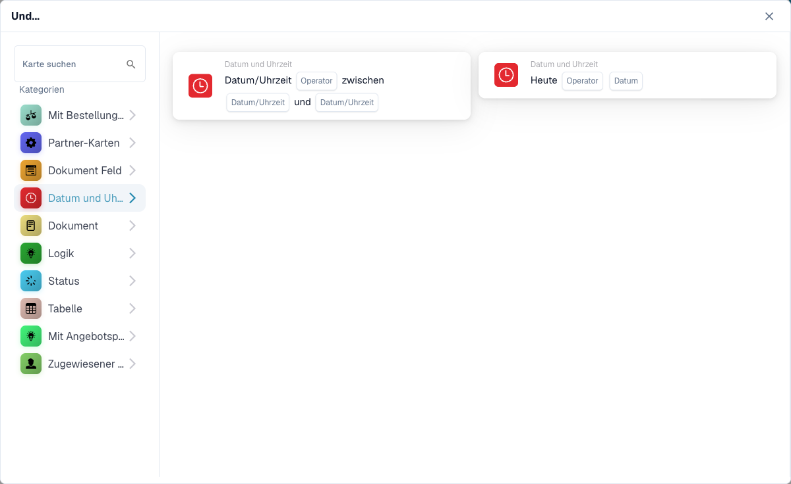

# Date & Time

Die **Datum und Zeit**-Karten im **Add Card**-Picker des Workflow-Builders (öffnen über die **Und**-Gruppe → **Karte hinzufügen**):

<figure><figcaption>
Die Karten der Kategorie <strong>Datum und Zeit</strong>.
</figcaption></figure>

