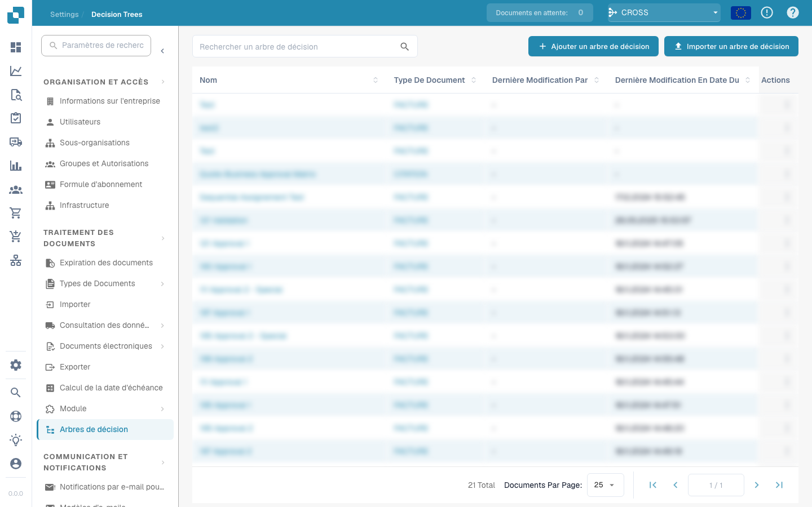

# Checkbox is checked

<figure><figcaption></figcaption></figure>

## **Doel:**

Deze workflow-kaart is ontworpen om acties te automatiseren op basis van de status (aangevinkt of niet aangevinkt) van een selectievakje binnen uw ERP-systeem. Door de voorwaarde van het selectievakje te evalueren, faciliteert hij het triggeren van specifieke processen of het afdwingen van bepaalde regels binnen de applicatie.

## **Onderdelen van de kaart:**

* **Field Name**
  * **Beschrijving:** Geeft de naam op van het selectievakjeveld dat wordt geëvalueerd.
  * **Detail:** Dit moet exact overeenkomen met de identifier van het veld die in het systeem wordt gebruikt. Het bepaalt van welk selectievakje de status wordt gemonitord.
* **Boolean**
  * **Beschrijving:** Definieert de voorwaarde die de workflow triggert.
  * **Opties:**
    * **True:** De workflow wordt getriggerd als het selectievakje is aangevinkt.
    * **False:** De workflow wordt getriggerd als het selectievakje niet is aangevinkt.

#### **Functionaliteit:**

* **Statusdetectie:** De kaart monitort continu de status van het opgegeven selectievakjeveld.
* **Voorwaarde-evaluatie:** Het systeem controleert of het selectievakje zich in de status (aangevinkt of niet aangevinkt) bevindt die door de Boolean-voorwaarde is opgegeven.
* **Actie-uitvoering:**
  * **True-voorwaarde:**\
    Als de status van het selectievakje overeenkomt met de opgegeven Boolean-voorwaarde (true voor aangevinkt of false voor niet aangevinkt), start het systeem de bijbehorende acties. Deze kunnen bestaan uit het in- of uitschakelen van formuliervelden, het triggeren van meldingen, het starten van workflows of het bijwerken van records.
  * **False-voorwaarde:**\
    Als de status van het selectievakje niet overeenkomt met de voorwaarde, kunnen alternatieve of geen acties worden uitgevoerd, afhankelijk van de workflow-opzet.

## **Opzet en configuratie:**

* Gebruikers configureren de kaart door het selectievakjeveld uit een lijst van beschikbare velden te selecteren en de Boolean-voorwaarde in te stellen.&#x20;

## Conclusie:

De workflow-kaart "Checkbox Field Condition" is een fundamenteel hulpmiddel voor het beheren van dynamische formulieren en documenten binnen een ERP-systeem, waarbij gebruikersinvoer de daaropvolgende gegevensprocessen kan bepalen. Door acties te automatiseren op basis van de status van een selectievakje verbetert deze kaart de workflow-efficiëntie en zorgt hij ervoor dat het systeemgedrag aansluit op de gebruikersinvoer. Een duidelijke documentatie van deze kaart helpt gebruikers hem effectief in hun werkzaamheden te implementeren, wat zorgt voor betere controle over formuliergedrag en procesautomatiseringen.

**Note: Niet elke klant heeft het selectievakje, maar het kan desgewenst worden toegevoegd.**
