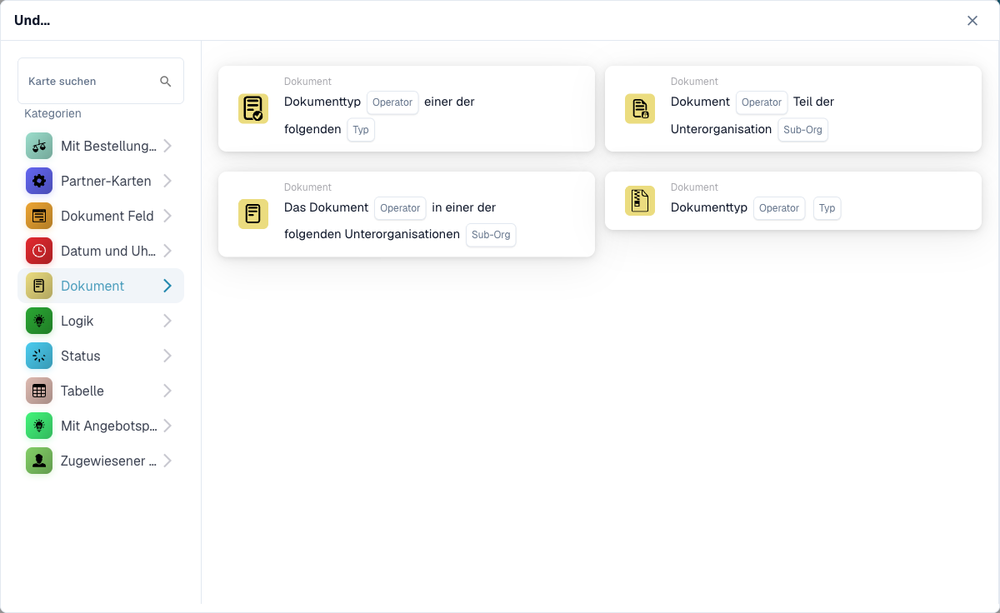

# Document

Die **Dokument**-Karten im **Add Card**-Picker des Workflow-Builders (öffnen über die **Und**-Gruppe → **Karte hinzufügen**):

<figure><figcaption>
Die Karten der Kategorie <strong>Dokument</strong>.
</figcaption></figure>

