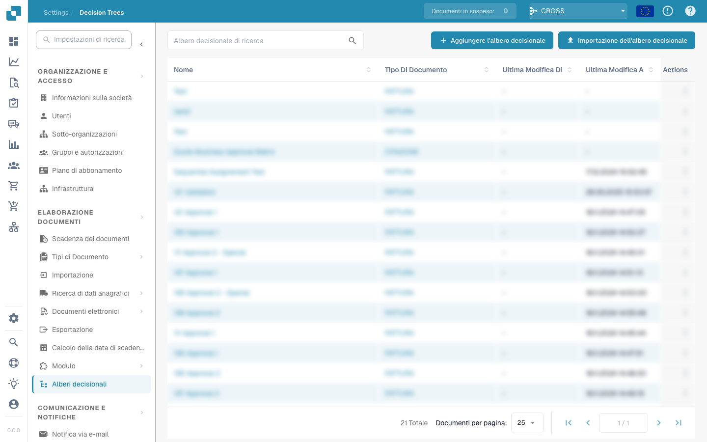

# Continue with a chance

<figure><figcaption></figcaption></figure>

## **Doel:**

Deze DocBits-kaart introduceert een probabilistische voorwaarde, waardoor workflows met een ingestelde waarschijnlijkheid kunnen doorgaan. De kaart is nuttig voor testscenario's, gerandomiseerde selecties of gecontroleerde variabiliteit binnen processen.

## **Functionaliteit:**

* **Voorwaardelijke voortzetting:** Deze kaart zet de workflow voort op basis van een opgegeven waarschijnlijkheid, door de gebruiker ingesteld als percentagewaarde. De kaart genereert een willekeurige uitkomst en vergelijkt deze met het opgegeven percentage, waardoor een gecontroleerde kans op voortzetting van de workflow ontstaat.
* **Kanspercentage:** Gebruikers geven een percentagewaarde (0-100%) op die de waarschijnlijkheid vertegenwoordigt dat de workflow doorgaat. Bijvoorbeeld:
  * **0%:** De workflow gaat nooit verder.
  * **50%:** De workflow heeft 50/50 kans om door te gaan.
  * **100%:** De workflow gaat altijd verder.

## **Gebruik:**

Deze kaart is nuttig in scenario's waarin gerandomiseerde workflow-paden nodig zijn, zoals A/B-testing, gecontroleerde steekproeven of processimulatie. Hij kan ook worden toegepast om variabiliteit aan geautomatiseerde workflows toe te voegen.

## **Voorbeeldscenario:**

* Een gebruiker configureert de kaart met een **kans van 30%**. Wanneer de workflow deze kaart bereikt, is er een waarschijnlijkheid van 30% dat de workflow doorgaat naar de volgende stap. Deze opzet is ideaal voor scenario's waarin willekeurige steekproeven of gedeeltelijke verwerking gewenst is.

Door de kaart "Conditional Continuation" te gebruiken, kunnen organisaties gecontroleerde willekeur in workflows introduceren, procesexperimenten faciliteren en de besluitvorming met probabilistische voorwaarden verbeteren.
