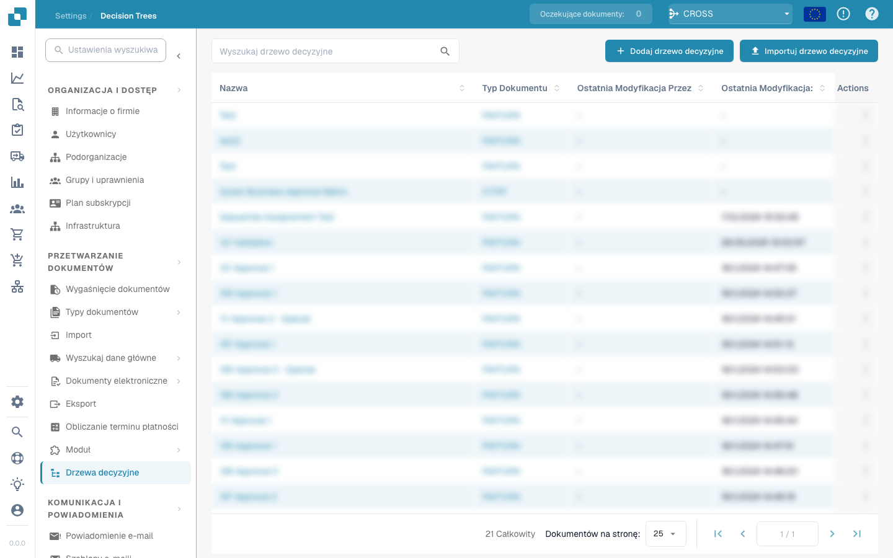

# Item Receiving Method

<figure><figcaption></figcaption></figure>

## **Doel:**

Deze DocBits-kaart controleert of items in een dataset een opgegeven ontvangstmethode hebben. Gebruikers kunnen ervoor kiezen om **een** item of **alle** items in de dataset te valideren op basis van een geselecteerde voorwaarde, waardoor hij geschikt is voor scenario's waarin workflows afhankelijk zijn van ontvangstmethoden van items, zoals bij supply-chain-management of voorraadtracering.

## **Functionaliteit:**

* **Validatie van ontvangstmethode:** Deze kaart verifieert de ontvangstmethode van items ten opzichte van een opgegeven voorwaarde. Gebruikers kunnen kiezen tussen **een** item of **alle** items in de dataset en de voorwaarde instellen als **equals** of **not equals**.
* **Itemselectie:** Gebruikers kunnen opgeven:
  * **Any Item:** De kaart wordt getriggerd als ten minste één item aan de opgegeven voorwaarde voor de ontvangstmethode voldoet.
  * **All Items:** De kaart wordt alleen getriggerd als alle items aan de opgegeven voorwaarde voor de ontvangstmethode voldoen.
* **Operatoren:** De volgende operatoren zijn beschikbaar om de voorwaarde te definiëren:
  * **Equals (=):** Controleert of de ontvangstmethode overeenkomt met de opgegeven waarde.
  * **Not Equals (≠):** Zorgt ervoor dat de ontvangstmethode niet overeenkomt met de opgegeven waarde.

## **Gebruik:**

Deze kaart is ideaal voor magazijnmanagers, voorraadcoördinatoren of logistiek personeel die ontvangstmethoden van items moeten valideren voordat ze verdere acties toestaan, zoals verwerking, opslag of verzending.

## **Voorbeeldscenario:**

* Een gebruiker configureert de kaart om te controleren of **alle items** de ontvangstmethode **equals "Direct Delivery"** hebben. Als elk item aan deze voorwaarde voldoet, gaat de workflow verder, wat bevestigt dat alle items bedoeld zijn voor directe levering.

Door de kaart "Receiving Method Validation" te gebruiken, kunnen organisaties naleving van ontvangstprotocollen waarborgen, logistieke workflows verbeteren en nauwkeurigheid in itemafhandeling behouden op basis van specifieke ontvangstmethoden.
