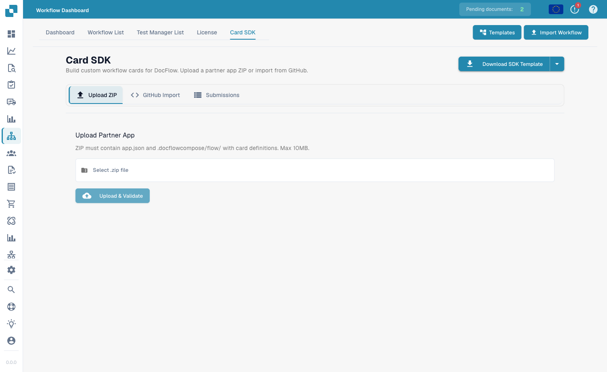

# Card SDK

**Card SDK** umożliwia partnerom i programistom tworzenie niestandardowych kart przepływu pracy dla DocFlow. Pakujesz kartę jako aplikację partnerską i przesyłasz ją lub importujesz bezpośrednio z GitHuba.

<figure><figcaption>
Card SDK — prześlij plik ZIP aplikacji partnerskiej, zaimportuj z GitHuba lub przejrzyj swoje zgłoszenia.
</figcaption></figure>

## Jak to działa

- **Download SDK Template** — zacznij od oficjalnego szablonu zawierającego oczekiwaną strukturę.
- **Upload ZIP** — plik ZIP musi zawierać `app.json` oraz folder `.docflowcompose/flow/` z definicjami kart (maks. 10 MB). Upload &#x26; Validate sprawdza pakiet przed jego zaakceptowaniem.
- **GitHub Import** — zaimportuj definicję karty bezpośrednio z repozytorium GitHub.
- **Submissions** — śledź status przesłanych przez siebie kart.

Po zweryfikowaniu i zaakceptowaniu Twoje niestandardowe karty pojawią się w bibliotece **Add Card** obok kart wbudowanych.
